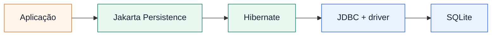
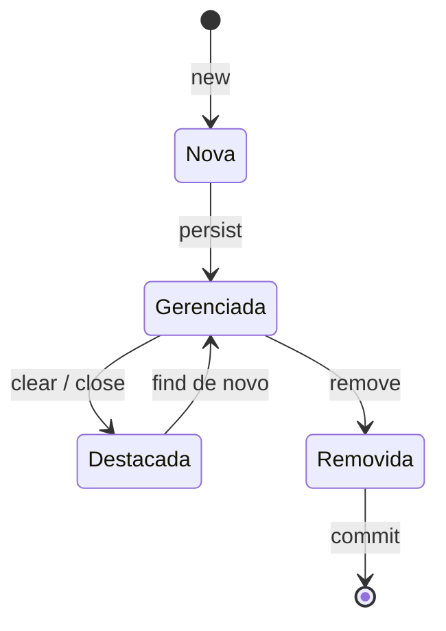
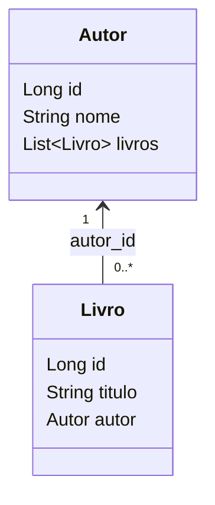
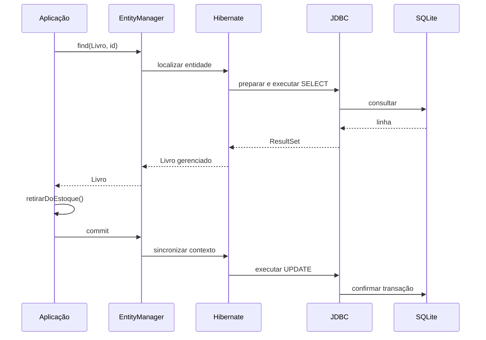

# JDBC e JPA em Java — uma livraria em nove paradas

<div align="center">

## Do primeiro acesso ao banco à venda transacional

<span style="color:#E97824"><strong>Material de estudo para graduação</strong></span>

**Livro • Autor • Venda • ItemVenda • estoque • preço**

</div>

---

<div style="border-left:6px solid #0A2240; background:#EEF4FA; padding:16px 20px; border-radius:10px;">
<strong>🎯 Objetivo do percurso</strong><br><br>
Compreender como uma aplicação Java persiste dados em um banco relacional. Primeiro você controlará conexão, SQL, resultados e transações com JDBC. Depois usará Jakarta Persistence com Hibernate para trabalhar com entidades, relacionamentos e uma unidade de trabalho — sem perder de vista o JDBC que continua por baixo da abstração.
</div>

## Pré-requisitos

- Java 17;
- orientação a objetos, exceções e coleções;
- noções iniciais de SQL;
- PowerShell para executar os comandos fornecidos.

## A narrativa que você seguirá

> Primeiro conectamos ao banco da livraria. Depois enviamos comandos seguros, transformamos linhas em objetos, organizamos o DAO, registramos uma venda transacional e, em seguida, observamos como a JPA abstrai parte desse trabalho.


Em cada parada, repita o mesmo ciclo:

```text
Problema → conceito → código → execução → observação
→ experimento → síntese → próxima parada
```

## Conheça o repositório

O [repositório JDBC-JPA-DB](https://github.com/marquesbmc/JDBC-JPA-DB) contém nove pastas `parada-*`. Cada uma possui suas próprias classes, testes e uma cópia independente de `livraria.db`. As aplicações não criam tabelas nem dados iniciais.

| Aula sugerida | Paradas | Evolução |
|---|---:|---|
| Aula 1 — Fundamentos e organização do JDBC | 1–4 | conexão → comando → objeto → DAO |
| Aula 2 — Transações e entrada na JPA | 5–7 | venda atômica → configuração → ciclo de vida |
| Aula 3 — Relacionamentos e unidade de trabalho | 8–9 | associações → venda JPA completa |

> **Independência:** você pode abrir qualquer parada diretamente. Não copie classes compiladas ou o banco de uma parada anterior para continuar o percurso.

## Baixar, executar e restaurar

Baixe pelo [repositório](https://github.com/marquesbmc/JDBC-JPA-DB) ou pelo [pacote completo](https://github.com/marquesbmc/JDBC-JPA-DB/releases/download/v1.0.0/JDBC-JPA-DB-completo-v1.0.0.zip). O pacote traz Java em `.tools` e dependências em `.lib`.

O percurso utiliza um único caminho de execução, válido para as nove paradas: `javac` e `java` locais com as dependências de `.lib`. Consulte o [`README.md`](README.md#execução-com-java-e-jars-locais) para a preparação e a execução dos testes.

Quando uma aplicação de escrita alterar o banco, restaure a parada a partir da raiz:

```powershell
Copy-Item -Force banco\livraria-base.db parada-05-transacoes\livraria.db
```

Troque o nome da pasta pela parada desejada. Essa cópia substitui os dados atuais; preserve antes qualquer experimento que queira guardar.

---

# Aula 1 — Fundamentos e organização do JDBC

# Parada 1 — Como abrir o banco da livraria sem criar outro por engano?

## O problema

O catálogo já existe em `livraria.db`. A aplicação precisa encontrar esse arquivo, selecionar o driver SQLite e liberar a sessão mesmo quando ocorre uma falha. Uma URL errada não deve criar silenciosamente um banco vazio.

## O que você aprenderá

- decompor a URL `jdbc:sqlite:...`;
- explicar como `DriverManager` descobre o driver;
- reconhecer uma `Connection` como sessão aberta;
- atribuir corretamente a responsabilidade pelo fechamento.

## Conceito essencial

JDBC é a API padrão do Java para bancos relacionais. A URL começa com `jdbc:sqlite:`, portanto `DriverManager` procura entre os drivers disponíveis aquele que reconhece SQLite. Drivers modernos se registram pelo mecanismo Java Service Provider; não é necessário chamar `Class.forName`.

A `Connection` representa uma sessão, não o banco. Fechá-la libera recursos, mas não apaga dados. Como SQLite normalmente cria um arquivo ausente, a factory valida primeiro `Files.isRegularFile`. Quem recebe a conexão controla seu período de uso e a fecha com `try-with-resources`, inclusive em caso de exceção.

<div style="border-left:6px solid #E97824; background:#FFF4E8; padding:14px 18px; border-radius:8px;">
<strong>🔎 Leia mesmo sem estilos</strong><br>
Ideia-chave: a factory cria e devolve; o código chamador usa e fecha.
</div>

## Abra estes arquivos

1. [`ConnectionFactory.java`](parada-01-conexao/src/main/java/br/edu/ibmec/livraria/ConnectionFactory.java)
2. [`Aplicacao.java`](parada-01-conexao/src/main/java/br/edu/ibmec/livraria/Aplicacao.java)
3. [`ConnectionFactoryTest.java`](parada-01-conexao/src/test/java/br/edu/ibmec/livraria/ConnectionFactoryTest.java)

## Código em foco

Trecho de [`ConnectionFactory.java`](parada-01-conexao/src/main/java/br/edu/ibmec/livraria/ConnectionFactory.java):

```java
public Connection obterConexao() throws SQLException {
    Path arquivoBanco = localizarArquivoBanco();
    String url = PREFIXO_URL_SQLITE + arquivoBanco;

    // O driver SQLite e descoberto automaticamente pelo mecanismo Service Provider.
    // A Connection aberta aqui deve ser fechada por quem a utiliza.
    return DriverManager.getConnection(url);
}

private Path localizarArquivoBanco() throws SQLException {
    String arquivoConfigurado = System.getProperty(PROPRIEDADE_ARQUIVO, ARQUIVO_PADRAO);
    Path arquivoBanco = Path.of(arquivoConfigurado).toAbsolutePath().normalize();
    if (!Files.isRegularFile(arquivoBanco)) {
        throw new SQLException("Banco SQLite nao encontrado: " + arquivoBanco);
    }
    return arquivoBanco;
}
```

## Execute

Na raiz do repositório:

```powershell
New-Item -ItemType Directory -Force parada-01-conexao\target\classes | Out-Null
& ".\.tools\jdk-17.0.20+8\bin\javac.exe" -cp ".\.lib\sqlite-jdbc-3.46.1.3.jar" -d parada-01-conexao\target\classes (Get-ChildItem parada-01-conexao\src\main\java -Recurse -Filter '*.java').FullName
Push-Location parada-01-conexao
& "..\.tools\jdk-17.0.20+8\bin\java.exe" -cp "target\classes;..\.lib\sqlite-jdbc-3.46.1.3.jar" br.edu.ibmec.livraria.Aplicacao
Pop-Location
```

## Observe

- a etapa de abertura no console;
- o nome do driver e a URL absoluta;
- `connection.isClosed()` enquanto o bloco está ativo;
- a mensagem que aparece depois do fechamento automático;
- no teste, a propriedade `livraria.db` apontando para uma cópia temporária.

## Experimento

Execute a mesma classe com um arquivo inexistente:

```powershell
Push-Location parada-01-conexao
& "..\.tools\jdk-17.0.20+8\bin\java.exe" -Dlivraria.db=ausente.db -cp "target\classes;..\.lib\sqlite-jdbc-3.46.1.3.jar" br.edu.ibmec.livraria.Aplicacao
Pop-Location
```

## O que deve acontecer

A factory informa o caminho absoluto que não existe. O arquivo `ausente.db` não é criado, pois a validação acontece antes de `DriverManager.getConnection`.

## Verifique sua compreensão

<details>
<summary><strong>Quem deve fechar a conexão e por quê?</strong></summary>

O código que a recebe e conhece o período de uso. Na aplicação, o `try-with-resources` chama `close()` ao sair do bloco, tanto no sucesso quanto na falha.
</details>

## Síntese

A URL identifica SQLite e o arquivo; `DriverManager` encontra o driver e devolve uma sessão. Validar o caminho evita um banco acidental, e o chamador fecha a `Connection` automaticamente.

## Próxima parada

Já podemos conversar com o banco. Agora precisamos enviar títulos, IDs e preços sem concatená-los ao SQL.

> **Aprofundamento — `DataSource` e pool:** em aplicações servidoras, uma `DataSource` costuma fornecer conexões de um pool. Aqui `DriverManager` permanece porque expõe o mecanismo essencial com menos infraestrutura.

---

# Parada 2 — Como separar o comando SQL dos valores da livraria?

## O problema

A livraria consulta títulos e cadastra livros. Concatenar um texto pesquisado ou um ISBN no comando mistura estrutura SQL e dados, prejudica a tipagem e pode permitir SQL Injection.

## O que você aprenderá

- preparar SQL fixo com marcadores `?`;
- vincular valores com setters tipados e índices iniciados em `1`;
- diferenciar `executeQuery` de `executeUpdate`;
- recuperar a identidade criada pelo SQLite.

## Conceito essencial

O `PreparedStatement` mantém o texto SQL fixo. Cada `?` recebe um valor separado por `setString`, `setLong`, `setInt` ou `setBigDecimal`. A contagem começa em `1` e segue a ordem dos marcadores.

Use `executeQuery()` para `SELECT`; ele devolve um `ResultSet`. Use `executeUpdate()` para `INSERT`, `UPDATE` e `DELETE`; ele devolve a quantidade de linhas afetadas. No `LIKE`, os curingas `%` pertencem ao valor. Para ler o ID de uma inserção, prepare com `RETURN_GENERATED_KEYS` e consulte `getGeneratedKeys()` depois do `INSERT`.

## Abra estes arquivos

1. [`ConsultaLivro.java`](parada-02-prepared-statement/src/main/java/br/edu/ibmec/livraria/ConsultaLivro.java)
2. [`CadastroLivro.java`](parada-02-prepared-statement/src/main/java/br/edu/ibmec/livraria/CadastroLivro.java)
3. [`Aplicacao.java`](parada-02-prepared-statement/src/main/java/br/edu/ibmec/livraria/Aplicacao.java)

## Código em foco

Trecho de [`CadastroLivro.java`](parada-02-prepared-statement/src/main/java/br/edu/ibmec/livraria/CadastroLivro.java):

```java
String sql = """
        INSERT INTO livro (titulo, isbn, preco, estoque, autor_id)
        VALUES (?, ?, ?, ?, ?)
        """;
try (var connection = connectionFactory.obterConexao();
     PreparedStatement statement = connection.prepareStatement(sql, Statement.RETURN_GENERATED_KEYS)) {
    statement.setString(1, titulo);
    statement.setString(2, isbn);
    statement.setBigDecimal(3, preco);
    statement.setInt(4, estoque);
    statement.setLong(5, autorId);
    statement.executeUpdate();

    try (ResultSet chaves = statement.getGeneratedKeys()) {
        if (chaves.next()) return chaves.getLong(1);
        throw new SQLException("Insercao nao retornou chave gerada");
    }
}
```

## Execute

```powershell
New-Item -ItemType Directory -Force parada-02-prepared-statement\target\classes | Out-Null
& ".\.tools\jdk-17.0.20+8\bin\javac.exe" -cp ".\.lib\sqlite-jdbc-3.46.1.3.jar" -d parada-02-prepared-statement\target\classes (Get-ChildItem parada-02-prepared-statement\src\main\java -Recurse -Filter '*.java').FullName
Push-Location parada-02-prepared-statement
& "..\.tools\jdk-17.0.20+8\bin\java.exe" -cp "target\classes;..\.lib\sqlite-jdbc-3.46.1.3.jar" br.edu.ibmec.livraria.Aplicacao
Pop-Location
```

Restaure o banco antes de repetir, pois o ISBN demonstrativo é único:

```powershell
Copy-Item -Force banco\livraria-base.db parada-02-prepared-statement\livraria.db
```

## Observe

- `WHERE id = ?` e o respectivo `setLong(1, id)`;
- `"%" + titulo + "%"` como valor do parâmetro `LIKE`;
- `executeQuery` nas duas consultas;
- `executeUpdate` antes de `getGeneratedKeys`;
- o ID exibido depois da inserção.

## Experimento

Troque a busca por `"Casa"` para `"Areia"`. Depois remova temporariamente o quinto setter do `INSERT`, execute, observe a causa e restaure a linha.

## O que deve acontecer

A primeira mudança altera somente a lista retornada. Sem o quinto setter, o comando incompleto falha e a classe converte a `SQLException` em `IllegalStateException`, preservando a causa original.

## Verifique sua compreensão

<details>
<summary><strong>Por que a chave gerada só pode ser lida depois do `executeUpdate`?</strong></summary>

Porque o banco produz a identidade durante a inserção. Antes de executar o `INSERT`, ainda não há nova linha nem chave associada a ela.
</details>

## Síntese

`PreparedStatement` separa comando e dados, preserva tipos e evita concatenação insegura. Consultas devolvem resultados; escritas devolvem linhas afetadas e podem disponibilizar identidades geradas.

## Próxima parada

O banco já devolve linhas, mas a aplicação ainda monta textos. Na próxima parada, cada linha se tornará um objeto `Livro`.

---

# Parada 3 — Como um cursor se transforma em `Optional<Livro>` ou `List<Livro>`?

## O problema

Um `ResultSet` não é uma lista pronta. Seu cursor começa antes da primeira linha, e repetir a leitura de todas as colunas em cada consulta tornaria o código inconsistente.

## O que você aprenderá

- movimentar o cursor com `next()`;
- escolher `if` para zero ou uma linha e `while` para várias;
- ler colunas por nome, inclusive preço com `BigDecimal`;
- separar o mapeamento e comunicar cardinalidade com `Optional` e `List`.

## Conceito essencial

`executeQuery()` devolve um cursor posicionado antes dos dados. `next()` avança e informa se existe uma linha válida. Uma busca por chave usa `if`; uma listagem usa `while`.

O `LivroMapper` recebe um cursor já posicionado e apenas converte colunas em um `Livro`. Ele não abre conexão, não executa SQL, não chama `next()` e não fecha o resultado. `Optional.empty()` representa uma busca única sem linha; uma lista vazia representa uma listagem sem correspondências. Nenhum dos dois casos exige `null`.

## Abra estes arquivos

1. [`Livro.java`](parada-03-resultset-mapeamento/src/main/java/br/edu/ibmec/livraria/Livro.java)
2. [`LivroMapper.java`](parada-03-resultset-mapeamento/src/main/java/br/edu/ibmec/livraria/LivroMapper.java)
3. [`ConsultaLivro.java`](parada-03-resultset-mapeamento/src/main/java/br/edu/ibmec/livraria/ConsultaLivro.java)
4. [`ConsultaLivroTest.java`](parada-03-resultset-mapeamento/src/test/java/br/edu/ibmec/livraria/ConsultaLivroTest.java)

## Código em foco

Trecho de [`LivroMapper.java`](parada-03-resultset-mapeamento/src/main/java/br/edu/ibmec/livraria/LivroMapper.java):

```java
public Livro mapear(ResultSet resultSet) throws SQLException {
    // O cursor ja deve estar posicionado em uma linha pelo resultSet.next().
    // Ler pelo nome da coluna deixa clara a relacao entre SQL e objeto Java.
    // getBigDecimal preserva a precisao de NUMERIC usada para preco.
    // autor_id vira autorId porque o modelo Java usa camelCase.
    return new Livro(resultSet.getLong("id"), resultSet.getString("titulo"), resultSet.getString("isbn"),
            resultSet.getBigDecimal("preco"), resultSet.getInt("estoque"), resultSet.getLong("autor_id"));
}
```

## Execute

```powershell
New-Item -ItemType Directory -Force parada-03-resultset-mapeamento\target\classes | Out-Null
& ".\.tools\jdk-17.0.20+8\bin\javac.exe" -cp ".\.lib\sqlite-jdbc-3.46.1.3.jar" -d parada-03-resultset-mapeamento\target\classes (Get-ChildItem parada-03-resultset-mapeamento\src\main\java -Recurse -Filter '*.java').FullName
Push-Location parada-03-resultset-mapeamento
& "..\.tools\jdk-17.0.20+8\bin\java.exe" -cp "target\classes;..\.lib\sqlite-jdbc-3.46.1.3.jar" br.edu.ibmec.livraria.Aplicacao
Pop-Location
```

## Observe

- `resultSet.next()` ocorre antes do Mapper;
- `buscarUm` usa uma decisão e `buscarLista` usa repetição;
- `getBigDecimal("preco")` preserva o valor monetário;
- o console contrasta `Optional` preenchido, `Optional.empty` e listas;
- o teste confere campos mapeados, ausência e quantidade de itens.

## Experimento

Troque o ID inexistente `999` por `2`. Em seguida, procure parte de um título que não exista, como `"Inexistente"`.

## O que deve acontecer

A primeira mudança produz um `Optional` com `Livro`. A segunda consulta devolve uma lista vazia, não `null` nem exceção.

## Verifique sua compreensão

<details>
<summary><strong>O que aconteceria se o Mapper chamasse `next()`?</strong></summary>

Consulta e Mapper passariam a disputar o controle do cursor. Em uma listagem, linhas poderiam ser puladas; além disso, o Mapper deixaria de ter a responsabilidade única de converter a linha atual.
</details>

## Síntese

`ResultSet` é um cursor e precisa ser movimentado explicitamente. O Mapper concentra a conversão, enquanto `Optional` e `List` tornam visível quantos resultados a consulta pode produzir.

## Próxima parada

Já transformamos linhas em objetos. Agora reuniremos SQL, conexões e mapeamento em um DAO com o CRUD completo.

---

# Parada 4 — Como esconder os detalhes JDBC atrás de um CRUD claro?

## O problema

A aplicação precisa criar, ler, atualizar e excluir livros. Se ela própria abrir conexões, escrever SQL e percorrer cursores, a regra de uso fica misturada aos detalhes de persistência.

## O que você aprenderá

- explicar a responsabilidade de um DAO;
- relacionar seus métodos ao CRUD;
- reconhecer injeção por construtor e helpers internos;
- interpretar linhas afetadas e ausência de resultados.

## Conceito essencial

O Data Access Object concentra SQL, obtenção de conexões, statements e mapeamento. A aplicação conversa com `LivroDAO`, não com `PreparedStatement` ou `ResultSet`. A `ConnectionFactory` chega pelo construtor, deixando a dependência visível.

Nesta parada, cada método abre e fecha sua própria conexão. Isso funciona porque cada operação é independente. Os helpers `preencherDadosDoLivro` e `buscarLista` reduzem repetição sem fazer parte da API pública. Em operações por chave, uma linha afetada indica sucesso; zero indica ausência. Uma busca ausente devolve `Optional.empty()`.

## Abra estes arquivos

1. [`LivroDAO.java`](parada-04-dao-crud/src/main/java/br/edu/ibmec/livraria/LivroDAO.java)
2. [`LivroMapper.java`](parada-04-dao-crud/src/main/java/br/edu/ibmec/livraria/LivroMapper.java)
3. [`Aplicacao.java`](parada-04-dao-crud/src/main/java/br/edu/ibmec/livraria/Aplicacao.java)
4. [`LivroDAOTest.java`](parada-04-dao-crud/src/test/java/br/edu/ibmec/livraria/LivroDAOTest.java)

## Código em foco

Trecho de [`LivroDAO.java`](parada-04-dao-crud/src/main/java/br/edu/ibmec/livraria/LivroDAO.java):

```java
public boolean atualizar(Livro livro) {
    String sql = """
            UPDATE livro
            SET titulo = ?, isbn = ?, preco = ?, estoque = ?, autor_id = ?
            WHERE id = ?
            """;

    try (var connection = connectionFactory.obterConexao();
         PreparedStatement statement = connection.prepareStatement(sql)) {
        preencherDadosDoLivro(statement, livro);
        statement.setLong(6, livro.id());

        // executeUpdate devolve quantas linhas foram afetadas. Uma linha indica sucesso.
        return statement.executeUpdate() == 1;
    } catch (SQLException exception) {
        throw new IllegalStateException(exception);
    }
}
```

## Execute

```powershell
New-Item -ItemType Directory -Force parada-04-dao-crud\target\classes | Out-Null
& ".\.tools\jdk-17.0.20+8\bin\javac.exe" -cp ".\.lib\sqlite-jdbc-3.46.1.3.jar" -d parada-04-dao-crud\target\classes (Get-ChildItem parada-04-dao-crud\src\main\java -Recurse -Filter '*.java').FullName
Push-Location parada-04-dao-crud
& "..\.tools\jdk-17.0.20+8\bin\java.exe" -cp "target\classes;..\.lib\sqlite-jdbc-3.46.1.3.jar" br.edu.ibmec.livraria.Aplicacao
Pop-Location
```

## Observe

- `Aplicacao` não importa `java.sql`;
- o objeto novo chega ao DAO com ID `0` e volta com a chave gerada;
- o mesmo ID percorre busca, atualização e exclusão;
- o `record` imutável exige outro objeto para representar a versão atualizada;
- a busca final devolve `Optional.empty()`.

## Experimento

Depois da primeira exclusão, execute `dao.excluir(inserido.id())` novamente. Acrescente uma etapa numerada ao console e restaure o arquivo ao terminar.

## O que deve acontecer

A segunda exclusão devolve `false`, pois nenhuma linha corresponde ao ID. Não ocorre exceção: ausência é um resultado previsto pela API do DAO.

## Verifique sua compreensão

<details>
<summary><strong>Por que o DAO não guarda uma `Connection` aberta como atributo?</strong></summary>

Porque a conexão é um recurso temporário. Nesta parada, cada método controla seu próprio período de uso e fechamento; compartilhar uma sessão longa criaria acoplamento e riscos adicionais.
</details>

## Síntese

O DAO apresenta operações do domínio e esconde o mecanismo JDBC. Helpers reduzem repetição, e os retornos distinguem sucesso, ausência e falha técnica.

## Próxima parada

Cada método atual confirma isoladamente. Uma venda precisa combinar várias escritas na mesma fronteira transacional.

---

# Aula 2 — Transações e entrada na JPA

# Parada 5 — Como impedir que venda, item e estoque discordem?

## O problema

Registrar uma venda exige três mudanças: inserir `venda`, inserir `item_venda` e reduzir o estoque de `livro`. Se apenas algumas forem confirmadas, o banco registrará uma operação comercial incompleta.

## O que você aprenderá

- explicar atomicidade como tudo ou nada;
- controlar `autoCommit`, `commit` e `rollback`;
- manter todos os comandos na mesma `Connection`;
- reconhecer a ordem exigida pelas chaves estrangeiras.

## Conceito essencial

Com `autoCommit=true`, cada comando pode ser confirmado isoladamente. `setAutoCommit(false)` permite que a aplicação decida quando confirmar. Todos os helpers recebem exatamente a mesma `Connection`; abrir outra sessão criaria outra transação.

O cabeçalho de `venda` é inserido primeiro para gerar o ID exigido por `item_venda`. Depois o estoque é atualizado. `commit()` torna tudo definitivo; qualquer `SQLException` ou falha de negócio conduz a `rollback()`. O `finally` restaura o estado original da conexão antes do fechamento.

<div style="border-left:6px solid #B42318; background:#FDECEC; padding:14px 18px; border-radius:8px;">
<strong>⚠️ Limite desta garantia</strong><br>
Atomicidade impede uma venda pela metade, mas não resolve automaticamente a concorrência entre duas vendas simultâneas. Isolamento e controle concorrente são um aprofundamento, não o foco desta parada.
</div>

## Abra estes arquivos

1. [`VendaService.java`](parada-05-transacoes/src/main/java/br/edu/ibmec/livraria/VendaService.java)
2. [`Venda.java`](parada-05-transacoes/src/main/java/br/edu/ibmec/livraria/Venda.java)
3. [`ItemVenda.java`](parada-05-transacoes/src/main/java/br/edu/ibmec/livraria/ItemVenda.java)
4. [`Aplicacao.java`](parada-05-transacoes/src/main/java/br/edu/ibmec/livraria/Aplicacao.java)
5. [`VendaServiceTest.java`](parada-05-transacoes/src/test/java/br/edu/ibmec/livraria/VendaServiceTest.java)

## Código em foco

Trecho de [`VendaService.java`](parada-05-transacoes/src/main/java/br/edu/ibmec/livraria/VendaService.java):

```java
try (Connection connection = connectionFactory.obterConexao()) {
    boolean autoCommitOriginal = connection.getAutoCommit();
    connection.setAutoCommit(false);
    try {
        Livro livro = buscarLivro(connection, livroId);
        if (livro.estoque() < quantidade) {
            throw new EstoqueInsuficienteException("Estoque insuficiente");
        }

        BigDecimal valorTotal = livro.preco().multiply(BigDecimal.valueOf(quantidade));
        long vendaId = inserirVenda(connection, valorTotal);
        inserirItemVenda(connection, vendaId, livroId, quantidade, livro.preco());
        baixarEstoque(connection, livroId, quantidade);
        connection.commit();
        return new VendaResultado(
                new Venda(vendaId, LocalDateTime.now(), valorTotal),
                livro.estoque() - quantidade);
    } catch (SQLException | RuntimeException exception) {
        connection.rollback();
        throw exception;
    } finally {
        connection.setAutoCommit(autoCommitOriginal);
    }
}
```

## Execute

```powershell
New-Item -ItemType Directory -Force parada-05-transacoes\target\classes | Out-Null
& ".\.tools\jdk-17.0.20+8\bin\javac.exe" -cp ".\.lib\sqlite-jdbc-3.46.1.3.jar" -d parada-05-transacoes\target\classes (Get-ChildItem parada-05-transacoes\src\main\java -Recurse -Filter '*.java').FullName
Push-Location parada-05-transacoes
& "..\.tools\jdk-17.0.20+8\bin\java.exe" -cp "target\classes;..\.lib\sqlite-jdbc-3.46.1.3.jar" br.edu.ibmec.livraria.Aplicacao
Pop-Location
```

Depois, restaure o banco:

```powershell
Copy-Item -Force banco\livraria-base.db parada-05-transacoes\livraria.db
```

## Observe

- o estoque antes e depois do caminho de commit;
- a mesma variável `connection` sendo passada aos helpers;
- o ID de venda chegando à inserção do item;
- a tentativa com quantidade superior ao estoque;
- o teste contando vendas e itens antes e depois do rollback.

## Experimento

Troque temporariamente a quantidade da primeira venda de `2` para `10_000`. Execute e compare o estoque final com o inicial; depois restaure o valor.

## O que deve acontecer

A exceção interrompe o fluxo antes do commit. Venda, item e estoque permanecem inalterados. Com quantidade `2`, as três mudanças são confirmadas juntas.

## Verifique sua compreensão

<details>
<summary><strong>Por que todos os helpers recebem a mesma conexão?</strong></summary>

Porque `commit` e `rollback` afetam os comandos executados naquela sessão. Outra conexão teria outra fronteira transacional.
</details>

## Síntese

Uma transação protege a unidade de negócio, não apenas um comando. A venda só é válida quando cabeçalho, item e estoque chegam juntos ao commit ou são todos desfeitos.

## Próxima parada

Controlamos diretamente SQL, chaves e sincronização. Agora a JPA chegará ao mesmo banco e mapeará `Livro` como entidade.

> **Aprofundamento — depois do mecanismo básico:** estude separadamente `Savepoint`, diferenças entre atomicidade e isolamento e como anexar uma falha de rollback como exceção suprimida sem esconder a causa original.

---

# Parada 6 — Como configurar uma abstração sem esconder o JDBC?

## O problema

Queremos buscar `Livro` pela identidade sem escrever manualmente o `SELECT` e o Mapper. Para isso, a JPA precisa conhecer o provedor, a entidade, o banco, o driver e o dialeto.

## O que você aprenderá

- diferenciar Jakarta Persistence e Hibernate;
- localizar unidade de persistência, driver, URL e dialeto;
- comparar `EntityManagerFactory` e `EntityManager`;
- buscar uma entidade com `find`.

## Conceito essencial

Jakarta Persistence — ainda chamada de JPA — é a especificação: define interfaces, anotações e regras. Hibernate é o provedor que implementa esse contrato. Ele continua usando JDBC, o driver SQLite e uma URL.

O `persistence.xml` declara a unidade `livraria`, o provedor, as classes gerenciadas e propriedades. O dialeto adapta o SQL às capacidades do SQLite. `EntityManagerFactory` é cara e normalmente compartilhada; cada `EntityManager` é curto, não thread-safe e representa um contexto de persistência. `find(Livro.class, id)` busca pela chave primária e devolve `null` quando não encontra.



## Abra estes arquivos

1. [`persistence.xml`](parada-06-jpa-configuracao/src/main/resources/META-INF/persistence.xml)
2. [`JPAUtil.java`](parada-06-jpa-configuracao/src/main/java/br/edu/ibmec/livraria/JPAUtil.java)
3. [`Livro.java`](parada-06-jpa-configuracao/src/main/java/br/edu/ibmec/livraria/Livro.java)
4. [`Aplicacao.java`](parada-06-jpa-configuracao/src/main/java/br/edu/ibmec/livraria/Aplicacao.java)

## Código em foco

Trecho de [`persistence.xml`](parada-06-jpa-configuracao/src/main/resources/META-INF/persistence.xml):

```xml
<persistence-unit name="livraria" transaction-type="RESOURCE_LOCAL">
    <provider>org.hibernate.jpa.HibernatePersistenceProvider</provider>
    <class>br.edu.ibmec.livraria.Livro</class>

    <properties>
        <property name="jakarta.persistence.jdbc.driver"
                  value="org.sqlite.JDBC"/>
        <property name="jakarta.persistence.jdbc.url"
                  value="jdbc:sqlite:livraria.db"/>
        <property name="hibernate.dialect"
                  value="org.hibernate.community.dialect.SQLiteDialect"/>
        <property name="jakarta.persistence.schema-generation.database.action"
                  value="none"/>
    </properties>
</persistence-unit>
```

## Execute

```powershell
New-Item -ItemType Directory -Force parada-06-jpa-configuracao\target\classes | Out-Null
& ".\.tools\jdk-17.0.20+8\bin\javac.exe" -cp ".\.lib\jpa\*" -d parada-06-jpa-configuracao\target\classes (Get-ChildItem parada-06-jpa-configuracao\src\main\java -Recurse -Filter '*.java').FullName
Push-Location parada-06-jpa-configuracao
& "..\.tools\jdk-17.0.20+8\bin\java.exe" -cp "target\classes;src\main\resources;..\.lib\jpa\*" br.edu.ibmec.livraria.Aplicacao
Pop-Location
```

## Observe

- os imports pertencem a `jakarta.persistence`, não a Hibernate;
- o nome `livraria` coincide no XML e em `JPAUtil`;
- `JPAUtil` valida o arquivo e substitui a URL por um caminho absoluto;
- o Hibernate mostra o SQL executado;
- uma identidade existente devolve `Livro`; uma ausente devolve `null`.

## Experimento

Troque o segundo ID `999L` por `2L`, recompile e execute. Depois restaure o valor.

## O que deve acontecer

As duas chamadas passam a devolver entidades. O SQL continua sendo produzido pelo Hibernate, e o banco permanece inalterado porque `find` é leitura.

## Verifique sua compreensão

<details>
<summary><strong>Por que ainda existe uma URL JDBC quando usamos JPA?</strong></summary>

Porque JPA é uma abstração. O provedor ainda precisa de driver e URL para acessar efetivamente o banco.
</details>

## Síntese

JPA define o contrato e Hibernate o implementa sobre JDBC. A unidade de persistência liga configuração, entidades e provedor; a factory cria contextos curtos para cada unidade de trabalho.

## Próxima parada

Já materializamos um `Livro`. Agora veremos como o contexto muda sua relação com a entidade durante o CRUD.

---

# Parada 7 — Quando uma mudança em `Livro` se transforma em SQL?

## O problema

Na JPA, a mesma classe pode representar um objeto apenas em memória, uma linha acompanhada pelo contexto ou uma entidade que será excluída. Sem reconhecer esses estados, o SQL parece surgir de forma imprevisível.

## O que você aprenderá

- distinguir os estados novo, gerenciado, destacado e removido;
- usar `persist`, `find`, `clear`, `contains` e `remove`;
- explicar dirty checking;
- reconhecer que escritas exigem uma transação.

## Conceito essencial

Um `Livro` criado com `new` é novo: ainda não tem identidade nem vínculo com o contexto. `persist` o torna gerenciado. `clear` destaca todas as entidades sem apagar suas linhas. `find` devolve uma entidade gerenciada. `remove` agenda uma entidade gerenciada para exclusão.

Enquanto uma entidade está gerenciada, o provedor acompanha seu estado. Se `atualizar` muda título, preço ou estoque, o commit detecta a diferença e produz o `UPDATE`: isso é dirty checking. Não existe `entityManager.update()` na API JPA. `persist`, mudanças confirmadas e `remove` precisam de uma `EntityTransaction` ativa neste projeto `RESOURCE_LOCAL`.



## Abra estes arquivos

1. [`Livro.java`](parada-07-jpa-crud/src/main/java/br/edu/ibmec/livraria/Livro.java)
2. [`Aplicacao.java`](parada-07-jpa-crud/src/main/java/br/edu/ibmec/livraria/Aplicacao.java)
3. [`JPACrudTest.java`](parada-07-jpa-crud/src/test/java/br/edu/ibmec/livraria/JPACrudTest.java)

## Código em foco

Trecho de [`Aplicacao.java`](parada-07-jpa-crud/src/main/java/br/edu/ibmec/livraria/Aplicacao.java):

```java
Livro livro = new Livro(
        "JPA na Pratica", "9789999000020",
        new BigDecimal("54.90"), 6, 1L);
System.out.println("[1] Novo e gerenciado: " + entityManager.contains(livro));

EntityTransaction transacao = entityManager.getTransaction();
transacao.begin();
entityManager.persist(livro);
System.out.println("[2] Apos persist e gerenciado: " + entityManager.contains(livro));
transacao.commit();

Long id = livro.getId();
entityManager.clear();
System.out.println("[3] Apos clear e gerenciado: " + entityManager.contains(livro));
Livro encontrado = entityManager.find(Livro.class, id);
```

O arquivo completo contém `try/catch` com rollback em todos os blocos de escrita; o recorte mantém apenas as mudanças de estado em foco.

## Execute

```powershell
New-Item -ItemType Directory -Force parada-07-jpa-crud\target\classes | Out-Null
& ".\.tools\jdk-17.0.20+8\bin\javac.exe" -cp ".\.lib\jpa\*" -d parada-07-jpa-crud\target\classes (Get-ChildItem parada-07-jpa-crud\src\main\java -Recurse -Filter '*.java').FullName
Push-Location parada-07-jpa-crud
& "..\.tools\jdk-17.0.20+8\bin\java.exe" -cp "target\classes;src\main\resources;..\.lib\jpa\*" br.edu.ibmec.livraria.Aplicacao
Pop-Location
```

## Observe

- ID `null` e `contains=false` no estado novo;
- ID gerado e `contains=true` depois de `persist`;
- `contains=false` depois de `clear`;
- `find` trazendo outra instância gerenciada;
- `UPDATE` sem uma chamada explícita de atualização no `EntityManager`;
- `DELETE` e busca final retornando `null`.

## Experimento

Depois de obter `encontrado`, chame `entityManager.clear()` antes de `encontrado.atualizar(...)`. Execute o bloco de commit e restaure a linha ao terminar.

## O que deve acontecer

A instância destacada muda em memória, mas não é acompanhada; portanto, sua alteração não produz o `UPDATE` automático.

## Verifique sua compreensão

<details>
<summary><strong>O que `clear()` remove: objetos do banco ou objetos do contexto?</strong></summary>

Somente o vínculo das entidades com o contexto. As instâncias continuam em memória e as linhas continuam no banco.
</details>

## Síntese

O estado descreve a relação entre uma instância e o contexto de persistência. Dirty checking só sincroniza mudanças de entidades gerenciadas dentro de uma unidade de trabalho transacional.

## Próxima parada

Até aqui `Livro` contém um `autorId`. Agora a chave estrangeira passará a ser uma referência navegável para `Autor`.

---

# Aula 3 — Relacionamentos e unidade de trabalho

# Parada 8 — Como uma chave estrangeira vira navegação entre objetos?

## O problema

O campo `autorId` indica a linha relacionada, mas obriga a aplicação a resolver o autor manualmente. Queremos navegar de `Livro` para `Autor` e de `Autor` para seus livros, entendendo quem controla a chave e quando os dados são carregados.

## O que você aprenderá

- substituir `autorId` por `Autor`;
- distinguir lado dono e lado inverso;
- interpretar `@ManyToOne`, `@OneToMany`, `@JoinColumn` e `mappedBy`;
- observar lazy loading e evitar recursão em `toString`.

## Conceito essencial

`Livro` contém a coluna `autor_id`, portanto seu atributo `autor` é o lado dono: `@ManyToOne` descreve a cardinalidade e `@JoinColumn` aponta para a chave estrangeira existente. `Autor.livros` é o lado inverso; `mappedBy="autor"` referencia o nome do atributo Java em `Livro`, não a coluna.

`FetchType.LAZY` adia a consulta até que os dados sejam necessários. A coleção precisa ser inicializada enquanto o `EntityManager` está aberto. Como a associação é bidirecional, incluir `Autor.livros` e `Livro.autor` nos dois `toString()` causaria recursão e poderia disparar consultas acidentais.



## Abra estes arquivos

1. [`Livro.java`](parada-08-jpa-relacionamentos/src/main/java/br/edu/ibmec/livraria/Livro.java)
2. [`Autor.java`](parada-08-jpa-relacionamentos/src/main/java/br/edu/ibmec/livraria/Autor.java)
3. [`Aplicacao.java`](parada-08-jpa-relacionamentos/src/main/java/br/edu/ibmec/livraria/Aplicacao.java)
4. [`JPARelacionamentosTest.java`](parada-08-jpa-relacionamentos/src/test/java/br/edu/ibmec/livraria/JPARelacionamentosTest.java)

## Código em foco

Trechos de [`Livro.java`](parada-08-jpa-relacionamentos/src/main/java/br/edu/ibmec/livraria/Livro.java) e [`Autor.java`](parada-08-jpa-relacionamentos/src/main/java/br/edu/ibmec/livraria/Autor.java):

```java
@ManyToOne(fetch = FetchType.LAZY, optional = false)
@JoinColumn(name = "autor_id", nullable = false)
private Autor autor;

@OneToMany(mappedBy = "autor", fetch = FetchType.LAZY)
private List<Livro> livros = new ArrayList<>();
```

## Execute

```powershell
New-Item -ItemType Directory -Force parada-08-jpa-relacionamentos\target\classes | Out-Null
& ".\.tools\jdk-17.0.20+8\bin\javac.exe" -cp ".\.lib\jpa\*" -d parada-08-jpa-relacionamentos\target\classes (Get-ChildItem parada-08-jpa-relacionamentos\src\main\java -Recurse -Filter '*.java').FullName
Push-Location parada-08-jpa-relacionamentos
& "..\.tools\jdk-17.0.20+8\bin\java.exe" -cp "target\classes;src\main\resources;..\.lib\jpa\*" br.edu.ibmec.livraria.Aplicacao
Pop-Location
```

## Observe

- o primeiro `find(Autor.class, 1L)` não inclui a coleção no mesmo SQL;
- `PersistenceUtil.isLoaded` é `false` antes do acesso;
- percorrer `autor.getLivros()` dispara outro `SELECT`;
- depois do acesso, `isLoaded` é `true`;
- a navegação inversa `livro.getAutor().getNome()` usa a referência associada.

## Experimento

Guarde o `Autor`, feche o `EntityManager` antes do primeiro uso de `getLivros()` e tente consultar `size()`. Depois restaure a ordem original.

## O que deve acontecer

Com o contexto aberto, a coleção é carregada sob demanda. Depois do fechamento antecipado, o provedor não consegue inicializar a associação ainda lazy.

## Verifique sua compreensão

<details>
<summary><strong>`mappedBy="autor"` aponta para `autor_id`?</strong></summary>

Não. Aponta para o atributo Java `Livro.autor`, que contém `@JoinColumn(name = "autor_id")` e controla o vínculo.
</details>

## Síntese

Relacionamentos transformam chaves em referências e coleções. O lado dono controla a chave estrangeira; o lazy loading adia trabalho, mas exige que o contexto ainda possa buscar os dados.

## Próxima parada

Já temos um grafo navegável. Agora `Venda`, `ItemVenda` e `Livro` participarão juntos de uma única transação JPA.

> **Aprofundamento — serialização lazy:** converter entidades bidirecionais diretamente para JSON pode inicializar associações, falhar fora do contexto ou recursar. Esse planejamento fica fora do fluxo principal da aplicação de console.

---

# Parada 9 — Como persistir uma venda inteira com uma única unidade de trabalho?

## O problema

A venda JPA cria uma `Venda`, cria seu `ItemVenda` e reduz o estoque de um `Livro` existente. Precisamos manter o grafo coerente em memória, enviar o SQL na ordem correta e ainda desfazer tudo se uma falha ocorrer depois do envio.

## O que você aprenderá

- delimitar a unidade de trabalho com `EntityTransaction`;
- distribuir regras entre service e entidades;
- combinar cascade e dirty checking;
- diferenciar `flush`, `commit` e `rollback`.

## Conceito essencial

O service abre um `EntityManager`, obtém sua `EntityTransaction` e executa toda a venda dentro dela. `find` devolve um `Livro` já gerenciado. A regra `retirarDoEstoque` valida quantidade e protege o estado dentro da entidade.

`Venda.adicionarItem` cria `ItemVenda`, aponta o item para a venda e o adiciona à coleção, mantendo os dois lados. Apenas `Venda` recebe `persist`; `cascade = ALL` alcança o item novo. `Livro` não recebe `persist`: sua mudança é detectada pelo dirty checking e produz `UPDATE`.

`LocalDateTimeStringConverter` adapta a data para a coluna `TEXT`. `flush()` sincroniza o contexto e pode enviar `INSERT` e `UPDATE`, mas não confirma. Somente `commit()` confirma; enquanto a transação permanece ativa, `rollback()` ainda desfaz o SQL enviado.

<div style="border-left:6px solid #14806F; background:#E9F7F1; padding:14px 18px; border-radius:8px;">
<strong>✅ Leia a unidade completa</strong><br>
Somente <code>Venda</code> recebe <code>persist</code>. Cascade persiste <code>ItemVenda</code>. <code>Livro</code> veio de <code>find</code> e já está gerenciado. Seu <code>UPDATE</code> vem do dirty checking. <code>flush</code> envia SQL, mas não confirma a transação.
</div>

## Abra estes arquivos

1. [`VendaService.java`](parada-09-jpa-transacoes/src/main/java/br/edu/ibmec/livraria/VendaService.java)
2. [`Venda.java`](parada-09-jpa-transacoes/src/main/java/br/edu/ibmec/livraria/Venda.java)
3. [`ItemVenda.java`](parada-09-jpa-transacoes/src/main/java/br/edu/ibmec/livraria/ItemVenda.java)
4. [`Livro.java`](parada-09-jpa-transacoes/src/main/java/br/edu/ibmec/livraria/Livro.java)
5. [`LocalDateTimeStringConverter.java`](parada-09-jpa-transacoes/src/main/java/br/edu/ibmec/livraria/LocalDateTimeStringConverter.java)
6. [`JPATransacoesTest.java`](parada-09-jpa-transacoes/src/test/java/br/edu/ibmec/livraria/JPATransacoesTest.java)

## Código em foco

Trecho de [`VendaService.java`](parada-09-jpa-transacoes/src/main/java/br/edu/ibmec/livraria/VendaService.java):

```java
transacao.begin();

Livro livro = entityManager.find(Livro.class, livroId);
if (livro == null) {
    throw new IllegalArgumentException("Livro inexistente: " + livroId);
}
livro.retirarDoEstoque(quantidade);

Venda venda = new Venda(LocalDateTime.now());
ItemVenda item = venda.adicionarItem(livro, quantidade);

// CascadeType.ALL faz o persist alcancar ItemVenda.
// Livro ja e gerenciado e sera atualizado por dirty checking.
entityManager.persist(venda);

if (simularFalhaDepoisDoFlush) {
    entityManager.flush();
    throw new IllegalStateException("Falha simulada depois do flush");
}

transacao.commit();
return new VendaResultado(
        venda.getId(), item.getId(), livro.getEstoque());
```

## Execute

```powershell
New-Item -ItemType Directory -Force parada-09-jpa-transacoes\target\classes | Out-Null
& ".\.tools\jdk-17.0.20+8\bin\javac.exe" -cp ".\.lib\jpa\*" -d parada-09-jpa-transacoes\target\classes (Get-ChildItem parada-09-jpa-transacoes\src\main\java -Recurse -Filter '*.java').FullName
Push-Location parada-09-jpa-transacoes
& "..\.tools\jdk-17.0.20+8\bin\java.exe" -cp "target\classes;src\main\resources;..\.lib\jpa\*" br.edu.ibmec.livraria.Aplicacao
Pop-Location
```

Depois, restaure o banco:

```powershell
Copy-Item -Force banco\livraria-base.db parada-09-jpa-transacoes\livraria.db
```

## Observe

- o estoque inicial e o valor depois do commit;
- IDs gerados para venda e item, embora somente a venda receba `persist`;
- `INSERT` de venda, `INSERT` de item e `UPDATE` de livro;
- os mesmos comandos surgindo antes da falha simulada após `flush`;
- estoque e contagens inalterados depois do rollback.

## Experimento

Remova temporariamente `entityManager.flush()` do caminho simulado. Execute, compare quais comandos aparecem antes do rollback e restaure a chamada.

## O que deve acontecer

Sem `flush` explícito, o provedor pode não enviar as escritas antes da exceção. Com `flush`, o SQL aparece. Nos dois casos, a tentativa não é confirmada: venda, item e estoque permanecem como antes dela.

## Verifique sua compreensão

<details>
<summary><strong>De onde vêm o `INSERT` do item e o `UPDATE` do livro?</strong></summary>

O `INSERT` do item vem do cascade iniciado por `persist(venda)`. O `UPDATE` vem do dirty checking sobre `Livro`, que foi carregado por `find` e já está gerenciado.
</details>

## Síntese

A unidade de trabalho reúne regras, grafo de entidades e fronteira transacional. Cascade propaga a persistência ao item, dirty checking sincroniza o estoque e rollback continua possível depois de `flush`.

## Próxima parada

As nove paradas terminaram. Compare agora o controle explícito do JDBC com o contexto de entidades da JPA, sem tratar uma abordagem como vencedora universal.

> **Aprofundamento — `AttributeConverter`:** o conversor atual é reversível, trata `null` e usa texto ISO-8601. Tipos `java.time` têm suporte na JPA; este conversor existe por causa da representação `TEXT` escolhida no esquema SQLite da aula.

> **Desafio — concorrência com `@Version`:** trabalhe em uma cópia da parada. Adicione `@Version` a `Livro`, adapte a tabela, abra dois contextos que leiam a última unidade e tente confirmar duas vendas. A segunda deve detectar a versão antiga. Apenas adicionar a anotação sem alterar o esquema quebraria o mapeamento atual.

---

# Encerramento — o que mudou do JDBC para a JPA?

## Comparação entre JDBC e JPA

| Aspecto | JDBC nas paradas 1–5 | JPA nas paradas 6–9 |
|---|---|---|
| Abstração principal | conexão, SQL, parâmetros e linhas | entidades e contexto de persistência |
| Busca por ID | `PreparedStatement` + `ResultSet` + Mapper | `EntityManager.find` |
| Atualização | `UPDATE` explícito | mudança em entidade gerenciada + dirty checking |
| Relacionamento | IDs e chaves tratados manualmente | referências e coleções mapeadas |
| Transação | mesma `Connection` | mesmo `EntityManager` e `EntityTransaction` |
| Fechamento | recursos JDBC em `try-with-resources` | manager curto e factory compartilhada |
| SQL | escrito pela aplicação | produzido pelo provedor e visível no console |

<div style="border-left:6px solid #0A2240; background:#EEF4FA; padding:16px 20px; border-radius:10px;">
<strong>🧠 Não existe vencedor universal</strong><br><br>
JDBC oferece controle direto e previsível. JPA reduz repetição e acompanha entidades, mas introduz um contexto cujo ciclo de vida precisa ser compreendido. A escolha depende do problema; conhecer os dois níveis permite avaliar a abstração sem tratá-la como mágica.
</div>

## Síntese da evolução



O diagrama não apresenta um caminho novo. Ele revela que a operação concisa da JPA reutiliza mecanismos que você já estudou: conexão, SQL, resultado, mapeamento e transação.

## Cola rápida

### Leitura JDBC

```java
try (Connection con = factory.obterConexao();
     PreparedStatement ps = con.prepareStatement(SQL)) {
    ps.setLong(1, id);
    try (ResultSet rs = ps.executeQuery()) {
        while (rs.next()) {
            // mapear a linha atual
        }
    }
}
```

### Transação JDBC

```java
boolean original = con.getAutoCommit();
con.setAutoCommit(false);
try {
    // todos os comandos usam con
    con.commit();
} catch (Exception e) {
    con.rollback();
    throw e;
} finally {
    con.setAutoCommit(original);
}
```

### Unidade de trabalho JPA

```java
try (EntityManager em = jpa.criarEntityManager()) {
    EntityTransaction tx = em.getTransaction();
    try {
        tx.begin();
        // carregar, modificar e persistir entidades
        tx.commit();
    } catch (RuntimeException e) {
        if (tx.isActive()) tx.rollback();
        throw e;
    }
}
```

### Vocabulário mínimo

| Elemento | Lembrete |
|---|---|
| `PreparedStatement` | SQL fixo e valores separados |
| `ResultSet` | cursor que exige `next()` |
| Mapper | linha atual → objeto |
| DAO | concentra persistência JDBC |
| `persist` | nova → gerenciada |
| `clear` | entidades → destacadas |
| `mappedBy` | atributo Java do lado dono |
| cascade | propaga uma operação a entidades relacionadas |
| dirty checking | sincroniza mudanças gerenciadas |
| `flush` | envia SQL sem confirmar |
| `commit` | confirma a transação |
| `rollback` | desfaz a unidade ainda não confirmada |

## Desafios opcionais

Escolha apenas depois de concluir o fluxo principal:

1. **Relatório JDBC:** acrescente ao DAO uma listagem de livros com estoque abaixo de um limite, mantendo SQL parametrizado e teste em cópia temporária.
2. **Segunda venda:** permita que uma `Venda` da parada 9 receba dois livros e confirme total, itens e estoques.
3. **Falha de restrição:** tente inserir um ISBN duplicado em um banco temporário e percorra a cadeia de causas da exceção.
4. **Concorrência:** execute o desafio de `@Version` descrito na parada 9, adaptando código e esquema juntos.
5. **Isolamento:** compare conceitualmente uma transação atômica com a proteção necessária quando duas sessões disputam o mesmo estoque.

## Referências oficiais

- [Repositório prático JDBC-JPA-DB](https://github.com/marquesbmc/JDBC-JPA-DB)
- [Jakarta Persistence 3.2](https://jakarta.ee/specifications/persistence/3.2/)
- [Jakarta Persistence 3.2 — especificação](https://jakarta.ee/specifications/persistence/3.2/jakarta-persistence-spec-3.2)
- [Oracle Java Tutorials — Prepared Statements](https://docs.oracle.com/javase/tutorial/jdbc/basics/prepared.html)
- [Oracle Java Tutorials — transações JDBC](https://docs.oracle.com/javase/tutorial/jdbc/basics/transactions.html)
- [Oracle Java Tutorials — `DataSource`](https://docs.oracle.com/javase/tutorial/jdbc/basics/sqldatasources.html)
- [Hibernate ORM — documentação](https://hibernate.org/orm/documentation/)
- [SQLite JDBC — projeto](https://github.com/xerial/sqlite-jdbc)

---

<div align="center">

## Síntese final

<span style="color:#0A2240"><strong>JDBC mostra o mecanismo.</strong></span><br>
<span style="color:#14806F"><strong>JPA organiza a abstração.</strong></span><br>
<span style="color:#E97824"><strong>A transação protege a unidade de negócio.</strong></span>

Você percorreu os três níveis usando um único domínio: a livraria.

</div>
