# Aula 4 — Arquiteturas de Dados para Análise do Data Warehouse ao Lakehouse

## Data Warehouse, Data Lake e Lakehouse

**Material do aluno — Curso de Graduação em Big Data**  
**Tempo de aula:** 2 horas  
**Leitura complementar:** este material contém explicações além do que será discutido durante o encontro.

---

## Como estudar este material

O texto está dividido em blocos curtos, semelhantes a capítulos ou slides comentados. Cada bloco apresenta uma ideia principal, sua explicação e exemplos. Os diagramas mostram o relacionamento entre os componentes de uma arquitetura.

Ao final da leitura, você deverá conseguir:

- Distinguir sistemas transacionais e sistemas analíticos;
- Diferenciar banco relacional das principais famílias de bancos NoSQL;
- Explicar Data Warehouse, Data Lake e Lakehouse;
- Diferenciar armazenamento, processamento, catálogo e consulta;
- Explicar e reconhecer a implementação de um pipeline ETL;
- Comparar ETL e ELT;
- Relacionar `schema-on-write` e `schema-on-read` às arquiteturas;
- Entender o papel de formatos como CSV, JSON e Parquet;
- Compreender por que Iceberg e Delta Lake não são apenas formatos de arquivo;
- Reconhecer serviços correspondentes na AWS, no Azure e no Google Cloud;
- Comparar serviços gerenciados com alternativas de código aberto/autogerenciadas;
- Escolher uma arquitetura com base em requisitos, e não apenas no nome de uma tecnologia.

> [!NOTE]
> **Nota sobre os diagramas:** este arquivo utiliza Mermaid. Abra-o em um leitor de Markdown compatível para visualizar os desenhos renderizados.

---

# Capítulo 1 — Por que precisamos de arquiteturas analíticas?

## 1.1 Dados espalhados não formam automaticamente informação

Uma organização pode ter vários sistemas funcionando corretamente e, ainda assim, encontrar dificuldade para responder perguntas importantes.

Considere uma universidade com os seguintes sistemas:

- Sistema acadêmico;
- Sistema financeiro;
- Ambiente virtual de aprendizagem;
- Sistema da biblioteca;
- Planilhas departamentais;
- Registros de acesso e segurança;
- Formulários de avaliação institucional.

Cada sistema foi criado para resolver uma parte do trabalho. O sistema acadêmico registra matrículas e notas. O financeiro registra cobranças e pagamentos. O ambiente virtual registra acessos, entregas e participação.

Entretanto, uma pergunta como “quais fatores estão relacionados à evasão?” exige combinar dados de várias fontes e analisar um período histórico. A resposta não está pronta dentro de um único sistema.

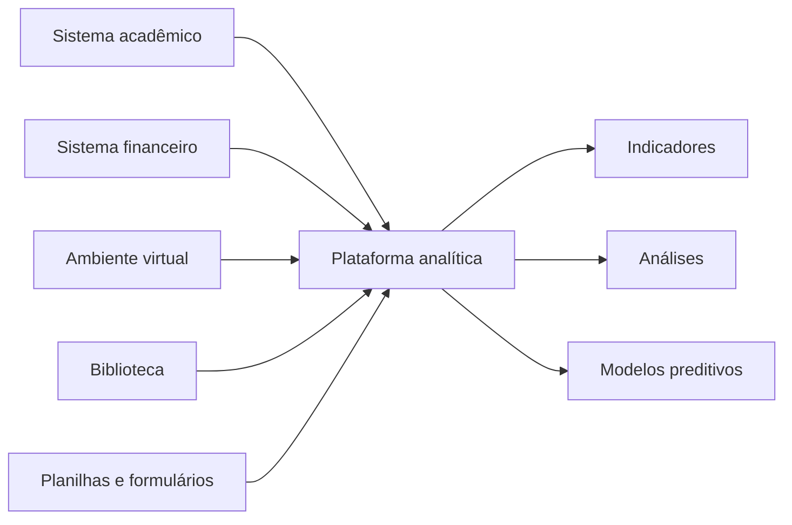

Uma arquitetura analítica define como os dados serão:

1. Obtidos das fontes (**extração**);
2. Transportados (**ingestão**);
3. Armazenados (**armazenamento**);
4. Organizados e documentados (**catalogação e gestão de metadados**);
5. Transformados (**processamento**);
6. Protegidos (**segurança de dados**);
7. Disponibilizados para uso (**consumo**).

Extração e ingestão costumam ser tratadas como uma única etapa de pipeline; catalogação e segurança costumam ser agrupadas sob **governança de dados**, que atua de forma transversal às demais funções.

## 1.2 Arquitetura não é uma lista de produtos

<mark style="background-color:#cfe8fb">Uma arquitetura descreve componentes, responsabilidades e relacionamentos. Produtos são escolhas de implementação.</mark>

Por exemplo, “armazenamento de objetos” é uma capacidade arquitetural. Alguns serviços que oferecem essa capacidade são:

| Provedor | Nome do serviço |
|---|---|
| AWS | Amazon S3 |
| Microsoft | Azure Blob Storage, Azure Data Lake Storage Gen2 e OneLake |
| Google Cloud | Cloud Storage |

Aprender apenas o nome Amazon S3 não explica a função do armazenamento de objetos. Aprender a função permite reconhecer soluções semelhantes em diferentes plataformas.

> [!TIP]
> **Princípio:** <mark style="background-color:#d3f2dc">primeiro compreenda o problema e a função arquitetural; depois associe os produtos que podem implementá-la.</mark>

---

# Capítulo 2 — Sistemas transacionais e sistemas analíticos

## 2.1 OLTP: registrar o funcionamento da organização

OLTP significa *Online Transaction Processing*. <mark style="background-color:#cfe8fb">Sistemas OLTP registram operações do cotidiano.</mark>

Exemplos:

- Efetuar uma matrícula;
- Confirmar um pagamento;
- Registrar uma venda;
- Atualizar um endereço;
- Reservar um assento;
- Registrar a presença em uma aula.

Esses sistemas normalmente precisam de:

- Baixa latência para operações pontuais;
- Muitas inserções e atualizações concorrentes;
- Integridade dos dados;
- Transações;
- Disponibilidade;
- Consulta rápida de registros específicos.

O modelo relacional normalizado é bastante utilizado em OLTP porque reduz redundâncias e ajuda a preservar a integridade. <mark style="background-color:#ffe1a8">Entretanto, OLTP não significa obrigatoriamente banco relacional.</mark> Sistemas transacionais também podem utilizar bancos NoSQL.

### Exemplos de sistemas transacionais nas nuvens

| AWS | Azure | Google Cloud |
|---|---|---|
| Amazon RDS, Aurora ou DynamoDB | Azure SQL Database ou Cosmos DB | Cloud SQL, AlloyDB, Firestore ou Bigtable |

A tabela reúne exemplos, não categorias equivalentes. RDS, Azure SQL Database e Cloud SQL são relacionais; DynamoDB, Cosmos DB, Firestore e Bigtable utilizam modelos não relacionais diferentes. Essas diferenças são detalhadas na Seção 2.4.

## 2.2 OLAP: analisar o que aconteceu

OLAP significa *Online Analytical Processing*. <mark style="background-color:#cfe8fb">Sistemas OLAP são voltados a consultas analíticas, agregações, histórico e apoio à decisão.</mark>

Exemplos:

- Comparar desempenho entre cursos e semestres;
- Analisar vendas dos últimos cinco anos;
- Identificar padrões de desistência;
- Acompanhar indicadores institucionais;
- Explorar relações entre variáveis;
- Preparar dados para modelos estatísticos ou de aprendizado de máquina.

Uma consulta OLAP pode ler milhões ou bilhões de registros, combinar tabelas e calcular agregações. Executá-la diretamente no banco transacional pode competir com matrículas, pagamentos ou vendas que estão ocorrendo naquele momento.

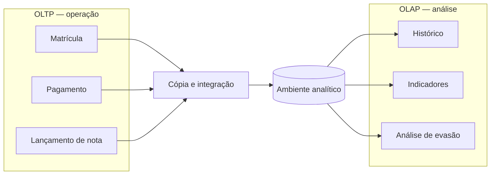

<mark style="background-color:#ffe1a8">O ambiente analítico não substitui os sistemas transacionais. Cada um possui uma finalidade diferente.</mark>

## 2.3 Comparação

| Característica | OLTP | OLAP |
|---|---|---|
| Objetivo | Registrar operações | Analisar dados |
| Tipo de consulta | Curta e pontual | Ampla e complexa |
| Alterações | Frequentes | Cargas controladas e leituras frequentes |
| Horizonte temporal | Presente e estado atual | Histórico |
| Modelagem frequente | Normalizada | Dimensional ou analítica |
| Usuários | Aplicações e equipes operacionais | Analistas, gestores e cientistas de dados |

## 2.4 OLTP e OLAP não são tipos de banco de dados

<mark style="background-color:#cfe8fb">OLTP e OLAP descrevem **tipos de carga de trabalho**. Relacional, chave-valor, documentos, família de colunas e grafos descrevem **modelos de dados e formas de acesso**.</mark> Esses eixos não devem ser confundidos.

> [!IMPORTANT]
> **Precisão de linguagem:** <mark style="background-color:#ffe1a8">SQL é uma linguagem de consulta, não um tipo de banco.</mark> A comparação mais adequada é entre **bancos relacionais** e diferentes famílias de **bancos não relacionais**. As expressões “banco SQL” e “banco NoSQL” são usadas informalmente, mas escondem diferenças importantes.

Um banco relacional pode atender um sistema OLTP, como matrículas, e outro banco relacional pode atender análises OLAP, como um Data Warehouse. Da mesma forma, um banco NoSQL pode registrar operações ou servir resultados analíticos.

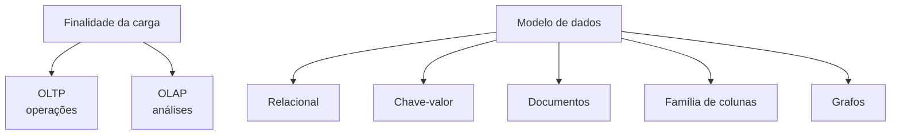

### A expressão NoSQL

<mark style="background-color:#ffe1a8">NoSQL não representa um único modelo de banco.</mark> É um termo amplo para diferentes famílias de sistemas não relacionais, geralmente desenhados para padrões específicos de escala, estrutura ou acesso.

O nome também não deve ser interpretado literalmente como “proibido usar SQL”. Alguns sistemas não relacionais oferecem linguagens semelhantes a SQL. O ponto principal é o modelo de dados, a distribuição e o padrão de acesso.

| Família | Organização | Consulta típica | Exemplos de produtos |
|---|---|---|---|
| Chave-valor | Uma chave identifica um valor | Buscar rapidamente pelo identificador | Redis, DynamoDB |
| Documentos | Registros como documentos JSON/BSON | Buscar por campos do documento | MongoDB, Cosmos DB, Firestore |
| Família de colunas | Dados distribuídos por chaves e famílias de colunas | Grandes volumes com acesso por chave e intervalo | Cassandra, HBase, Bigtable |
| Grafos | Vértices e relacionamentos | Percorrer relações e caminhos | Neo4j, Amazon Neptune |
| Séries temporais | Medições associadas ao tempo | Consultar janelas e tendências temporais | InfluxDB, Amazon Timestream |
| Busca e indexação | Documentos mantidos em índices invertidos | Pesquisa textual e relevância | Elasticsearch, OpenSearch |

Alguns sistemas combinam mais de um modelo. A classificação indica sua principal forma de organização e uso, não uma fronteira absoluta.

### Como escolher um modelo NoSQL

A escolha começa pelo padrão de acesso:

- Preciso localizar um valor por uma chave? **Chave-valor**;
- Preciso armazenar objetos com campos flexíveis? **Documentos**;
- Preciso distribuir um conjunto enorme por chave e consultar intervalos? **Família de colunas**;
- Preciso analisar relacionamentos e caminhos? **Grafos**;
- Preciso tratar medições ordenadas pelo tempo? **Séries temporais**;
- Preciso pesquisar palavras, relevância e documentos? **Busca e indexação**.

<mark style="background-color:#d3f2dc">Não se escolhe NoSQL apenas porque o volume é grande.</mark> Bancos relacionais também escalam, e bancos NoSQL possuem diferentes garantias, linguagens e limitações.

---

# Capítulo 3 — Tipos, estruturas e formatos de dados

Os tipos de dados devem ser entendidos antes de Data Warehouse, Data Lake e Lakehouse, porque variedade e estrutura influenciam a arquitetura.

Neste capítulo, <mark style="background-color:#cfe8fb">“tipo de dado” refere-se ao **grau de organização do conjunto** — estruturado, semiestruturado ou não estruturado.</mark> Isso é diferente dos tipos de uma linguagem ou coluna, como inteiro, texto, data e booleano.

## 3.1 Dados estruturados

Possuem estrutura explícita e regular. Exemplos:

- Tabelas relacionais;
- Planilhas tabulares bem formadas;
- Registros com colunas e tipos definidos.

<mark style="background-color:#ffe1a8">Estruturado não significa necessariamente “armazenado em SQL”.</mark> Um arquivo Parquet também pode representar dados estruturados.

## 3.2 Dados semiestruturados

Possuem elementos de organização, mas sua estrutura pode variar entre registros.

Exemplos:

- JSON;
- XML;
- Logs;
- Eventos de aplicações;
- Mensagens provenientes de APIs.

Um documento JSON pode ter campos aninhados e opcionais. Ainda existe estrutura, mas ela não precisa seguir uma tabela rígida.

```json
{
  "id_aluno": 101,
  "curso": "Sistemas de Informação",
  "acessos": [
    {"data": "2026-08-10", "recurso": "video"},
    {"data": "2026-08-11", "recurso": "atividade"}
  ]
}
```

## 3.3 Dados não estruturados

Não são naturalmente organizados como linhas e colunas.

Exemplos:

- Textos livres;
- Documentos PDF;
- Imagens;
- Áudio;
- Vídeo.

<mark style="background-color:#ffe1a8">“Não estruturado” não significa “sem metadados”.</mark> Uma imagem pode ter formato, resolução, data, autor e localização. Seu conteúdo principal, porém, não está representado originalmente como uma tabela.

## 3.4 Tipo lógico e formato físico são coisas diferentes

<mark style="background-color:#ffe1a8">Não confunda o conteúdo com o modo como ele é gravado:</mark>

| Questão | Exemplo |
|---|---|
| Estrutura lógica | Tabela de matrículas com colunas definidas |
| Formato físico | CSV ou Parquet |
| Estrutura lógica | Evento semiestruturado |
| Formato físico | JSON ou Avro |
| Conteúdo não estruturado | Gravação de aula |
| Formato físico | MP4 |

Essa distinção será importante ao estudar Data Lake e formatos de arquivos.

---

# Capítulo 4 — As funções de uma plataforma de dados

Uma arquitetura moderna pode ser entendida por suas funções. <mark style="background-color:#ffe1a8">Separá-las evita confusões como imaginar que Spark armazena dados permanentemente ou que S3 realiza sozinho toda a governança.</mark>

| Função | Pergunta | Exemplos |
|---|---|---|
| Fonte | Onde os dados são produzidos? | Bancos, APIs, arquivos, sensores e eventos |
| Ingestão | Como os dados chegam? | Jobs, conectores, eventos e pipelines |
| Armazenamento | Onde os bytes permanecem? | Discos, bancos e armazenamento de objetos |
| Processamento | Quem transforma os dados? | SQL, Spark, Python e mecanismos distribuídos |
| Catálogo | Como localizar e compreender os dados? | Metadados, esquemas, glossários e linhagem |
| Governança | Quem pode usar e com qual finalidade? | Políticas, papéis, classificação e auditoria |
| Consumo | Como o valor é entregue? | BI, relatórios, APIs, aplicações e modelos |

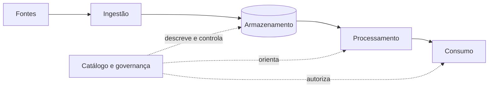

Na nuvem, <mark style="background-color:#cfe8fb">armazenamento e processamento frequentemente são desacoplados</mark>. Os dados permanecem em um serviço durável de armazenamento, enquanto recursos de computação podem ser criados, dimensionados e encerrados conforme a demanda.

### Paralelo entre serviços gerenciados e implantação própria

| Função | AWS | Azure/Microsoft | Google Cloud | Código aberto/autogerenciado |
|---|---|---|---|---|
| Armazenamento de objetos | Amazon S3 | ADLS Gen2 ou OneLake | Cloud Storage | Apache Ozone ou Ceph; HDFS para sistema de arquivos distribuído |
| Processamento distribuído | Amazon EMR ou AWS Glue | Fabric Spark, Azure Databricks ou Synapse Spark | Dataproc ou Serverless for Apache Spark | Apache Spark ou Hadoop |
| Catálogo e governança | Glue Data Catalog e Lake Formation | Microsoft Purview e catálogo do Fabric | Knowledge Catalog | OpenMetadata e controles dos componentes |
| Consulta analítica | Redshift ou Athena | Fabric Warehouse ou Synapse SQL | BigQuery | Trino ou ClickHouse |

---

# Capítulo 5 — Pipeline de dados, ETL e ELT

## 5.1 O que é um pipeline de dados?

Um **pipeline de dados** é uma sequência automatizada de etapas que leva dados de uma ou mais fontes até um destino. Ele pode executar em um horário, reagir à chegada de um arquivo ou processar eventos continuamente.

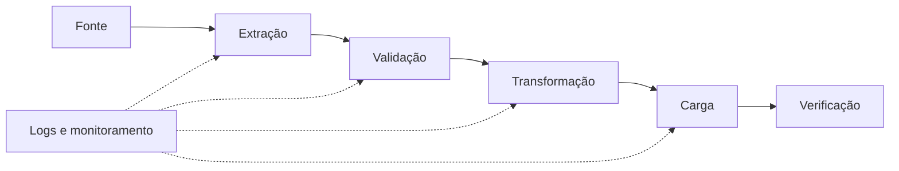

<mark style="background-color:#d3f2dc">Um pipeline não é apenas um script que funcionou uma vez.</mark> Em produção, ele precisa lidar com:

- Execução automática;
- Erros e novas tentativas;
- Registros duplicados;
- Dados inválidos;
- Mudanças no esquema;
- Monitoramento;
- Reprocessamento;
- Segurança e credenciais;
- Registro do que foi executado.

## 5.2 ETL: extrair, transformar e carregar

ETL significa *Extract, Transform, Load*.

### Extract — extração

Consiste em ler os dados da origem. A origem pode ser:

- Banco acessado por JDBC;
- API;
- Arquivo CSV ou JSON;
- Planilha;
- Fila de mensagens;
- Armazenamento de objetos.

A extração pode ser:

- **Completa:** lê novamente todos os registros;
- **Incremental:** lê somente registros novos ou alterados;
- **CDC:** captura inserções, atualizações e exclusões ocorridas na fonte.

CDC significa *Change Data Capture*.

Como a turma já estudou JDBC, é possível relacioná-lo diretamente a esta etapa. Uma ferramenta ETL pode utilizar um conector JDBC para executar uma consulta e extrair registros de um banco relacional. Em uma carga incremental, a consulta pode selecionar apenas alterações posteriores à última execução:

```sql
SELECT id_aluno, curso, nota, atualizado_em
FROM matriculas
WHERE atualizado_em > :ultima_execucao;
```

<mark style="background-color:#ffe1a8">O pipeline precisa armazenar com segurança o valor de `ultima_execucao`. Se ele avançar esse marcador antes de concluir a carga, registros podem ser perdidos; se não o atualizar, registros podem ser processados novamente.</mark>

### Transform — transformação

Consiste em aplicar regras para que os dados se tornem confiáveis e adequados ao destino:

- Corrigir tipos;
- Padronizar códigos;
- Tratar valores ausentes;
- Remover duplicidades;
- Integrar fontes;
- Calcular novas colunas;
- Aplicar regras de negócio;
- Remover ou proteger dados sensíveis;
- Validar o resultado.

### Load — carga

Consiste em gravar os dados no destino. A carga pode:

- Acrescentar novos registros;
- Substituir uma tabela;
- Atualizar registros existentes;
- Criar uma nova partição;
- Manter versões históricas.

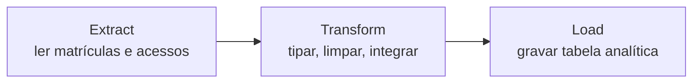

## 5.3 Exemplo concreto de ETL com Pandas

Considere dois arquivos:

**`matriculas.csv`**

```csv
id_aluno,curso,nota
101,BSI,8.5
102,Sistemas de Informacao,7.0
103, BSI ,9.0
```

**`acessos.json`**

```json
[
  {"id_aluno": 101, "quantidade_acessos": 15},
  {"id_aluno": 102, "quantidade_acessos": 8},
  {"id_aluno": 103, "quantidade_acessos": 21}
]
```

### 1. Extract

```python
import pandas as pd

matriculas = pd.read_csv("matriculas.csv")
acessos = pd.read_json("acessos.json")
```

Nesse ponto, o programa apenas leu as fontes. Ainda não existe garantia de que os valores estejam padronizados.

### 2. Transform

```python
matriculas["curso"] = (
    matriculas["curso"]
    .str.strip()
    .replace({"BSI": "SISTEMAS DE INFORMAÇÃO",
              "Sistemas de Informacao": "SISTEMAS DE INFORMAÇÃO"})
)

matriculas["nota"] = pd.to_numeric(
    matriculas["nota"], errors="coerce"
)

dados_integrados = matriculas.merge(
    acessos,
    on="id_aluno",
    how="left",
    validate="one_to_one"
)

dados_integrados["quantidade_acessos"] = (
    dados_integrados["quantidade_acessos"].fillna(0)
)
```

As transformações:

1. Removem espaços;
2. Padronizam o nome do curso;
3. Garantem que nota seja numérica;
4. Integram os dois conjuntos pelo identificador;
5. Tratam estudantes sem registro de acesso.

<mark style="background-color:#d3f2dc">O parâmetro `validate="one_to_one"` ajuda a detectar uma relação inesperada.</mark> Se houver mais de uma linha para o mesmo estudante em uma das fontes, o `merge` falhará em vez de produzir silenciosamente uma multiplicação de registros.

### 3. Load

```python
dados_integrados.to_parquet(
    "dados_academicos.parquet",
    index=False
)
```

Nesse exemplo, a carga grava um arquivo Parquet. Em uma solução real, o destino poderia ser uma tabela de Data Warehouse, uma zona tratada do Data Lake ou uma tabela de Lakehouse.

### Organizando o ETL como programa

Uma implementação simples pode separar cada etapa em uma função. Isso facilita testes, manutenção e substituição de fontes ou destinos.

```python
import pandas as pd


def extract():
    """Lê as fontes e devolve os dados ainda sem integração."""
    matriculas = pd.read_csv("matriculas.csv")
    acessos = pd.read_json("acessos.json")
    return matriculas, acessos


def transform(matriculas, acessos):
    """Aplica regras de qualidade e integração."""
    matriculas = matriculas.copy()

    matriculas["curso"] = (
        matriculas["curso"]
        .str.strip()
        .replace({
            "BSI": "SISTEMAS DE INFORMAÇÃO",
            "Sistemas de Informacao": "SISTEMAS DE INFORMAÇÃO"
        })
    )

    matriculas["nota"] = pd.to_numeric(
        matriculas["nota"], errors="raise"
    )

    resultado = matriculas.merge(
        acessos,
        on="id_aluno",
        how="left",
        validate="one_to_one"
    )

    resultado["quantidade_acessos"] = (
        resultado["quantidade_acessos"].fillna(0)
    )

    if not resultado["nota"].between(0, 10).all():
        raise ValueError("Foram encontradas notas fora do intervalo 0–10")

    return resultado


def load(resultado):
    """Grava o conjunto validado no destino analítico."""
    resultado.to_parquet(
        "dados_academicos.parquet",
        index=False
    )


def main():
    matriculas, acessos = extract()
    resultado = transform(matriculas, acessos)
    load(resultado)


if __name__ == "__main__":
    main()
```

O programa ainda é pequeno e local, mas já mostra a estrutura lógica de um ETL. Em escala maior:

- `read_csv` pode ser substituído por leitura JDBC, API ou armazenamento de objetos;
- Pandas pode ser substituído por SQL ou Spark;
- `to_parquet` pode ser substituído por uma carga no Redshift, Fabric Warehouse ou BigQuery;
- Um orquestrador pode chamar `main` em horários definidos;
- Logs, métricas, alertas e novas tentativas devem ser adicionados.

### 4. Validação pós-carga

```python
resultado = pd.read_parquet("dados_academicos.parquet")

assert len(resultado) == len(matriculas)
assert resultado["id_aluno"].is_unique
assert resultado["nota"].between(0, 10).all()
```

As verificações confirmam algumas expectativas. Em produção, uma falha deve ser registrada e impedir que dados incorretos sejam publicados aos consumidores.

## 5.4 Como esse código vira um pipeline real?

O código Python representa a lógica de transformação. Para executá-lo de forma confiável, um pipeline acrescenta uma camada operacional:

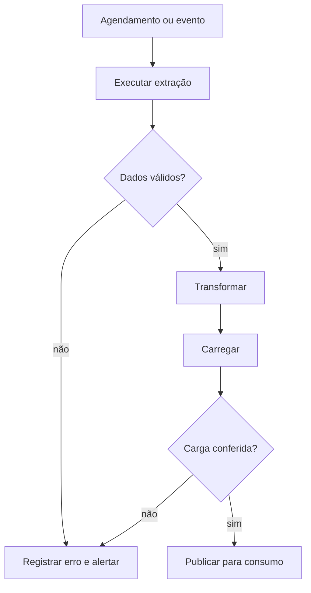

Um orquestrador controla dependências, horários, tentativas e estado. A transformação ainda pode ser escrita em Python, SQL ou Spark.

### Correspondência entre serviços gerenciados e implantação própria

| Função | AWS | Azure/Microsoft | Google Cloud | Código aberto/autogerenciado |
|---|---|---|---|---|
| Orquestrar e integrar | AWS Glue Workflows | Fabric Data Factory ou Azure Data Factory | Cloud Composer ou Cloud Data Fusion | Apache Airflow e Apache NiFi |
| Transformar com Spark | AWS Glue ou Amazon EMR | Fabric Spark, Azure Databricks ou Synapse Spark | Dataproc ou Serverless for Apache Spark | Apache Spark |
| Armazenar arquivos | Amazon S3 | OneLake ou ADLS Gen2 | Cloud Storage | HDFS, Apache Ozone ou Ceph |
| Carregar no ambiente analítico | Amazon Redshift | Fabric Warehouse ou Synapse | BigQuery | ClickHouse, PostgreSQL em menor escala ou tabelas consultadas por Trino |

O produto não substitui a lógica. Ainda é necessário definir fontes, chaves, regras de qualidade, transformações e estratégia de carga.

## 5.5 ELT: extrair, carregar e transformar

No ELT, os dados são carregados primeiro e transformados usando a capacidade do ambiente de destino.

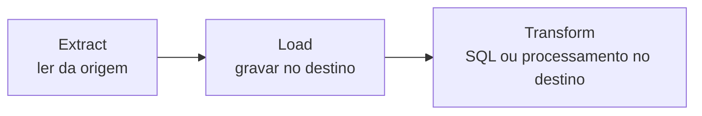

Exemplo: dados brutos são carregados em uma tabela de estágio do BigQuery, Redshift ou Fabric Warehouse. Em seguida, comandos SQL criam tabelas tratadas.

```sql
CREATE TABLE alunos_tratados AS
SELECT
    id_aluno,
    UPPER(TRIM(curso)) AS curso,
    CAST(nota AS DECIMAL(4,2)) AS nota
FROM alunos_stage
WHERE nota IS NOT NULL;
```

<mark style="background-color:#d3f2dc">ETL e ELT podem coexistir.</mark> Dados pessoais podem ser removidos antes da carga, enquanto agregações são calculadas posteriormente no destino.

## 5.6 Idempotência e reprocessamento

<mark style="background-color:#cfe8fb">Um pipeline é **idempotente** quando repeti-lo com a mesma entrada não produz duplicações ou resultados diferentes sem justificativa.</mark>

Exemplo problemático:

```text
Execução 1: insere 1.000 matrículas
Execução 2: insere as mesmas 1.000 novamente
Resultado incorreto: 2.000 registros
```

Possíveis estratégias:

- Substituir uma partição inteira;
- Utilizar uma chave única;
- Fazer `merge` ou *upsert*;
- Registrar quais arquivos já foram processados;
- Associar cada execução a um identificador.

Reprocessamento é necessário quando uma fonte chega atrasada, uma regra muda ou um erro é corrigido. Por isso, preservar dados de origem e registrar a linhagem é importante.

## 5.7 Schema-on-write e schema-on-read

### Schema-on-write

O esquema é validado antes ou durante a escrita no destino. Favorece consistência, mas exige definição antecipada.

### Schema-on-read

O dado pode ser armazenado antes da definição de todos os usos; a estrutura é interpretada na leitura. Favorece flexibilidade, mas aumenta a necessidade de metadados e validação.

<mark style="background-color:#d3f2dc">As duas estratégias podem aparecer no mesmo pipeline.</mark> Uma zona raw pode preservar JSON com flexibilidade, enquanto uma tabela analítica aplica esquema rígido.

---

# Capítulo 6 — Data Warehouse

## 6.1 Conceito

<mark style="background-color:#cfe8fb">Um **Data Warehouse** é um ambiente analítico que integra dados de diferentes fontes, mantém histórico e fornece uma visão consistente para análise e tomada de decisão.</mark>

Na definição clássica, um Data Warehouse apresenta quatro propriedades importantes:

- **Orientado por assunto:** organiza dados em torno de assuntos como estudantes, vendas, produtos ou finanças;
- **Integrado:** padroniza dados provenientes de fontes distintas;
- **Variável no tempo:** mantém histórico e permite comparar períodos;
- **Não volátil:** os dados analíticos são carregados e consultados de maneira controlada, sem reproduzir exatamente o padrão constante de alterações do OLTP.

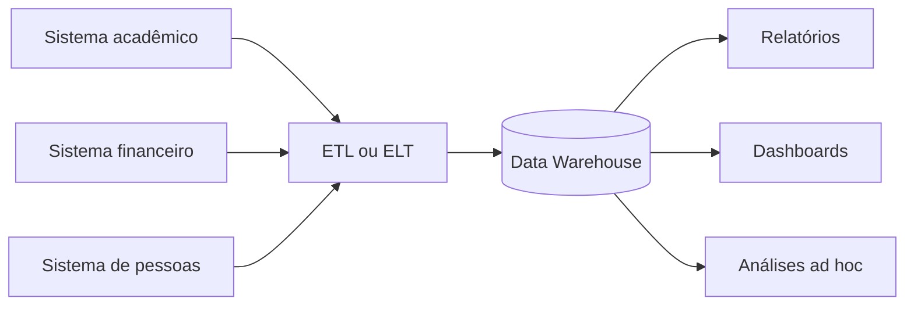

## 6.2 O problema da integração

Sistemas diferentes podem representar a mesma entidade de formas diferentes.

| Origem | Representação do curso |
|---|---|
| Sistema acadêmico | `BSI` |
| Sistema financeiro | `Sistemas de Informação` |
| Ambiente virtual | `CURSO_07` |

Antes de calcular um indicador, é necessário determinar que os três valores representam o mesmo curso. Também podem existir diferenças de:

- Datas e fusos horários;
- Moedas e unidades;
- Identificadores;
- Nomes de pessoas;
- Regras de negócio;
- Granularidade dos registros.

O Data Warehouse busca oferecer uma versão integrada e confiável para análise. Isso não significa que todos os conflitos sejam resolvidos automaticamente: as regras precisam ser definidas pela organização.

## 6.3 Modelagem dimensional

Uma forma comum de organizar um Data Warehouse é a modelagem dimensional.

### Tabela fato

Registra um acontecimento mensurável. Exemplos:

- Uma matrícula em uma disciplina;
- Uma venda;
- Um pagamento;
- Um acesso ao ambiente virtual.

<mark style="background-color:#cfe8fb">A primeira decisão é estabelecer o **grão**: o que exatamente uma linha representa?</mark> Uma linha pode representar uma matrícula por estudante e disciplina, por exemplo.

### Tabelas dimensão

Descrevem o contexto do fato:

- Estudante;
- Curso;
- Disciplina;
- Professor;
- Campus;
- Tempo.

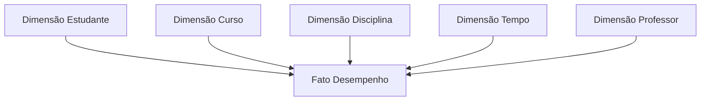

<mark style="background-color:#cfe8fb">Esse arranjo é chamado de **esquema estrela**.</mark> A tabela fato ocupa o centro e se relaciona com dimensões utilizadas para filtrar, agrupar e interpretar medidas.

### Mudanças históricas

Uma dimensão pode mudar. Um estudante pode trocar de curso ou um produto pode mudar de categoria. Em um ambiente analítico, é necessário decidir se a mudança:

- Substitui o valor anterior;
- Gera uma nova versão histórica;
- Mantém apenas parte do histórico.

<mark style="background-color:#cfe8fb">Esse problema é estudado como **Slowly Changing Dimensions**, ou dimensões lentamente mutáveis.</mark>

## 6.4 Data marts

Um **Data Mart** é um subconjunto analítico voltado a uma área, assunto ou grupo de usuários. Uma universidade pode ter data marts acadêmico, financeiro e de pesquisa.

Data marts podem facilitar o consumo, mas precisam compartilhar definições. Se cada área definir “aluno ativo” de forma diferente, surgirão indicadores contraditórios.

## 6.5 Serviços gerenciados e alternativa autogerenciada

| AWS | Azure/Microsoft | Google Cloud | Código aberto/autogerenciado |
|---|---|---|---|
| Amazon Redshift e Redshift Serverless | Microsoft Fabric Data Warehouse; Azure Synapse Dedicated SQL Pool em ambientes existentes | BigQuery | ClickHouse; PostgreSQL pode atender cenários analíticos menores |

- **Redshift:** serviço de Data Warehouse da AWS, baseado em processamento analítico paralelo e SQL;
- **Fabric Data Warehouse:** warehouse integrado ao Microsoft Fabric e ao OneLake;
- **Synapse Dedicated SQL Pool:** nome encontrado em projetos e materiais do ecossistema Azure;
- **BigQuery:** plataforma analítica sem servidor do Google Cloud, com armazenamento e computação gerenciados.
- **ClickHouse:** banco colunar voltado a consultas analíticas, instalável na infraestrutura da própria organização.

Esses serviços cumprem papéis semelhantes, mas não são equivalentes perfeitos. Possuem diferenças de arquitetura, administração, desempenho e cobrança.

## 6.6 Benefícios e limitações

### Benefícios

- Indicadores consistentes;
- Histórico integrado;
- Bom suporte a SQL e BI;
- Modelos compreensíveis para usuários de negócio;
- Controles de qualidade e acesso;
- Desempenho orientado a consultas analíticas.

### Limitações

- Integração pode exigir muito trabalho;
- Mudanças no modelo precisam ser administradas;
- Novas fontes podem demandar novas transformações;
- Formatos altamente variados podem não se ajustar bem ao modelo inicial;
- Definições incorretas de negócio continuam produzindo resultados incorretos.

> [!WARNING]
> <mark style="background-color:#ffe1a8">Um Data Warehouse não é apenas “um banco muito grande”. Sua identidade está na finalidade analítica, integração, histórico e organização.</mark>

---

# Capítulo 7 — Data Lake

## 7.1 Conceito

<mark style="background-color:#cfe8fb">Um **Data Lake** é uma arquitetura para armazenar grandes volumes de dados estruturados, semiestruturados e não estruturados.</mark> Frequentemente preserva uma versão próxima do dado recebido.

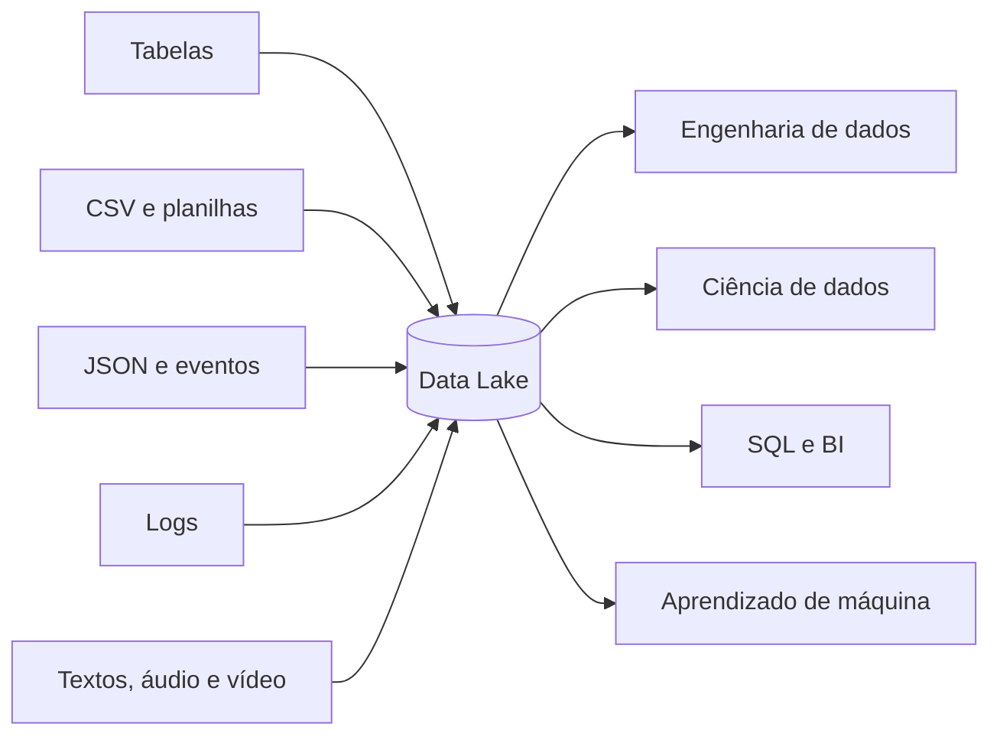

Os tipos de dados foram apresentados no Capítulo 3. A capacidade de reuni-los sem exigir que todos assumam previamente o mesmo formato é uma motivação importante para o Data Lake.

## 7.2 Zonas de dados

Um lake precisa de organização. Um modelo possível utiliza as seguintes zonas:

| Zona | Conteúdo |
|---|---|
| Landing | Dados que acabaram de chegar e aguardam processamento |
| Raw | Dados preservados próximos da origem |
| Trusted | Dados validados, tipados e padronizados |
| Curated | Dados preparados para necessidades específicas |

Os nomes variam. O importante é declarar:

- Que transformações ocorreram;
- Qual é o nível de confiança;
- Quem é o responsável;
- Quem pode acessar;
- Por quanto tempo o dado será mantido.

## 7.3 Catálogo, metadados e linhagem

### Metadados

São dados que descrevem outros dados:

- Nome e descrição;
- Estrutura e tipos;
- Origem;
- Data de atualização;
- Responsável;
- Classificação de segurança;
- Regras de qualidade.

### Catálogo

É um mecanismo para registrar, localizar e compreender ativos de dados. Um catálogo reduz a dependência do conhecimento informal de pessoas específicas.

### Linhagem

Registra o caminho do dado:

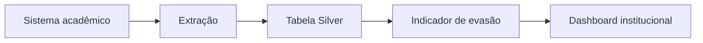

<mark style="background-color:#d3f2dc">Se o indicador estiver errado, a linhagem ajuda a descobrir de qual fonte e transformação ele veio.</mark>

## 7.4 Data swamp

<mark style="background-color:#ffe1a8">Um lake sem organização pode tornar-se um **data swamp**, ou pântano de dados.</mark> Os arquivos existem, mas não são facilmente encontrados, compreendidos ou confiáveis.

```text
Data Lake utilizável
= dados + metadados + catálogo + qualidade + segurança + responsáveis

Data swamp
= arquivos acumulados sem contexto ou confiança
```

<mark style="background-color:#d3f2dc">Armazenar tudo indefinidamente não é boa estratégia.</mark> Além do custo, existem riscos de privacidade, segurança e uso indevido.

## 7.5 Data Lake: gerenciado ou autogerenciado

| Função | AWS | Azure/Microsoft | Google Cloud | Código aberto/autogerenciado |
|---|---|---|---|---|
| Armazenamento | Amazon S3 | ADLS Gen2 ou OneLake | Cloud Storage | HDFS, Apache Ozone ou Ceph |
| Catálogo | Glue Data Catalog | Catálogo do Fabric e Microsoft Purview | Knowledge Catalog | OpenMetadata ou Hive Metastore |
| Governança | Lake Formation e IAM | Purview, Entra ID e controles do OneLake | Knowledge Catalog e Cloud IAM | OpenMetadata e políticas configuradas nos componentes |
| SQL sobre arquivos | Athena ou Redshift Spectrum | Fabric SQL analytics endpoint ou Synapse serverless SQL | BigQuery e BigLake | Trino |
| Processamento | EMR ou Glue | Fabric Spark, Databricks ou Synapse Spark | Dataproc ou Serverless for Apache Spark | Apache Spark ou Hadoop |

> [!WARNING]
> S3, ADLS Gen2, OneLake, Cloud Storage, Ozone, Ceph e HDFS representam alternativas de armazenamento. Sozinhos, não constituem uma plataforma completa de Data Lake.

---

# Capítulo 8 — Formatos de arquivos para análise

## 8.1 CSV

CSV é simples e amplamente compatível, mas apresenta limitações:

- Tipos de dados não são armazenados de forma robusta;
- Não existe esquema embutido confiável;
- Separadores e codificação podem causar erros;
- Para ler uma coluna, frequentemente é necessário percorrer grande parte do arquivo;
- Compressão e consultas analíticas são menos eficientes.

## 8.2 JSON

JSON representa objetos e estruturas aninhadas. É comum em APIs e eventos. Sua flexibilidade é útil, mas arquivos extensos podem consumir mais armazenamento e processamento que formatos analíticos colunares.

## 8.3 Parquet

Parquet é um formato colunar. Valores da mesma coluna são armazenados próximos, favorecendo:

- Compressão;
- Leitura seletiva de colunas;
- Preservação de tipos;
- Processamento paralelo;
- Consultas analíticas.

### Exemplo

Uma tabela possui cem colunas, mas a consulta utiliza apenas `curso`, `semestre` e `nota`. Um mecanismo compatível pode ler apenas os blocos relacionados a essas colunas. <mark style="background-color:#cfe8fb">Essa técnica é chamada de **column pruning**.</mark>

Se o arquivo contém estatísticas sobre grupos de registros, o mecanismo pode evitar a leitura de partes que certamente não atendem a um filtro. <mark style="background-color:#cfe8fb">Essa otimização é associada ao **predicate pushdown**.</mark>

## 8.4 Arquivo, tabela e arquitetura são níveis diferentes

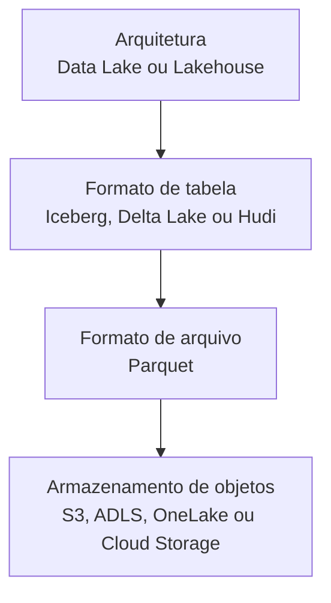

Leia de baixo para cima:

1. O armazenamento mantém objetos;
2. Parquet organiza os dados dentro dos arquivos;
3. Iceberg, Delta Lake ou Hudi administram conjuntos de arquivos como tabelas;
4. A arquitetura acrescenta processamento, catálogo, governança, segurança e consumo.

<mark style="background-color:#ffe1a8">Salvar arquivos Parquet não cria automaticamente um Lakehouse.</mark>

---

# Capítulo 9 — Lakehouse

## 9.1 O problema que a abordagem tenta resolver

Em algumas arquiteturas, os dados são copiados várias vezes:

1. Chegam ao Data Lake;
2. São tratados;
3. São copiados para o Data Warehouse;
4. São copiados novamente para ciência de dados.

<mark style="background-color:#ffe1a8">Essas cópias podem aumentar custo, demora e inconsistência.</mark> O Lakehouse procura permitir que diferentes cargas de trabalho utilizem uma base de dados comum, mantendo flexibilidade e adicionando recursos de confiabilidade.

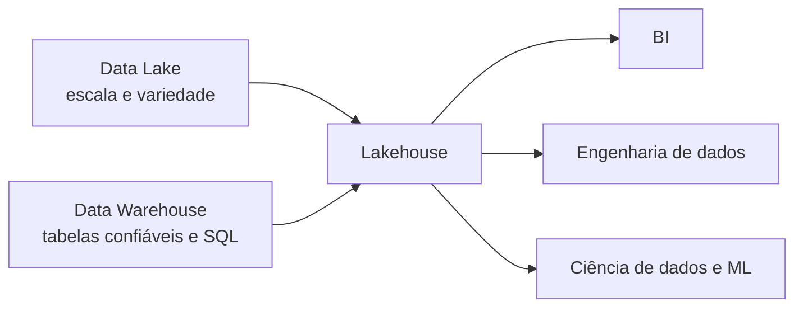

## 9.2 Formatos de tabela

Arquivos Parquet não sabem, por conta própria, quais arquivos compõem a versão atual de uma tabela. Formatos como Apache Iceberg, Delta Lake e Apache Hudi mantêm metadados adicionais.

Esses metadados podem oferecer:

- Lista consistente dos arquivos da tabela;
- Controle de versões;
- Evolução de esquema;
- Operações transacionais;
- Leitura de versões anteriores;
- Adição e remoção controlada de dados;
- Compatibilidade com diferentes mecanismos.

## 9.3 Por que transações são importantes?

Imagine que uma atualização precise substituir dez arquivos. O processo falha depois de substituir cinco. Sem controle, os leitores podem enxergar uma mistura de dados antigos e novos.

<mark style="background-color:#cfe8fb">Um mecanismo transacional procura publicar a nova versão da tabela apenas quando a operação estiver completa.</mark> Isso aproxima tabelas sobre armazenamento de objetos das garantias esperadas em sistemas de dados confiáveis.

## 9.4 Arquitetura medalhão

Uma organização comum utiliza as camadas bronze, silver e gold:

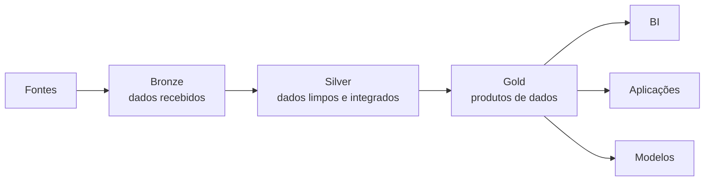

### Bronze

- Preserva os dados recebidos;
- Registra origem e momento de ingestão;
- Permite reprocessamento;
- Possui acesso restrito.

### Silver

- Corrige tipos;
- Padroniza códigos;
- Remove duplicidades;
- Valida regras;
- Integra fontes.

### Gold

- Organiza indicadores;
- Produz tabelas de negócio;
- Atende relatórios, aplicações e modelos;
- Possui significado definido para consumidores.

<mark style="background-color:#ffe1a8">Bronze/silver/gold são convenções. Uma organização pode usar outros nomes ou mais camadas.</mark>

## 9.5 Lakehouse gerenciado e autogerenciado

| Elemento | AWS | Azure/Microsoft | Google Cloud | Código aberto/autogerenciado |
|---|---|---|---|---|
| Oferta ou abordagem | Arquitetura Lakehouse do Amazon SageMaker | Microsoft Fabric Lakehouse ou Azure Databricks | Lakehouse no BigQuery e BigLake | Composição de projetos abertos escolhidos pela organização |
| Armazenamento | S3 e armazenamento do Redshift | OneLake ou ADLS Gen2 | BigQuery Storage e Cloud Storage | Apache Ozone, Ceph ou HDFS |
| Formato em destaque | Apache Iceberg | Delta Lake e Iceberg | Apache Iceberg | Apache Iceberg, Delta Lake ou Hudi |
| Catálogo e governança | Glue Data Catalog e Lake Formation | Catálogo do Fabric, Purview ou Unity Catalog | Knowledge Catalog e BigQuery | OpenMetadata, Hive Metastore e controles dos componentes |
| Consulta e processamento | Athena, Redshift, EMR e Glue | Fabric Spark, Fabric Warehouse e Databricks | BigQuery e Dataproc | Trino e Apache Spark |

### AWS

A arquitetura Lakehouse do Amazon SageMaker pode integrar dados de lakes no S3 e de warehouses no Redshift. Glue Data Catalog e Lake Formation participam de catálogo e governança. Apache Iceberg fornece uma representação aberta de tabelas.

### Microsoft

No Microsoft Fabric, **Lakehouse** é também o nome de um item da plataforma. Ele possui uma área de arquivos e uma área de tabelas no OneLake. As tabelas usam Delta, e um endpoint SQL permite consultas analíticas.

Azure Databricks é outra forma de implementar Lakehouse no ecossistema Microsoft, com Delta Lake e Unity Catalog.

### Google Cloud

BigQuery combina capacidades de Data Warehouse com consulta a dados externos. BigLake permite representar e controlar tabelas sobre dados mantidos fora do armazenamento nativo do BigQuery. A oferta Lakehouse do BigQuery enfatiza Apache Iceberg e integração entre análise e IA.

---

# Capítulo 10 — Comparação: Warehouse, Lake e Lakehouse

| Critério | Data Warehouse | Data Lake | Lakehouse |
|---|---|---|---|
| Foco | BI e análise estruturada | Armazenamento flexível e exploração | Usos analíticos diversos sobre dados gerenciados |
| Dados | Predominantemente estruturados | Estruturados, semiestruturados e não estruturados | Estruturados, semiestruturados e não estruturados |
| Esquema | Predominantemente antes da carga | Pode ser aplicado no consumo | Flexível, mas controlado em tabelas |
| Dados brutos | Nem sempre preservados | Frequentemente preservados | Frequentemente preservados em uma camada inicial |
| SQL | Recurso central | Depende do mecanismo de consulta | Recurso importante junto com APIs de dados |
| Governança | Tradicionalmente forte | Precisa ser construída | Parte essencial da proposta |
| Ponto forte | Consistência analítica | Flexibilidade e variedade | Flexibilidade com tabelas mais confiáveis |
| Risco | Rigidez | Data swamp | Complexidade ou adoção apenas nominal |

## 10.1 Eles podem coexistir

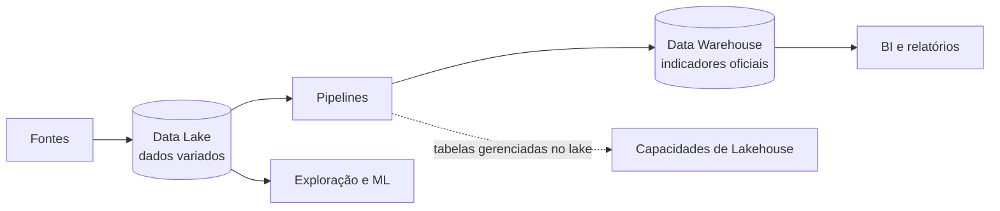

Uma organização pode manter um Data Lake para logs e documentos, um Data Warehouse para indicadores oficiais e adotar gradualmente tabelas de Lakehouse. <mark style="background-color:#d3f2dc">A decisão não precisa ser excludente.</mark>

## 10.2 Como escolher

Pergunte:

1. Quem utilizará os dados?
2. Quais formatos precisam ser armazenados?
3. Os usos já são conhecidos?
4. Qual latência é aceitável?
5. Qual volume é esperado?
6. Quais consultas serão executadas?
7. Quais garantias de qualidade são necessárias?
8. Existem dados pessoais ou sensíveis?
9. A equipe consegue operar a solução?
10. Qual é o custo total, incluindo pessoas e manutenção?

<mark style="background-color:#d3f2dc">Não escolha Lakehouse apenas por ser uma abordagem recente. A complexidade precisa ser justificada pelo problema.</mark>

---

# Capítulo 11 — O mesmo conceito em nuvem e em implantação própria

## 11.1 Dicionário de serviços

| Conceito | AWS | Azure/Microsoft | Google Cloud | Código aberto/autogerenciado |
|---|---|---|---|---|
| Armazenamento de objetos | Amazon S3 | ADLS Gen2 ou OneLake | Cloud Storage | Apache Ozone ou Ceph |
| Sistema de arquivos distribuído | HDFS no EMR, quando utilizado | HDFS em clusters compatíveis | HDFS no Dataproc, quando utilizado | Apache HDFS |
| Data Warehouse/OLAP | Amazon Redshift | Fabric Data Warehouse ou Synapse Dedicated SQL Pool | BigQuery | ClickHouse; PostgreSQL em menor escala |
| Data Lake | S3 com catálogo e governança | ADLS Gen2/OneLake com catálogo e governança | Cloud Storage com catálogo e governança | Ozone, Ceph ou HDFS com catálogo e governança |
| Lakehouse | SageMaker Lakehouse e Iceberg | Fabric Lakehouse ou Databricks | BigQuery Lakehouse e BigLake | Iceberg/Delta/Hudi + Spark/Trino + armazenamento |
| Integração | AWS Glue | Fabric Data Factory ou Azure Data Factory | Cloud Data Fusion ou Dataflow | Apache NiFi |
| Orquestração | Glue Workflows | Data Factory | Cloud Composer | Apache Airflow |
| Catálogo | Glue Data Catalog | Fabric/Purview | Knowledge Catalog | OpenMetadata ou Hive Metastore |
| Governança | Lake Formation e IAM | Purview, Entra ID e RBAC | Knowledge Catalog e Cloud IAM | OpenMetadata e políticas dos componentes |
| SQL sobre arquivos | Athena ou Redshift Spectrum | SQL endpoint ou Synapse serverless SQL | BigQuery e BigLake | Trino |
| Hadoop/Spark | Amazon EMR | HDInsight, Databricks, Synapse ou Fabric Spark | Dataproc | Apache Hadoop e Apache Spark |
| Streaming | Kinesis ou Amazon MSK | Event Hubs | Pub/Sub | Apache Kafka |
| BI | QuickSight | Power BI | Looker | Apache Superset |

## 11.2 Quatro implementações possíveis

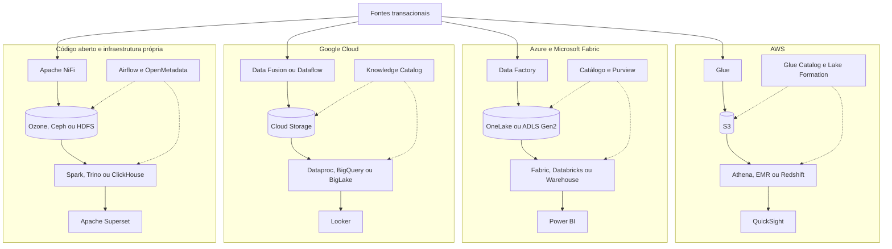

<mark style="background-color:#d3f2dc">O objetivo não é decorar todos os serviços. Observe as funções que se repetem:</mark>

```text
fontes → ingestão → armazenamento → processamento → consumo
                    ↑                  ↑
                       governança
```

---

# Capítulo 12 — Código aberto e implantação própria

## 12.1 “Gratuito”, “código aberto” e “autogerenciado” não são sinônimos

É comum chamar todo software que pode ser baixado de “gratuito”. Em arquitetura de dados, essa simplificação é perigosa.

| Termo | Significado |
|---|---|
| Código aberto | O código-fonte está disponível sob uma licença que estabelece direitos e obrigações |
| Gratuito | Não existe cobrança direta para determinado uso, versão ou faixa de consumo |
| Autogerenciado | A organização instala, configura, atualiza e opera o sistema |
| On-premises | A infraestrutura está nas instalações ou no datacenter controlado pela organização |
| Serviço gerenciado | Um provedor assume parte da operação da infraestrutura e do software |

Um projeto pode ser de código aberto e executado:

- Em servidores da própria empresa;
- Em máquinas virtuais da AWS, Azure ou Google Cloud;
- Em Kubernetes;
- Por uma empresa que vende uma versão gerenciada do mesmo projeto.

<mark style="background-color:#ffe1a8">Portanto, código aberto e nuvem não são opostos.</mark>

## 12.2 De onde vem o custo?

Mesmo sem licença comercial, a organização precisa considerar:

- Servidores ou máquinas virtuais;
- Discos e replicação;
- Rede;
- Energia e espaço físico, quando on-premises;
- Backup;
- Monitoramento;
- Atualizações;
- Correções de segurança;
- Alta disponibilidade;
- Recuperação de desastres;
- Horas da equipe técnica;
- Suporte especializado.

<mark style="background-color:#cfe8fb">O **custo total de propriedade**, ou TCO, inclui aquisição, implantação, operação, manutenção e risco.</mark> Comparar apenas o preço da licença pode levar a uma decisão inadequada.

## 12.3 Divisão de responsabilidades

| Responsabilidade | Serviço gerenciado | Código aberto/autogerenciado |
|---|---|---|
| Instalação do software | Predominantemente o provedor | Organização |
| Servidores e sistema operacional | Predominantemente o provedor | Organização |
| Atualizações | Automatizadas ou apoiadas pelo provedor | Organização planeja e executa |
| Escalabilidade | Recursos fornecidos pelo serviço | Organização projeta e opera o cluster |
| Backup e recuperação | Recursos gerenciados, mas precisam ser configurados | Organização projeta, executa e testa |
| Alta disponibilidade | Opções oferecidas pelo provedor | Organização implementa e valida |
| Monitoramento | Integrações prontas ou nativas | Organização instala e integra ferramentas |
| Segurança dos dados e acessos | Responsabilidade compartilhada | Principalmente da organização |
| Correção da lógica dos dados | Organização | Organização |
| Conhecimento sobre regras de negócio | Organização | Organização |

<mark style="background-color:#ffe1a8">Serviço gerenciado não elimina a responsabilidade do cliente.</mark> O provedor pode operar servidores, mas não sabe se “aluno ativo” foi calculado corretamente ou se determinada pessoa deveria acessar dados sensíveis.

## 12.4 Uma arquitetura autogerenciada possível

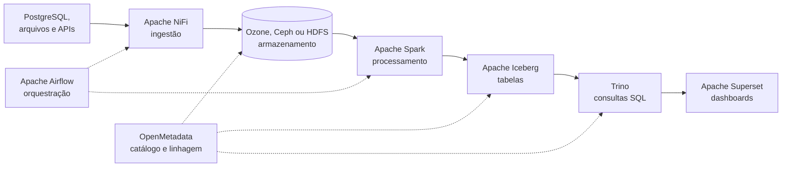

### Função de cada componente

| Componente | Função principal |
|---|---|
| PostgreSQL | Banco relacional transacional ou fonte de dados |
| Apache NiFi | Movimentação, roteamento e integração de dados |
| HDFS | Sistema de arquivos distribuído do ecossistema Hadoop |
| Apache Ozone | Armazenamento distribuído de objetos com interface compatível com S3 |
| Ceph | Plataforma distribuída que pode fornecer armazenamento de objetos |
| Apache Spark | Processamento distribuído |
| Apache Iceberg | Gerenciamento de tabelas analíticas sobre arquivos |
| Trino | Mecanismo SQL distribuído para consultar diferentes fontes |
| Apache Airflow | Orquestração de tarefas e dependências |
| OpenMetadata | Catálogo, descoberta, qualidade e linhagem |
| Apache Superset | Exploração visual e dashboards |

Nenhum componente isolado representa toda a plataforma. A arquitetura surge da integração entre armazenamento, processamento, catálogo, orquestração, segurança e consumo.

## 12.5 Uma pilha pequena para aprendizagem

Para estudar conceitos em um computador pessoal, não é necessário instalar todo o ambiente anterior. Uma pilha didática pode utilizar:

- Jupyter Notebook;
- Python e Pandas;
- DuckDB;
- PostgreSQL;
- Arquivos CSV, JSON e Parquet;
- Docker, quando necessário.

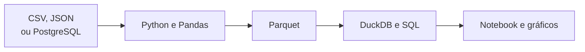

Essa pilha não simula completamente um cluster, mas permite estudar:

- Extração e transformação;
- Diferenças entre formatos;
- SQL analítico;
- Organização em camadas;
- Qualidade e validação;
- Separação entre fonte, processamento e consumo.

Depois, o mesmo raciocínio pode ser levado para Hadoop, Spark ou serviços de nuvem.

## 12.6 Quando a implantação própria pode fazer sentido?

- Requisitos de soberania ou localização dos dados;
- Infraestrutura própria já disponível;
- Equipe experiente em sistemas distribuídos;
- Necessidade de controle detalhado;
- Integração intensa com sistemas internos;
- Previsibilidade de uma carga estável;
- Estratégia para reduzir dependência de um único provedor.

## 12.7 Quando um serviço gerenciado pode fazer sentido?

- Equipe pequena;
- Necessidade de implantação rápida;
- Carga variável;
- Falta de especialistas em operação de clusters;
- Necessidade de integrações prontas;
- Preferência por transferir parte da manutenção ao provedor.

Nenhuma das listas determina a decisão sozinha. Segurança, desempenho, custo, legislação, maturidade da equipe e continuidade do negócio precisam ser avaliados em conjunto.

## 12.8 Licenças também fazem parte da arquitetura

“Código aberto” não é uma licença única. Projetos podem usar Apache License 2.0, AGPL, GPL ou outras licenças, com obrigações diferentes.

Antes da adoção empresarial, a organização deve verificar:

- Licença da versão escolhida;
- Obrigações de redistribuição;
- Regras para modificações;
- Uso de marcas;
- Existência de versão comunitária e comercial;
- Política de atualizações e segurança;
- Disponibilidade de suporte.

> [!CAUTION]
> **Exemplo de mudança no ecossistema:** materiais antigos frequentemente recomendam MinIO como armazenamento autogerenciado compatível com S3. A empresa informou o encerramento de seus produtos open source em 2025 e deixou de distribuir essas versões em seu site. Esse caso mostra por que <mark style="background-color:#d3f2dc">licenças, manutenção e continuidade do projeto devem ser verificadas, e não apenas o conjunto de funcionalidades.</mark>

---

# Capítulo 13 — Estudo de caso: universidade orientada por dados

## 13.1 Situação

A universidade possui:

- Matrículas em banco relacional;
- Pagamentos no sistema financeiro;
- Notas em planilhas;
- Eventos do ambiente virtual em JSON;
- Logs de autenticação;
- Respostas textuais de avaliações;
- Gravações de aulas;
- Histórico de empréstimos da biblioteca.

Deseja produzir relatórios e identificar estudantes que podem precisar de apoio.

## 13.2 Arquitetura possível

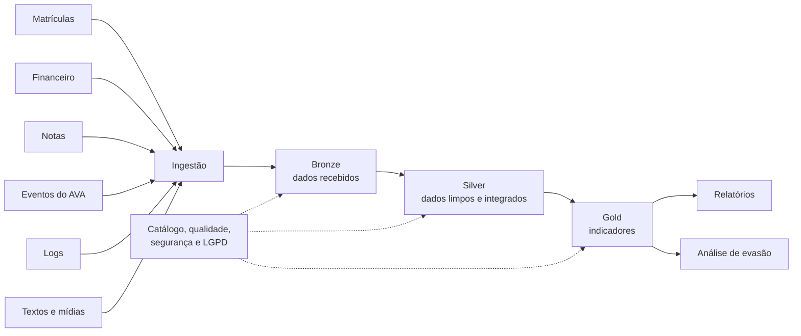

## 13.3 Decisões necessárias

### Identidade

É necessário integrar o estudante entre sistemas sem expor indevidamente dados pessoais. Identificadores técnicos e pseudonimização podem reduzir riscos.

### Granularidade

Um evento de acesso representa um clique, uma sessão ou um acesso diário? A resposta altera volumes e indicadores.

### Qualidade

- Existem estudantes duplicados?
- Datas são válidas?
- Cursos usam códigos padronizados?
- Registros atrasados serão aceitos?
- Qual sistema é a fonte oficial de cada informação?

### Ética

<mark style="background-color:#ffe1a8">Um modelo de risco não deve ser interpretado como certeza de evasão.</mark> Ele pode reproduzir vieses dos dados históricos. O resultado deve apoiar intervenções responsáveis, não punições automáticas.

### LGPD

Devem ser considerados:

- Finalidade do tratamento;
- Necessidade dos dados;
- Controle de acesso;
- Prazo de retenção;
- Transparência;
- Proteção de dados pessoais e sensíveis;
- Registro de uso e auditoria.

## 13.4 Tradução para serviços gerenciados e autogerenciados

| Etapa | AWS | Azure/Microsoft | Google Cloud | Código aberto/autogerenciado |
|---|---|---|---|---|
| Ingestão | Glue | Data Factory | Data Fusion ou Dataflow | Apache NiFi |
| Armazenamento | S3 | OneLake ou ADLS Gen2 | Cloud Storage | Ozone, Ceph ou HDFS |
| Transformação | Glue/EMR | Fabric Spark/Databricks | Dataproc/BigQuery | Apache Spark |
| Catálogo | Glue Data Catalog | Fabric/Purview | Knowledge Catalog | OpenMetadata |
| Consulta | Athena/Redshift | Fabric Warehouse/SQL endpoint | BigQuery/BigLake | Trino ou ClickHouse |
| BI | QuickSight | Power BI | Looker | Apache Superset |

---

# Capítulo 14 — Relação com os 5 Vs

| V | Pergunta arquitetural |
|---|---|
| Volume | Os dados e o processamento cabem em uma única máquina? |
| Velocidade | Quanto tempo pode passar entre produção e disponibilidade? |
| Variedade | Quais estruturas e formatos precisam ser integrados? |
| Veracidade | Como origem, qualidade e significado serão verificados? |
| Valor | Qual decisão, produto ou serviço será melhorado? |

<mark style="background-color:#d3f2dc">Os 5 Vs não determinam automaticamente uma tecnologia. Eles ajudam a caracterizar o problema.</mark>

Exemplo: uma base de 20 GB pode ter grande variedade e baixa qualidade, exigindo trabalho de integração, mas não necessariamente um cluster. Por outro lado, um fluxo contínuo de eventos pode exigir processamento distribuído mesmo antes de atingir volumes históricos enormes.

---

# Capítulo 15 — Equívocos frequentes

## “Data Warehouse é um banco de dados grande”

Incorreto. Volume pode ser uma característica, mas integração, histórico, finalidade analítica e consistência são centrais.

## “Data Lake armazena somente dados não estruturados”

Incorreto. Um lake pode armazenar dados estruturados, semiestruturados e não estruturados.

## “Schema-on-read significa ausência de esquema”

Incorreto. O esquema existe ou será interpretado no consumo. Sem documentação, diferentes usuários podem interpretar os mesmos dados de maneiras incompatíveis.

## “Parquet é um banco de dados”

Incorreto. Parquet é um formato de arquivo colunar.

## “Arquivos Parquet formam um Lakehouse”

<mark style="background-color:#ffe1a8">Incorreto. Um Lakehouse exige mecanismos de tabela, catálogo, governança, processamento e consumo.</mark>

## “Hadoop é sinônimo de Data Lake”

<mark style="background-color:#ffe1a8">Incorreto. Hadoop é um ecossistema de tecnologias.</mark> HDFS pode fornecer armazenamento para um lake, mas os conceitos não são equivalentes.

## “Spark armazena os dados”

<mark style="background-color:#ffe1a8">Spark é principalmente um mecanismo de processamento.</mark> Ele lê e grava dados em diferentes sistemas de armazenamento.

## “Lakehouse sempre substitui o Warehouse”

Incorreto. A decisão depende de requisitos, maturidade, custos e arquitetura existente.

---

# Capítulo 16 — Preparação para Hadoop e Spark

As arquiteturas estudadas criam perguntas sobre escala:

- Como distribuir arquivos entre máquinas?
- Como tolerar a falha de um nó?
- Como dividir um processamento em tarefas paralelas?
- Como administrar recursos de um cluster?

```mermaid
flowchart LR
    A["Arquiteturas analíticas"] --> B["Armazenar e processar em escala"]
    B --> C["Hadoop"]
    C --> D["HDFS<br/>armazenamento distribuído"]
    C --> E["MapReduce<br/>processamento distribuído"]
    C --> F["YARN<br/>gerenciamento de recursos"]
    E --> G["Spark<br/>processamento mais flexível"]
```

### Nomes encontrados nas nuvens e em implantação própria

| Tecnologia | AWS | Azure/Microsoft | Google Cloud | Código aberto/autogerenciado |
|---|---|---|---|---|
| Hadoop e Spark | Amazon EMR | HDInsight; Spark também em Databricks, Synapse e Fabric | Dataproc | Apache Hadoop e Apache Spark instalados pela organização |
| Armazenamento | Amazon S3 | ADLS Gen2 ou OneLake | Cloud Storage | HDFS, Apache Ozone ou Ceph |

Clusters Hadoop tradicionais podem usar HDFS. Na nuvem, mecanismos de processamento frequentemente acessam armazenamento de objetos durável. <mark style="background-color:#d3f2dc">Assim, o cluster pode ser encerrado sem eliminar o repositório principal.</mark>

---

# Capítulo 17 — Síntese

| Conceito | Síntese |
|---|---|
| OLTP | Registra operações do cotidiano |
| OLAP | Analisa dados integrados e históricos |
| Data Warehouse | Organiza dados confiáveis para análise e BI |
| Data Lake | Armazena dados variados com flexibilidade |
| Lakehouse | Acrescenta gerenciamento de tabelas e confiabilidade ao lake |
| ETL | Transforma antes da carga principal |
| ELT | Carrega e transforma utilizando o destino |
| Parquet | Formato de arquivo colunar |
| Iceberg/Delta/Hudi | Formatos de tabela com metadados e controle |
| Catálogo | Permite localizar e compreender dados |
| Linhagem | Registra a origem e o caminho das transformações |
| Governança | Define responsabilidade, qualidade, acesso e uso adequado |
| Código aberto | Software disponibilizado sob uma licença que define direitos e obrigações |
| Autogerenciado | Sistema instalado e operado pela própria organização |

> [!TIP]
> **Conclusão:** <mark style="background-color:#d3f2dc">não existe uma arquitetura universalmente melhor. Existe uma arquitetura mais coerente com os dados, usuários, requisitos, riscos e capacidade operacional de cada organização.</mark>

---

# Capítulo 18 — Questões de revisão

1. Por que consultas analíticas podem prejudicar um sistema OLTP?
2. Quais propriedades diferenciam um Data Warehouse de um banco transacional?
3. O que é o grão de uma tabela fato?
4. Qual é a diferença entre ETL e ELT?
5. Por que `schema-on-read` não significa ausência de esquema?
6. Quais tipos de dados podem ser armazenados em um Data Lake?
7. Como um Data Lake pode se transformar em data swamp?
8. Qual é a diferença entre Parquet e Apache Iceberg?
9. Por que uma transação é importante em uma tabela formada por vários arquivos?
10. Bronze, silver e gold são tecnologias ou convenções arquiteturais?
11. Qual é a diferença entre Amazon S3 e AWS Lake Formation?
12. Qual papel OneLake desempenha no Microsoft Fabric?
13. Como BigQuery e BigLake se relacionam com uma arquitetura analítica?
14. Data Warehouse e Data Lake podem coexistir? Dê um exemplo.
15. Que fatores devem ser analisados antes da escolha de um Lakehouse?
16. Por que NoSQL não pode ser tratado como um único modelo de banco?
17. Compare bancos de documentos, família de colunas e grafos.
18. Qual é a diferença entre classificar uma carga como OLTP/OLAP e classificar um banco como relacional/não relacional?
19. O que torna um script ETL idempotente?
20. Como um código Pandas pode ser transformado em um pipeline executado de forma automática e monitorada?
21. Qual é a diferença entre código aberto, gratuito, autogerenciado e on-premises?
22. Cite três custos que continuam existindo mesmo quando não há cobrança de licença.
23. Compare uma arquitetura gerenciada com uma autogerenciada em termos de responsabilidades.

## Questão aplicada

Escolha uma organização e descreva:

1. Três fontes de dados;
2. Uma necessidade analítica;
3. Os tipos e formatos dos dados;
4. A arquitetura recomendada;
5. Uma possível implementação na AWS, no Azure ou no Google Cloud;
6. Um risco de qualidade;
7. Um risco de privacidade ou segurança.

---

# Glossário

| Termo | Definição breve |
|---|---|
| ACID | Propriedades de atomicidade, consistência, isolamento e durabilidade de transações |
| Armazenamento de objetos | Armazenamento de dados como objetos identificados por chaves |
| Autogerenciado | Sistema instalado, atualizado, monitorado e operado pela organização usuária |
| Catálogo | Inventário de ativos e metadados de dados |
| CDC | Captura das alterações ocorridas em uma fonte de dados |
| Data Lake | Repositório arquitetural para dados variados e em escala |
| Data Mart | Subconjunto analítico voltado a uma área ou assunto |
| Data Warehouse | Ambiente integrado e histórico para análise |
| Data swamp | Lake sem organização, confiança ou capacidade adequada de descoberta |
| Dimensão | Contexto descritivo utilizado para analisar fatos |
| ELT | Extrair, carregar e transformar |
| ETL | Extrair, transformar e carregar |
| Fato | Evento ou processo mensurável em uma modelagem dimensional |
| Grão | Significado exato de uma linha de uma tabela fato |
| Lakehouse | Arquitetura que combina flexibilidade de lake e tabelas analíticas gerenciadas |
| Linhagem | Registro da origem, transformações e destinos de um dado |
| Metadado | Informação que descreve um ativo de dados |
| NoSQL | Termo amplo para diferentes famílias de bancos não relacionais |
| OLAP | Processamento voltado à análise |
| OLTP | Processamento voltado a transações do dia a dia da organização |
| Parquet | Formato de arquivo colunar para dados analíticos |
| Pipeline de dados | Sequência automatizada de movimentação, validação, transformação e carga de dados |
| Banco de documentos | Banco não relacional que organiza registros como documentos flexíveis |
| Banco de grafos | Banco orientado a entidades e relacionamentos |
| Banco chave-valor | Banco que recupera valores a partir de chaves |
| Família de colunas | Modelo distribuído organizado por chaves e grupos de colunas |
| Idempotência | Propriedade pela qual repetir uma operação com a mesma entrada não duplica seus efeitos |
| Schema-on-read | Estrutura interpretada de acordo com a leitura ou uso |
| Schema-on-write | Estrutura validada no momento da escrita |
| SQL | Linguagem utilizada para definir, consultar e manipular dados em sistemas compatíveis |
| Sistema transacional | Sistema que registra as operações do dia a dia de uma organização (equivalente a OLTP); não deve ser confundido com sistema operacional (software de base de uma máquina) |
| TCO | Custo total de propriedade, incluindo aquisição, operação, pessoas, manutenção e riscos |

---

# Referências oficiais para aprofundamento

## Conceitos gerais

- Kimball, Ralph; Ross, Margy. *The Data Warehouse Toolkit*.
- Inmon, W. H. *Building the Data Warehouse*.
- Kleppmann, Martin. *Designing Data-Intensive Applications*.
- Sadalage, Pramod J.; Fowler, Martin. *NoSQL Distilled*.

## AWS

- [Amazon Redshift](https://docs.aws.amazon.com/redshift/latest/mgmt/welcome.html)
- [AWS Lake Formation](https://docs.aws.amazon.com/lake-formation/latest/dg/what-is-lake-formation.html)
- [AWS Glue](https://docs.aws.amazon.com/glue/latest/dg/what-is-glue.html)
- [Amazon Athena](https://docs.aws.amazon.com/athena/)
- [Arquitetura Lakehouse do Amazon SageMaker](https://docs.aws.amazon.com/sagemaker-lakehouse-architecture/latest/userguide/what-is-smlh.html)
- [Amazon EMR](https://docs.aws.amazon.com/emr/latest/ManagementGuide/emr-overview-arch.html)

## Azure e Microsoft Fabric

- [Data Lake no Azure Architecture Center](https://learn.microsoft.com/en-us/azure/architecture/data-guide/scenarios/data-lake)
- [Azure Data Lake Storage](https://learn.microsoft.com/en-us/azure/storage/blobs/data-lake-storage-introduction)
- [Microsoft OneLake](https://learn.microsoft.com/en-us/fabric/onelake/onelake-overview)
- [Armazenamento no Microsoft Fabric](https://learn.microsoft.com/en-us/fabric/fundamentals/store-data)
- [Microsoft Fabric Data Warehouse](https://learn.microsoft.com/en-us/fabric/data-warehouse/data-warehousing)
- [Azure Synapse Dedicated SQL Pool](https://learn.microsoft.com/en-us/azure/synapse-analytics/sql-data-warehouse/sql-data-warehouse-overview-what-is)
- [Data Factory no Microsoft Fabric](https://learn.microsoft.com/en-us/fabric/data-factory/data-factory-overview)
- [Microsoft Purview Unified Catalog](https://learn.microsoft.com/en-us/purview/unified-catalog)

## Google Cloud

- [BigQuery](https://cloud.google.com/bigquery/docs/introduction)
- [BigLake](https://cloud.google.com/bigquery/docs/biglake-intro)
- [Lakehouse no BigQuery](https://cloud.google.com/bigquery/docs/lakehouse-in-bigquery)
- [Data Lake no Google Cloud](https://cloud.google.com/learn/what-is-a-data-lake)
- [Dataproc](https://cloud.google.com/dataproc/docs)
- [Cloud Data Fusion](https://cloud.google.com/data-fusion/docs)
- [Knowledge Catalog](https://cloud.google.com/dataplex/docs/metadata-overview)

## Código aberto e implantação própria

- [Apache Hadoop](https://hadoop.apache.org/)
- [Apache Spark](https://spark.apache.org/)
- [Apache Ozone](https://ozone.apache.org/docs/next/)
- [Ceph Object Gateway](https://docs.ceph.com/en/latest/radosgw/)
- [Apache Iceberg](https://iceberg.apache.org/)
- [Trino](https://trino.io/docs/current/overview.html)
- [ClickHouse OSS](https://clickhouse.com/docs/getting-started/quick-start/oss)
- [Apache NiFi](https://nifi.apache.org/documentation/)
- [Apache Airflow](https://airflow.apache.org/docs/)
- [Apache Kafka](https://kafka.apache.org/documentation/)
- [OpenMetadata](https://docs.open-metadata.org/)
- [Apache Superset](https://superset.apache.org/)
- [Aviso legal e de continuidade do MinIO](https://www.min.io/legal)

**Terminologia de nuvem revisada em 15 de setembro de 2026.**
