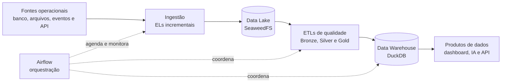
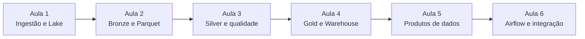

# Big Picture — Projeto Aurora Shop

## Uma plataforma de dados

**Carga horária:** 6 aulas de 2 horas  
**Projeto:** construção incremental de uma plataforma de Big Data local  
**Negócio:** comércio eletrônico


> “Nas próximas seis aulas. Vamos assumir a equipe de dados de uma empresa que cresceu e perdeu a visão integrada do próprio negócio. 
> Começaremos com dados espalhados em bancos, arquivos e APIs. 
> Ao final, teremos uma plataforma capaz de alimentar dashboards, modelos de inteligência artificial e outros sistemas.”


## 1. A história da Aurora Shop

A **Aurora Shop** é uma empresa fictícia de comércio eletrônico que cresceu rapidamente.

No início, a empresa tinha apenas um sistema de vendas. Conforme o negócio cresceu, novos setores, parceiros e canais começaram a produzir dados:

- o sistema comercial registra clientes, produtos, pedidos e pagamentos;
- o estoque envia catálogo e inventários em arquivos;
- o marketing cria campanhas;
- o site registra visualizações, pesquisas e carrinhos;
- a transportadora disponibiliza o acompanhamento das entregas.

A empresa possui muitos dados, mas eles estão espalhados em bancos, arquivos, eventos e APIs. Nenhuma fonte apresenta sozinha a jornada completa do cliente.

---

## 2. O problema de negócio

A direção da Aurora Shop quer responder perguntas como:

- quais produtos e categorias vendem mais;
- quais campanhas realmente geram vendas;
- em qual etapa os clientes abandonam a compra;
- quais produtos correm risco de falta de estoque;
- quais fornecedores estão associados a atrasos;
- quanto tempo existe entre pedido, pagamento e entrega;
- quais pedidos têm maior risco de atraso;
- quais produtos podem ser recomendados para cada cliente.

Hoje essas respostas exigiriam combinar manualmente fontes diferentes. Isso torna as análises lentas, frágeis e difíceis de reproduzir.

---

## 3. As necessidades da empresa

A Aurora Shop precisa de uma plataforma capaz de:

1. capturar dados de fontes diferentes;
2. armazenar os dados com histórico e rastreabilidade;
3. evitar duplicação durante novas execuções;
4. identificar problemas de qualidade;
5. integrar informações comerciais, comportamentais e logísticas;
6. criar métricas confiáveis para o negócio;
7. fornecer dados para dashboards;
8. preparar datasets para Machine Learning;
9. disponibilizar resultados para outros sistemas;
10. executar todo o processo de forma controlada e observável.

---

## 4. Por que não consultar diretamente os sistemas operacionais?

Conectar dashboards e modelos diretamente ao sistema de vendas, aos arquivos e à API da transportadora criaria alguns riscos:

- consultas analíticas poderiam prejudicar a operação;
- o resultado dependeria da disponibilidade de todas as fontes;
- mudanças em arquivos ou APIs poderiam interromper os relatórios;
- equipes diferentes poderiam calcular a mesma métrica de formas diferentes;
- não existiria uma cópia histórica central;
- treinamentos de IA seriam difíceis de reproduzir;
- a origem e as transformações dos dados seriam pouco transparentes.

A plataforma de dados separa a operação diária do uso analítico.

---

## 5. As fontes que vamos integrar

| Área | Dados | Origem |
| --- | --- | --- |
| Comercial | Clientes, fornecedores, produtos, pedidos e pagamentos | SQLite |
| Estoque | Catálogo e inventários | CSV |
| Marketing | Campanhas | JSON |
| Canais digitais | Eventos de navegação e compra | JSONL |
| Logística | Entregas | API REST |

Essa variedade permite trabalhar um dos pontos centrais de Big Data: dados importantes chegam em formatos e velocidades diferentes.

---

## 6. A plataforma que construiremos



### Visão da jornada

```text
Dados espalhados
    ↓
Dados capturados e preservados
    ↓
Dados organizados e classificados
    ↓
Dados confiáveis e integrados
    ↓
Informação pronta para análise
    ↓
Dashboard, inteligência artificial e serviços
```

---

## 7. Como o projeto gera valor

A plataforma não será construída apenas para armazenar arquivos. Ela sustentará três frentes de consumo.

### Decisão e acompanhamento

Dashboards permitirão acompanhar vendas, campanhas, estoque e entregas.

### Inteligência Artificial

Dados tratados poderão alimentar modelos de previsão de demanda, risco de atraso, abandono e recomendação de produtos.

### Integração com outros sistemas

Uma API analítica poderá disponibilizar métricas e resultados para aplicações da empresa.

---

## 8. Divisão das seis aulas



| Aula | Tema | Resultado principal |
| --- | --- | --- |
| **1** | Ingestão e Data Lake local | Fontes capturadas na Landing e sincronizadas com o SeaweedFS |
| **2** | Bronze, Parquet e particionamento | Dados brutos organizados em formato analítico |
| **3** | Silver, qualidade e classificação | Dados validados, padronizados, integrados e separados de registros problemáticos |
| **4** | Gold e Data Warehouse | Métricas de negócio e Warehouse dimensional no DuckDB |
| **5** | Produtos de dados | Dashboard, dataset de IA e API analítica |
| **6** | Orquestração e integração | Pipeline completo coordenado e monitorado pelo Airflow |

Cada aula utiliza o resultado da anterior. Não serão seis exercícios isolados, mas seis etapas do mesmo projeto.

---

## 9. Ferramentas da jornada

| Área | Ferramentas principais |
| --- | --- |
| Desenvolvimento | VS Code e Python |
| Fontes | SQLite, CSV, JSON, JSONL e API REST |
| Data Lake | SeaweedFS e protocolo S3 |
| Processamento | Python, PyArrow e Parquet |
| Qualidade | Python, SQL e validações de dados |
| Warehouse | DuckDB |
| Dashboard | Metabase |
| Machine Learning | scikit-learn |
| API analítica | FastAPI |
| Orquestração | Apache Airflow |

As ferramentas foram escolhidas para permitir uma experiência local e didática. Elas representam conceitos utilizados em plataformas maiores sem exigir infraestrutura de nuvem durante as aulas.

---

## 10. Resultado final esperado

Ao final das seis aulas, teremos construído:

```text
Aurora Shop Data Platform
├── ingestão de cinco fontes
├── carga incremental e idempotente
├── Data Lake local
├── camadas Bronze, Silver e Gold
├── controles de qualidade e quarentena
├── Data Warehouse analítico
├── dashboard
├── dataset e modelo inicial de IA
├── API analítica
└── pipeline orquestrado
```

O projeto mostrará que Big Data não é apenas armazenar um grande volume. É combinar dados variados, controlar sua chegada, melhorar sua qualidade e transformá-los em valor para o negócio.

---

## 11. Mensagem de abertura para a turma

> “Nas próximas seis aulas, não construiremos exercícios separados. Vamos assumir a equipe de dados de uma empresa que cresceu e perdeu a visão integrada do próprio negócio. Começaremos com dados espalhados em bancos, arquivos e APIs. Ao final, teremos uma plataforma capaz de alimentar dashboards, modelos de inteligência artificial e outros sistemas.”

## 12. Mensagem central da jornada

> “Uma plataforma de dados existe para transformar dados dispersos em informação confiável, reutilizável e capaz de gerar decisões.”
