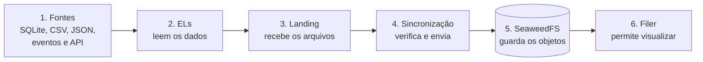
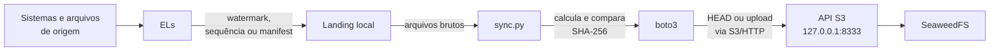
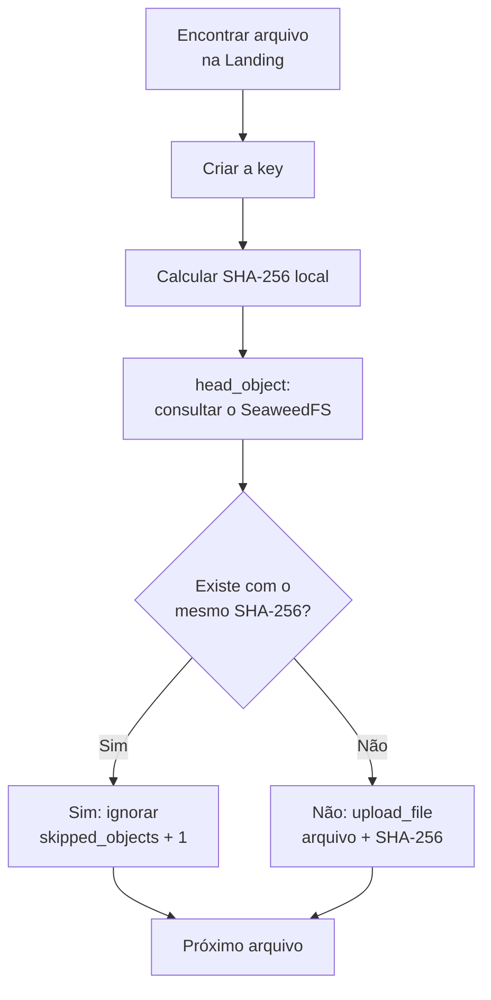
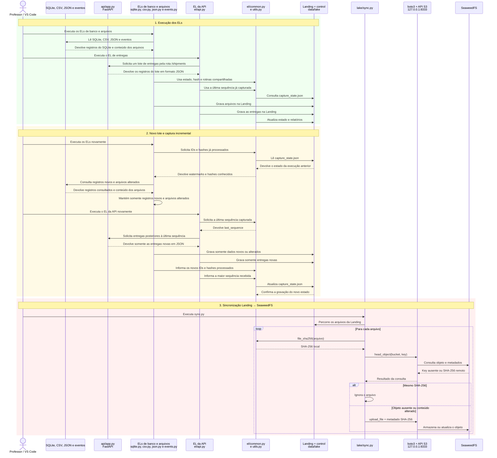

# Aula 4 — Ingestão de Dados e Data Lake

## Conteúdo técnico da aula

**Tema:** ingestão de dados heterogêneos, Landing Zone, Data Lake local, carga incremental e idempotência  
**Duração:** 2 horas  
**Formato:** discussão técnica guiada  
**Cenário:** uma empresa de comércio eletrônico precisa reunir dados de vendas, catálogo, estoque, campanhas, eventos de navegação e entregas  
**Ambiente:** Windows, VS Code, Python, SQLite, FastAPI e SeaweedFS, sem necessidade de AWS ou internet durante a aula

---

## 1. Resultado esperado da aula

Ao final, o aluno deverá ser capaz de:

1. explicar por que uma organização precisa integrar dados de fontes diferentes;
2. diferenciar banco transacional, arquivo, API e armazenamento de objetos;
3. explicar o que são **EL**, **ETL** e **ELT**;
4. identificar a função da **Landing Zone** em um Data Lake;
5. executar uma ingestão a partir de SQLite, CSV, JSON, JSON Lines e API REST;
6. explicar **watermark**, **manifest**, **checksum**, **paginação** e **idempotência**;
7. distinguir carga completa de carga incremental;
8. explicar a função do SeaweedFS, do protocolo S3 e do boto3;
9. compreender como esta aula se conecta às futuras camadas Bronze, Silver e Gold;
10. reconhecer as limitações deste laboratório em relação a uma plataforma distribuída de produção.

> **Mensagem central:** nesta aula não estamos apenas copiando arquivos. Estamos criando uma forma controlada, repetível e auditável de trazer dados de diferentes origens para um ponto central.

---

## 2. Arquitetura do laboratório



### Caminho do dado

```text
Fonte → extração → carga na Landing → controle da execução → sincronização S3 → SeaweedFS → futuras transformações
```

---

## 3. Ferramentas utilizadas

### 3.1 VS Code

O **Visual Studio Code** é a IDE usada para abrir o projeto, visualizar o código e executar tarefas prontas. O arquivo `.vscode/tasks.json` transforma comandos longos em opções como `EL 01 - SQLite` e `52. Sincronizar Landing com SeaweedFS`.

**Termo técnico — IDE:** *Integrated Development Environment*, ou ambiente integrado de desenvolvimento. Reúne editor, terminal, depurador e extensões.

### 3.2 Python

Python implementa os capturadores, a API, a inspeção e a sincronização. Grande parte da aula usa apenas sua biblioteca padrão:

- `sqlite3` para consultar o banco;
- `json` para serializar e desserializar dados;
- `urllib` para consumir a API;
- `hashlib` para calcular SHA-256;
- `pathlib` para trabalhar com caminhos.

### 3.3 Ambiente virtual

O `.venv` é um **ambiente virtual Python**. Ele isola as bibliotecas do projeto e evita conflito com pacotes instalados globalmente.

### 3.4 Wheelhouse

O `wheelhouse` é uma pasta com pacotes Python no formato `.whl`. Funciona como um estoque local de instaladores. O `pip` pode instalar as dependências com `--no-index`, sem consultar a internet ou o PyPI.

**Termos técnicos:**

- **pip:** gerenciador de pacotes do Python;
- **PyPI:** repositório público de pacotes Python;
- **wheel (`.whl`):** pacote Python já preparado para instalação;
- **dependência:** biblioteca externa necessária para a aplicação funcionar.

### 3.5 SQLite

SQLite é um banco de dados relacional armazenado em um único arquivo: `commerce.db`. Ele representa o sistema transacional da empresa.

**Termos técnicos:**

- **banco relacional:** organiza os dados em tabelas, linhas, colunas e relacionamentos;
- **SQL:** linguagem usada para consultar e modificar bancos relacionais;
- **OLTP:** *Online Transaction Processing*, sistema otimizado para operações do dia a dia, como cadastrar pedidos e pagamentos;
- **chave primária:** identificador único de um registro, como `order_id`.

### 3.6 CSV, JSON e JSON Lines

**CSV** representa dados tabulares. Cada linha normalmente é um registro e as colunas são separadas por delimitadores.

**JSON** representa documentos com objetos, listas e estruturas aninhadas.

**JSON Lines ou JSONL** mantém um documento JSON completo por linha. Isso permite ler e gravar registros progressivamente sem carregar um grande vetor JSON inteiro na memória.

Exemplo JSONL:

```json
{"event_id": 1, "event_type": "page_view"}
{"event_id": 2, "event_type": "add_to_cart"}
```

### 3.7 FastAPI e Uvicorn

**FastAPI** é o framework usado para criar a API de entregas. **Uvicorn** é o servidor que recebe as requisições HTTP e executa a aplicação.

URLs usadas:

- documentação Swagger: <http://127.0.0.1:8001/docs>
- saúde da API: <http://127.0.0.1:8001/health>
- entregas: <http://127.0.0.1:8001/shipments?page=1&limit=100>

**Termos técnicos:**

- **API:** interface pela qual um sistema oferece dados ou operações a outro;
- **REST:** estilo de API baseado em recursos, URLs e métodos HTTP;
- **endpoint:** endereço de uma operação da API;
- **HTTP 200:** resposta de sucesso;
- **HTTP 404:** recurso não encontrado;
- **HTTP 503:** serviço temporariamente indisponível;
- **query parameter:** parâmetro enviado na URL, como `page=1`;
- **paginação:** divisão de muitos registros em páginas menores;
- **Swagger/OpenAPI:** documentação interativa do contrato da API.

### 3.8 SeaweedFS: onde guardaremos os dados

#### Começando pelo problema

Depois que cada EL lê uma fonte, ele precisa colocar o resultado em algum lugar.

Primeiro, os arquivos são gravados nesta pasta do projeto:

```text
data/lake/landing
```

Essa pasta é chamada de **Landing**.

**Landing significa área de chegada.** É o primeiro lugar onde colocamos os dados que acabaram de ser capturados. Eles ainda não foram limpos, unidos ou preparados para análise.

Podemos pensar na Landing como a área de recebimento de um depósito:

```text
Fonte de dados → área de recebimento → armazenamento central
                    Landing             SeaweedFS
```

A Landing é útil, mas ainda é apenas uma pasta local do projeto. Para representar um Data Lake, vamos copiar seus arquivos para o SeaweedFS.

#### O que é um Data Lake?

Um **Data Lake** é um local central onde podemos guardar dados de vários tipos.

No nosso projeto, ele recebe:

- tabelas do SQLite exportadas como JSONL;
- arquivos CSV de catálogo e estoque;
- arquivos JSON de campanhas;
- eventos em JSONL;
- entregas capturadas da API.

O Data Lake ainda não é o dashboard nem o Data Warehouse. Ele é o lugar onde reunimos e preservamos os dados para que possam ser trabalhados nas próximas etapas.

#### O que é o SeaweedFS?

**SeaweedFS é o programa que usaremos para representar esse armazenamento central dentro do computador.**

Ele recebe os arquivos da Landing, guarda o conteúdo no disco e permite que os arquivos sejam consultados novamente.

Nesta aula:

```text
Landing local                     SeaweedFS
data/lake/landing                 armazenamento central
        │                                  ▲
        └────── sincronização ─────────────┘
```

O SeaweedFS roda localmente. Não precisamos contratar um serviço na nuvem e não precisamos de uma conta AWS.

#### Uma analogia simples

Imagine um depósito:

| No depósito | No nosso projeto |
| --- | --- |
| Área onde as mercadorias chegam | Landing |
| Depósito central | Data Lake |
| Sistema que administra o depósito | SeaweedFS |
| Uma área identificada dentro do depósito | Bucket |
| Uma caixa armazenada | Objeto |
| Etiqueta que informa onde está a caixa | Key |
| Funcionário que leva a caixa até o depósito | boto3 |

Essa analogia serve apenas para apresentar os papéis. Agora podemos definir os nomes técnicos com mais precisão.

#### O que o SeaweedFS inicia?

Quando executamos o SeaweedFS no modo `mini`, ele inicia em uma única máquina as partes necessárias para o laboratório.

| Componente | Explicação simples |
| --- | --- |
| **Master** | Coordena o armazenamento, como o gerente do depósito |
| **Volume Server** | Guarda o conteúdo dos arquivos no disco |
| **Filer** | Permite visualizar os dados como pastas e arquivos |
| **S3** | É a entrada usada pelos programas para enviar e consultar arquivos |

Não precisamos operar cada componente separadamente. O modo `mini` inicia todos eles.

#### O que veremos no navegador?

Use o Filer para navegar pelos dados:

<http://127.0.0.1:8888/buckets/curso-bigdata/>

O Filer funciona como um explorador de arquivos do SeaweedFS. Depois das capturas, veremos grupos como:

```text
landing/
├── sqlite/
├── csv/
├── json/
├── events/
└── api/
```

A porta `8333` não é uma página para navegação. Ela é usada pelos programas que conversam com o SeaweedFS. Portanto, abrir `http://127.0.0.1:8333` diretamente no navegador pode mostrar `AccessDenied`, e isso não significa que o serviço falhou.

#### Onde os dados ficam fisicamente?

O SeaweedFS grava os dados deste laboratório em:

```text
D:\dev\BIGDATA\seaweed-data-working-copy
```

Quando pressionamos `Ctrl+C`, o programa para de funcionar, mas os arquivos não são apagados. Ao iniciar novamente com o mesmo diretório, os dados continuam disponíveis.

### 3.9 S3, bucket, objeto e key

#### O que é S3 (Simple Storage Service)?

**S3 é uma forma padronizada de programas enviarem, consultarem e listarem arquivos em um armazenamento de objetos.**

A AWS criou originalmente essa interface, mas outros programas também conseguem oferecê-la. O SeaweedFS é um deles.

Nesta aula:

```text
S3 é a forma de comunicação SeaweedFS é o programa que recebe e guarda os dados
```

Usar S3 não significa que estamos enviando arquivos para a AWS.

#### O que é um bucket?

Um **bucket** é um contêiner usado para manter um conjunto de objetos.

Nosso bucket chama-se:

```text
curso-bigdata
```

Podemos imaginar o bucket como uma área identificada dentro do depósito. Todos os dados desta aula serão colocados nessa área.

#### O que é um objeto?

Um **objeto** é um arquivo armazenado no bucket.

Quando enviamos um arquivo de pedidos, ele passa a ser um objeto dentro de `curso-bigdata`.

Um objeto possui:

- o conteúdo do arquivo;
- um nome completo;
- algumas informações adicionais sobre o conteúdo.

#### O que é uma key?

A **key** é o nome completo que identifica o objeto dentro do bucket.

Exemplo:

```text
landing/sqlite/orders/orders_20260930T232828Z.jsonl
```

Podemos ler essa key assim:

```text
landing   → veio da área de chegada
sqlite    → veio do banco SQLite
orders    → contém pedidos
arquivo   → resultado de uma execução
```

#### O que é um prefixo?

Um **prefixo** é apenas o começo compartilhado por várias keys.

Por exemplo:

```text
landing/sqlite/orders/
```

é o prefixo de todos os objetos de pedidos extraídos do SQLite.

O Filer mostra esses prefixos como se fossem pastas. Essa visualização ajuda a navegar, mesmo que o S3 trate cada objeto pelo nome completo da key.

#### Exemplo completo

```text
Bucket: curso-bigdata

Key:
landing/sqlite/orders/orders_20260930T232828Z.jsonl

Objeto:
o conteúdo do arquivo de pedidos armazenado nessa key
```

### 3.10 boto3: como o Python envia os arquivos

#### O que é boto3?

**boto3 é a biblioteca Python que usamos para conversar com a entrada S3 do SeaweedFS.**

Ele funciona como o mensageiro entre nosso script e o armazenamento:

```text
sync.py → boto3 → SeaweedFS → dados no disco
```

O boto3 não decide quais dados são corretos e não faz transformações. Ele apenas executa operações como:

- verificar se o bucket está disponível;
- consultar se um objeto já existe;
- enviar um objeto;
- listar os objetos armazenados.

#### Por que aparecem variáveis com o nome AWS?

O boto3 espera nomes de configuração que nasceram no ecossistema AWS:

```text
AWS_ACCESS_KEY_ID
AWS_SECRET_ACCESS_KEY
```

No laboratório, esses valores são apenas credenciais locais usadas pelo SeaweedFS.

O endereço que define o destino é:

```text
S3_ENDPOINT_URL=http://127.0.0.1:8333
```

Como o endereço aponta para `127.0.0.1`, a comunicação permanece dentro do próprio computador.

#### Como funciona nossa sincronização?

O arquivo `bigdata_pipeline/lake/sync.py` realiza estes passos:

1. procura os arquivos dentro de `data/lake/landing`;
2. calcula uma impressão digital de cada arquivo;
3. verifica se o mesmo conteúdo já está no SeaweedFS;
4. envia apenas arquivos novos ou alterados;
5. informa quantos arquivos foram enviados e quantos foram ignorados.

A impressão digital é chamada de **SHA-256**. Ela permite comparar o conteúdo sem precisar abrir e comparar linha por linha.

#### Primeira sincronização

Na primeira execução, o bucket está vazio:

```text
Landing: 6 arquivos do SQLite
Bucket:  0 objetos

Resultado:
uploaded_objects = 6
skipped_objects  = 0
```

Todos os seis arquivos precisam ser enviados.

#### Sincronização seguinte

Depois, capturamos seis arquivos CSV. Os arquivos SQLite já estão armazenados:

```text
Landing: 6 SQLite + 6 CSV
Bucket:  6 objetos SQLite

Resultado:
uploaded_objects = 6
skipped_objects  = 6
```

Isso significa:

- os seis CSVs novos foram enviados;
- os seis arquivos SQLite foram reconhecidos e não foram enviados novamente.

Portanto, `skipped_objects` não representa erro. Ele mostra que o sistema evitou trabalho duplicado.

#### Resumo dos termos

| Termo | Explicação curta |
| --- | --- |
| **Landing** | Pasta onde os dados capturados chegam primeiro |
| **Data Lake** | Local central que reúne dados de diferentes tipos |
| **SeaweedFS** | Programa que representa o Data Lake local |
| **S3** | Forma padronizada de conversar com o armazenamento |
| **Bucket** | Contêiner lógico que reúne os objetos da aula |
| **Objeto** | Arquivo armazenado no bucket |
| **Key** | Nome completo do objeto |
| **Prefixo** | Parte inicial compartilhada por várias keys |
| **boto3** | Biblioteca Python que conversa usando S3 |
| **SHA-256** | Impressão digital usada para verificar se o conteúdo mudou |

---
## 4. Como funcionam os ELs desta aula

**EL** significa *Extract and Load* — extrair e carregar.

Cada módulo realiza três ações:

1. lê os dados de uma origem;
2. grava o resultado na Landing;
3. registra o que já foi capturado.

Ainda não corrigimos, deduplicamos ou combinamos os dados. Essas transformações serão realizadas em aulas futuras.

### 4.1 Código compartilhado pelos ELs

Antes de analisar cada fonte, precisamos entender o arquivo:

```text
bigdata_pipeline/el/common.py
```

Ele evita que cada EL tenha que implementar novamente a criação da Landing, a leitura do estado e o registro da execução.

#### A classe `CaptureRun`

```python
@dataclass
class CaptureRun:
    # Pasta que contém as fontes.
    source: Path

    # Pasta que representa o Lake local.
    lake: Path

    # Usada somente pelo EL da API.
    api_url: str | None = None

    def __post_init__(self) -> None:
        # Registra o horário da execução em UTC.
        self.started_at = datetime.now(timezone.utc)

        # Cria um identificador como 20260930T232828Z.
        self.run_id = self.started_at.strftime("%Y%m%dT%H%M%SZ")

        # Define a área onde os dados capturados serão gravados.
        self.landing = self.lake / "landing"

        # Define a área dos arquivos de controle.
        control = self.lake / "control"

        # Cria as pastas caso ainda não existam.
        control.mkdir(parents=True, exist_ok=True)
        self.landing.mkdir(parents=True, exist_ok=True)

        # Carrega a memória das capturas anteriores.
        state_path = control / "capture_state.json"
        self.state = read_json(state_path, {})
```

O arquivo `capture_state.json` funciona como a memória do pipeline. Nele ficam os últimos IDs capturados e os hashes dos arquivos já conhecidos.

#### Finalização de uma execução

```python
def finish(self, summary: dict) -> None:
    # Registra quando a execução terminou.
    finished_at = datetime.now(timezone.utc)

    # Acrescenta identificação e horários ao resultado.
    summary["run_id"] = self.run_id
    summary["started_at"] = self.started_at.isoformat()
    summary["finished_at"] = finished_at.isoformat()

    # Atualiza a data da última execução no estado.
    self.state["last_run"] = summary["finished_at"]

    control = self.lake / "control"

    # Salva a memória que será usada na próxima captura.
    write_json(control / "capture_state.json", self.state)

    # Cria um relatório específico desta execução.
    write_json(control / f"run_{self.run_id}.json", summary)

    # Exibe o mesmo resumo no terminal.
    print(json.dumps(summary, ensure_ascii=False, indent=2))
```

Temos dois arquivos com funções diferentes:

- `capture_state.json`: memória utilizada pela próxima execução;
- `run_<run_id>.json`: histórico do que aconteceu em uma execução.

#### Função compartilhada por CSV, JSON e eventos

```python
def capture_directory(
    source_dir: Path,          # Pasta que será lida.
    target_dir: Path,          # Pasta de destino na Landing.
    state: dict,               # Estado geral da captura.
    state_key: str,            # Nome do manifest dentro do estado.
    extensions: set[str] | None = None,
) -> dict[str, int]:

    # Obtém o manifest existente ou cria um manifest vazio.
    manifest = state.setdefault(state_key, {})

    # Contadores que aparecerão no resultado.
    copied = 0
    skipped = 0
    bytes_copied = 0

    # Se a fonte não existir, não há nada para capturar.
    if not source_dir.exists():
        return {"copied": 0, "skipped": 0, "bytes": 0}

    # Percorre todos os arquivos, inclusive em subpastas.
    for source_path in sorted(
        path for path in source_dir.rglob("*") if path.is_file()
    ):
        # Ignora extensões que não pertencem a este EL.
        if extensions is not None:
            if source_path.suffix.lower() not in extensions:
                continue

        # Mantém somente o caminho relativo à pasta de origem.
        relative = source_path.relative_to(source_dir).as_posix()

        # Calcula a impressão digital do conteúdo.
        checksum = file_sha256(source_path)

        # Se caminho e conteúdo já forem conhecidos, ignora o arquivo.
        if manifest.get(relative) == checksum:
            skipped += 1
            continue

        # Reproduz na Landing a organização da origem.
        destination = target_dir / relative
        destination.parent.mkdir(parents=True, exist_ok=True)

        # Copia o arquivo e preserva seus metadados básicos.
        shutil.copy2(source_path, destination)

        # Atualiza o manifest com o novo hash.
        manifest[relative] = checksum

        copied += 1
        bytes_copied += source_path.stat().st_size

    # Esse dicionário será exibido no terminal.
    return {
        "copied": copied,
        "skipped": skipped,
        "bytes": bytes_copied,
    }
```

Essa função explica por que CSV, JSON e eventos apresentam resultados como:

```json
{
  "copied": 6,
  "skipped": 0,
  "bytes": 90656
}
```

- `copied`: quantidade de arquivos novos ou alterados;
- `skipped`: quantidade de arquivos cujo conteúdo não mudou;
- `bytes`: tamanho realmente copiado nessa execução.

### 4.2 EL SQLite — registros novos por ID

**Arquivo:** `bigdata_pipeline/el/sqlite.py`  
**Origem:** `data/source/db/commerce.db`  
**Destino:** `data/lake/landing/sqlite/<tabela>/`

#### Tabelas e chaves

```python
TABLE_KEYS = {
    # tabela          coluna usada como ponto de controle
    "customers":      "customer_id",
    "suppliers":      "supplier_id",
    "products":       "product_id",
    "orders":         "order_id",
    "order_items":    "item_id",
    "payments":       "payment_id",
}
```

Cada tabela possui uma coluna numérica crescente. O maior valor já capturado é chamado de **watermark**.

#### Função comentada

```python
def capture(run: CaptureRun) -> dict[str, int]:
    # Caminho principal esperado para o banco.
    db_path = run.source / "sqlite" / "commerce.db"

    # A base da aula está em source/db.
    if not db_path.exists():
        db_path = run.source / "db" / "commerce.db"

    # Interrompe com uma mensagem clara se o banco não existir.
    if not db_path.exists():
        raise SystemExit(f"Banco SQLite não encontrado: {db_path}")

    # Abre a conexão com o banco.
    connection = sqlite3.connect(db_path)

    # Faz cada linha se comportar como um dicionário.
    connection.row_factory = sqlite3.Row

    # Recupera os últimos IDs capturados de cada tabela.
    database_state = run.state.setdefault(
        "database_watermarks",
        {},
    )

    result = {}

    try:
        # Executa a mesma lógica para todas as tabelas.
        for table, key in TABLE_KEYS.items():

            # Se nunca capturamos a tabela, começa em zero.
            watermark = int(database_state.get(table, 0))

            # Busca somente IDs posteriores ao watermark.
            rows = connection.execute(
                f"SELECT * FROM {table} "
                f"WHERE {key} > ? "
                f"ORDER BY {key}",
                (watermark,),
            )

            # Cada tabela recebe uma pasta própria.
            output_dir = run.landing / "sqlite" / table
            output_dir.mkdir(parents=True, exist_ok=True)

            # O nome contém o identificador da execução.
            output_path = (
                output_dir
                / f"{table}_{run.run_id}.jsonl"
            )

            count = 0
            maximum = watermark

            # Abre o arquivo de saída.
            with output_path.open(
                "w",
                encoding="utf-8",
            ) as stream:

                # Percorre os registros encontrados.
                for row in rows:
                    document = dict(row)

                    # Grava um documento JSON por linha.
                    stream.write(
                        json.dumps(
                            document,
                            ensure_ascii=False,
                        )
                        + "\n"
                    )

                    # Guarda o maior ID desta execução.
                    maximum = max(
                        maximum,
                        int(document[key]),
                    )
                    count += 1

            # Evita deixar um arquivo vazio na Landing.
            if count == 0:
                output_path.unlink()
            else:
                # Atualiza o watermark somente se houve dados.
                database_state[table] = maximum

            # Informa quantas linhas vieram da tabela.
            result[table] = count

    finally:
        # A conexão é fechada mesmo se ocorrer um erro.
        connection.close()

    return result
```

#### Consulta central

A instrução SQL é equivalente a:

```sql
SELECT *
FROM orders
WHERE order_id > 10000
ORDER BY order_id;
```

Se o watermark de pedidos é 10.000, somente pedidos com IDs maiores serão lidos.

#### Como interpretar o resultado

```json
{
  "sqlite": {
    "customers": 1000,
    "suppliers": 30,
    "products": 500,
    "orders": 10000,
    "order_items": 29891,
    "payments": 10000
  }
}
```

Na primeira captura, todas as linhas possuem IDs maiores que zero. Em uma segunda execução sem dados novos, os valores devem ser zero e nenhum JSONL vazio deve permanecer.

#### Limitação

O maior ID encontra novas inserções, mas não identifica sozinho uma alteração feita em um pedido antigo. Para isso, um sistema de produção poderia utilizar `updated_at` ou CDC.

### 4.3 EL CSV — arquivos novos ou alterados

**Arquivo:** `bigdata_pipeline/el/csv.py`  
**Origem:** arquivos CSV em `data/source/files/`  
**Destino:** `data/lake/landing/csv/`

#### Código comentado

```python
# Importa a estrutura da execução, a função compartilhada
# de arquivos e o inicializador do comando.
from .common import (
    CaptureRun,
    capture_directory,
    run_single_capture,
)


def capture(run: CaptureRun) -> dict[str, int]:
    # Algumas versões do projeto poderiam usar source/csv.
    source_dir = run.source / "csv"

    # Nesta aula os CSVs estão em source/files.
    if not source_dir.exists():
        source_dir = run.source / "files"

    # Reutiliza o algoritmo baseado em SHA-256.
    return capture_directory(
        source_dir,                  # Pasta de origem.
        run.landing / "csv",         # Destino na Landing.
        run.state,                   # Estado compartilhado.
        "file_manifest",             # Manifest de arquivos.
        extensions={".csv"},         # Captura somente CSV.
    )


def main() -> None:
    # Cria os argumentos, a CaptureRun e imprime o resumo.
    run_single_capture(
        "csv",
        capture,
        "Captura incremental dos arquivos CSV.",
    )
```

O código específico do CSV é pequeno porque a lógica de hash, cópia e manifest está centralizada em `capture_directory()`.

#### Como interpretar o resultado

```json
{
  "csv": {
    "copied": 6,
    "skipped": 0,
    "bytes": 90656
  }
}
```

Na primeira execução, foram copiados o catálogo e cinco snapshots de inventário. Se o comando for repetido sem alterações:

```json
{
  "csv": {
    "copied": 0,
    "skipped": 6,
    "bytes": 0
  }
}
```

### 4.4 EL JSON — campanhas de marketing

**Arquivo:** `bigdata_pipeline/el/json.py`  
**Origem:** arquivos JSON em `data/source/files/`  
**Destino:** `data/lake/landing/json/`

#### Código comentado

```python
from .common import (
    CaptureRun,
    capture_directory,
    run_single_capture,
)


def capture(run: CaptureRun) -> dict[str, int]:
    # Procura primeiro uma pasta exclusiva para JSON.
    source_dir = run.source / "json"

    # Na base da aula, campanhas.json está em source/files.
    if not source_dir.exists():
        source_dir = run.source / "files"

    # Usa o mesmo manifest dos arquivos,
    # mas filtra somente a extensão .json.
    return capture_directory(
        source_dir,
        run.landing / "json",
        run.state,
        "file_manifest",
        extensions={".json"},
    )


def main() -> None:
    run_single_capture(
        "json",
        capture,
        "Captura incremental dos arquivos JSON.",
    )
```

CSV e JSON usam a mesma função compartilhada, mas filtros e destinos diferentes. Isso evita duplicação de código e mantém cada domínio separado na Landing.

#### Como interpretar o resultado

```json
{
  "json": {
    "copied": 1,
    "skipped": 0,
    "bytes": 1834
  }
}
```

O único arquivo JSON da fonte é `campaigns.json`. Uma segunda execução sem mudança apresentará `copied: 0` e `skipped: 1`.

### 4.5 EL de eventos — JSONL capturado em lote

**Arquivo:** `bigdata_pipeline/el/events.py`  
**Origem:** `data/source/events/`  
**Destino:** `data/lake/landing/events/`

#### Código comentado

```python
from .common import (
    CaptureRun,
    capture_directory,
    run_single_capture,
)


def capture(run: CaptureRun) -> dict[str, int]:
    return capture_directory(
        run.source / "events",       # Arquivos diários.
        run.landing / "events",      # Destino separado.
        run.state,                   # Estado compartilhado.
        "event_manifest",            # Manifest dos eventos.
    )


def main() -> None:
    run_single_capture(
        "events",
        capture,
        "Captura incremental dos eventos JSON Lines.",
    )
```

Não foi informado um filtro de extensão. Portanto, todos os arquivos presentes na pasta de eventos são considerados.

O `event_manifest` é separado do `file_manifest`. Isso deixa claro que os eventos representam outro domínio da plataforma.

#### Como interpretar o resultado

```json
{
  "events": {
    "copied": 30,
    "skipped": 0,
    "bytes": 23459114
  }
}
```

Foram encontrados 30 arquivos diários.

Apesar do nome “eventos”, esta captura não é streaming. Ela executa uma carga **batch**, copiando arquivos completos. Em streaming real, poderíamos usar Kafka e offsets.

### 4.6 EL da API — paginação e sequência

**Arquivo:** `bigdata_pipeline/el/api.py`  
**Origem:** `GET http://127.0.0.1:8001/shipments`  
**Destino:** `data/lake/landing/api/shipments/`

#### Código comentado

```python
def capture(run: CaptureRun) -> dict[str, int]:
    # Recupera o estado específico da API.
    api_state = run.state.setdefault("api", {})

    # A leitura começa na primeira página.
    page = 1

    # A API permite até mil itens por página.
    limit = 1_000

    count = 0

    # Recupera a última sequência capturada.
    previous_sequence = int(
        api_state.get("last_sequence", 0)
    )

    # O maior valor começa no checkpoint anterior.
    maximum_sequence = previous_sequence

    # Define onde o JSONL da execução será gravado.
    output_dir = (
        run.landing
        / "api"
        / "shipments"
    )
    output_dir.mkdir(parents=True, exist_ok=True)

    output_path = (
        output_dir
        / f"shipments_{run.run_id}.jsonl"
    )

    # Abre um único arquivo para toda a execução.
    with output_path.open(
        "w",
        encoding="utf-8",
    ) as stream:

        # Continua até a API informar que não há outra página.
        while True:
            parameters = {
                "page": page,
                "limit": limit,
                "after_sequence": previous_sequence,
            }

            # Monta a URL com os parâmetros codificados.
            url = (
                f"{run.api_url.rstrip('/')}/shipments?"
                f"{urllib.parse.urlencode(parameters)}"
            )

            # Faz a requisição com limite de 30 segundos.
            with urllib.request.urlopen(
                url,
                timeout=30,
            ) as response:
                payload = json.load(response)

            # Grava os itens recebidos nesta página.
            for item in payload["items"]:
                stream.write(
                    json.dumps(
                        item,
                        ensure_ascii=False,
                    )
                    + "\n"
                )

                # Obtém a sequência da entrega.
                source_sequence = int(
                    item.get("source_sequence")
                    or item["shipment_id"].rsplit("-", 1)[-1]
                )

                # Mantém a maior sequência recebida.
                maximum_sequence = max(
                    maximum_sequence,
                    source_sequence,
                )
                count += 1

            # Sai quando a resposta informa que acabou.
            if not payload["has_more"]:
                break

            # Caso contrário, solicita a próxima página.
            page += 1

    # Não mantém um arquivo vazio.
    if count == 0:
        output_path.unlink()

    # Atualiza o checkpoint somente quando recebeu dados.
    elif maximum_sequence:
        api_state["last_sequence"] = maximum_sequence

    return {
        "rows": count,
        "pages": page if count else 0,
    }
```

#### Como interpretar o resultado

```json
{
  "api": {
    "rows": 10000,
    "pages": 10
  }
}
```

O cálculo é:

```text
10.000 entregas ÷ 1.000 por página = 10 páginas
```

As dez páginas são consolidadas em um único arquivo JSONL da execução.

Na próxima captura, `after_sequence` recebe a última sequência já conhecida. Se não existirem novas entregas, o arquivo vazio será removido e o resultado será:

```json
{
  "api": {
    "rows": 0,
    "pages": 0
  }
}
```

### 4.7 Comparação dos cinco ELs

| EL | O que controla a incrementalidade? | O que é gravado? |
| --- | --- | --- |
| SQLite | Maior ID por tabela | Um JSONL por tabela e execução |
| CSV | SHA-256 por caminho | Cópia dos CSVs novos ou alterados |
| JSON | SHA-256 por caminho | Cópia dos JSONs novos ou alterados |
| Eventos | SHA-256 por arquivo | Cópia dos arquivos diários |
| API | Maior `source_sequence` | Um JSONL por execução |

A escolha da estratégia depende do tipo de fonte:

- banco consultável: watermark;
- arquivo: hash do conteúdo;
- API ordenada: sequência e paginação.

### 4.8 Resultado dos ELs: organização da Landing

Depois que os cinco ELs são executados, os arquivos capturados ficam organizados na Landing de acordo com sua origem:

```text
data/lake/landing/
├── sqlite/
├── csv/
├── json/
├── events/
├── api/
└── classroom/
```

A Landing é a área de chegada usada nesta prática. Ela mantém os dados recebidos antes das futuras transformações e permite verificar separadamente o resultado de cada EL.

A visão completa de Data Lake, Bronze, Silver, Gold e Warehouse está no arquivo `00_BIG_PICTURE_PROJETO_6_AULAS.md`. Nesta aula, o objetivo é comprovar que cada fonte chegou corretamente à Landing, que o estado da captura foi registrado e que os ELs podem ser executados novamente sem duplicar os mesmos dados.

---
## 5. Incrementalidade e idempotência

### 5.1 O problema que queremos evitar

Na primeira execução, o pipeline precisa capturar os arquivos separados na landing criada. Porem nas execuções seguintes, repetir todo o trabalho seria caro e poderia gerar cópias desnecessárias.

```text
Primeira execução:
10.000 pedidos existentes → processar 10.000

Execução seguinte:
100 pedidos novos

Carga completa:     processar 10.100
Carga incremental: processar somente 100
```

Uma **carga completa** lê novamente toda a fonte. Uma **carga incremental** procura apenas dados novos ou alterados.

Neste projeto, cada parte usa um controle adequado:

| Origem ou transição | Como identifica novidades |
| --- | --- |
| SQLite → Landing | Maior ID processado por tabela |
| API → Landing | Maior `source_sequence` processado |
| CSV, JSON e eventos → Landing | Hash registrado no manifest |
| Landing → SeaweedFS | Hash local comparado ao metadado remoto |

Existem, portanto, dois controles encadeados:



O foco deste item é a segunda transição: **como o código leva os arquivos da Landing para o SeaweedFS sem reenviar o que já está armazenado**.

---

### 5.2 Watermark, manifest e hash

#### Watermark

**Watermark** é o maior valor já processado de um campo ordenável.

```json
{
  "database_watermarks": {
    "orders": 10000
  },
  "api": {
    "last_sequence": 10000
  }
}
```

Isso informa que:

- pedidos com ID até 10.000 já foram capturados;
- entregas com sequência até 10.000 já foram capturadas;
- a próxima execução deve procurar valores maiores.

O watermark é usado pelos ELs na transição **fonte → Landing**. Ele não é usado pelo `sync.py`.

#### Manifest

**Manifest** é um registro dos arquivos já conhecidos pelo pipeline. Neste projeto, ele associa o caminho de um arquivo ao seu SHA-256.

```json
{
  "file_manifest": {
    "catalog.csv": "a91f...e203",
    "campaigns.json": "5b31...9f08"
  }
}
```

Os ELs de CSV, JSON e eventos usam o manifest para decidir se um arquivo precisa ser copiado para a Landing.

O `sync.py` não consulta esse manifest. Para enviar ao SeaweedFS, ele verifica diretamente os metadados do objeto remoto.

#### Checksum e SHA-256

Um **checksum** é um resumo calculado a partir do conteúdo. O SHA-256 é o algoritmo utilizado neste projeto.

```text
conteúdo do arquivo
        ↓ SHA-256
45f1a6...9c803b
```

O resultado funciona como uma impressão digital:

- mesmo conteúdo → mesmo SHA-256;
- conteúdo alterado → SHA-256 diferente.

---

### 5.3 O código essencial da sincronização

Não precisamos apresentar o `sync.py` inteiro durante a aula. Para compreender a incrementalidade e a idempotência entre a Landing e o SeaweedFS, os alunos precisam acompanhar apenas duas partes:

1. a função que verifica se o conteúdo já está armazenado;
2. o trecho que percorre a Landing e decide entre ignorar ou enviar.

O arquivo completo, comentado, continua disponível em:

```text
bigdata_pipeline/lake/sync.py
```

#### Parte 1 — verificar se o objeto já existe com o mesmo conteúdo

```python
def object_has_hash(
    client,         # Cliente boto3 conectado ao SeaweedFS.
    bucket: str,    # Bucket em que procuraremos o objeto.
    key: str,       # Nome completo do objeto no bucket.
    checksum: str,  # SHA-256 do arquivo existente na Landing.
) -> bool:
    try:
        # Consulta apenas os metadados do objeto.
        # O arquivo armazenado não precisa ser baixado.
        response = client.head_object(
            Bucket=bucket,
            Key=key,
        )

    except ClientError as exc:
        # Lê o código do erro devolvido pela API S3.
        code = str(
            exc.response.get("Error", {}).get("Code", "")
        )

        # Esses códigos indicam que a key ainda não existe.
        # False informa que será necessário fazer o upload.
        if code in {"404", "NoSuchKey", "NotFound"}:
            return False

        # Outros erros, como conexão ou credencial,
        # precisam ser apresentados ao usuário.
        raise

    # Recupera o SHA-256 salvo no upload anterior.
    remote_checksum = (
        response
        .get("Metadata", {})
        .get("sha256")
    )

    # True: mesma key e mesmo conteúdo.
    # False: conteúdo novo ou alterado.
    return remote_checksum == checksum
```

A função responde a uma pergunta:

> “A mesma key já existe no SeaweedFS com o mesmo SHA-256?”

| Resposta | Significado | Decisão |
| --- | --- | --- |
| `True` | O conteúdo já está armazenado | Ignorar |
| `False` | O objeto não existe ou mudou | Enviar |

#### Parte 2 — percorrer a Landing e tomar a decisão

```python
# Percorre a Landing e todas as suas subpastas.
for path in sorted(
    item
    for item in source.rglob("*")
    if item.is_file()
):
    # Exemplo de arquivo encontrado:
    # data/lake/landing/sqlite/orders/orders_001.jsonl

    # Remove a raiz da Landing e preserva o caminho interno.
    relative_path = (
        path
        .relative_to(source)
        .as_posix()
    )
    # Resultado:
    # sqlite/orders/orders_001.jsonl

    # Cria o nome do objeto dentro do bucket.
    object_key = f"landing/{relative_path}"
    # Resultado:
    # landing/sqlite/orders/orders_001.jsonl

    # Calcula a impressão digital do arquivo local.
    checksum = file_sha256(path)

    # Consulta o SeaweedFS e compara os hashes.
    if object_has_hash(
        client,
        bucket,
        object_key,
        checksum,
    ):
        # O mesmo conteúdo já está armazenado.
        skipped_objects += 1

        # Não executa o upload.
        # Passa diretamente para o próximo arquivo.
        continue

    # Esta é a chamada que transfere o arquivo.
    client.upload_file(
        # Arquivo que será lido da Landing.
        str(path),

        # Bucket que receberá o objeto.
        bucket,

        # Nome completo do objeto no bucket.
        object_key,

        # Salva o SHA-256 junto do objeto.
        # Esse valor será consultado na próxima execução.
        ExtraArgs={
            "Metadata": {
                "sha256": checksum,
            }
        },
    )

    # Atualiza as estatísticas somente depois do upload.
    uploaded_objects += 1
    uploaded_bytes += path.stat().st_size
```

O ponto central está nesta decisão:

```text
object_has_hash(...) == True
        ↓
continue
        ↓
não enviar

object_has_hash(...) == False
        ↓
upload_file(...)
        ↓
enviar ao SeaweedFS
```

#### O que cada chamada faz?

| Código | Função |
| --- | --- |
| `source.rglob("*")` | Localiza os arquivos da Landing |
| `file_sha256(path)` | Calcula o hash do conteúdo local |
| `client.head_object(...)` | Consulta a key e seu hash remoto |
| `continue` | Pula um arquivo que já está armazenado |
| `client.upload_file(...)` | Transfere um arquivo novo ou alterado |

O `boto3` envia as operações `head_object` e `upload_file` para a API S3 local em `http://127.0.0.1:8333`. O SeaweedFS recebe essas requisições e consulta ou armazena o objeto no bucket `curso-bigdata`.

---

### 5.4 Exemplo de um arquivo atravessando o processo

Arquivo encontrado:

```text
data/lake/landing/sqlite/orders/orders_20260930T232828Z.jsonl
```

Valores criados pelo código:

| Variável | Valor |
| --- | --- |
| `source` | `data/lake/landing` |
| `relative_path` | `sqlite/orders/orders_20260930T232828Z.jsonl` |
| `object_key` | `landing/sqlite/orders/orders_20260930T232828Z.jsonl` |
| `bucket` | `curso-bigdata` |
| `checksum` | SHA-256 calculado sobre o conteúdo |

Na primeira execução:

```text
arquivo encontrado
    ↓
hash local calculado
    ↓
head_object: key não existe
    ↓
upload_file
    ↓
objeto + metadado SHA-256 armazenados
```

Na segunda execução, sem mudanças:

```text
arquivo encontrado
    ↓
mesmo hash local
    ↓
head_object: key existe e hash é igual
    ↓
continue
    ↓
nenhum upload
```

Se o conteúdo do arquivo mudar:

```text
mesma key
    ↓
hash local diferente do remoto
    ↓
upload_file
    ↓
objeto atualizado com o novo conteúdo e o novo hash
```

---

### 5.5 Idempotência na prática

Uma operação é **idempotente** quando repeti-la com a mesma entrada não produz efeitos adicionais indevidos.

Nesta aula:

- repetir o EL SQLite sem novos IDs produz zero linhas;
- repetir o EL da API sem nova sequência produz zero entregas;
- arquivos com o mesmo hash são ignorados pelos ELs;
- objetos com o mesmo hash não são reenviados ao SeaweedFS.

Primeira sincronização:

```json
{
  "bucket": "curso-bigdata",
  "uploaded_objects": 6,
  "skipped_objects": 0,
  "uploaded_bytes": 8401148
}
```

Repetição sem nenhuma alteração:

```json
{
  "bucket": "curso-bigdata",
  "uploaded_objects": 0,
  "skipped_objects": 6,
  "uploaded_bytes": 0
}
```

Esse segundo resultado demonstra a idempotência:

- nenhum objeto novo foi criado;
- nenhum byte foi reenviado;
- os seis arquivos foram reconhecidos pelo hash.

### 5.6 Resumo da decisão feita para cada arquivo



---

## 6. Big picture técnico: arquivos Python e sistemas

O diagrama abaixo apresenta o fluxo técnico completo da aula. Ele mostra quem cria as fontes, quais programas realizam os ELs, onde a Landing é montada e como os arquivos são sincronizados com o SeaweedFS.



No diagrama, usamos o nome curto `sync.py`. No terminal, o mesmo arquivo é chamado pelo nome completo do módulo:

```text
Arquivo no projeto:
bigdata_pipeline/lake/sync.py

Nome do módulo Python:
bigdata_pipeline.lake.sync

Comando:
python -m bigdata_pipeline.lake.sync
```

As três formas acima apontam para o mesmo código. A opção `-m` pede ao Python que encontre o módulo `bigdata_pipeline.lake.sync`, que corresponde ao arquivo `bigdata_pipeline/lake/sync.py`.

### 6.1 Responsabilidade de cada arquivo Python

| Arquivo | Papel no fluxo |
| --- | --- |
| `bigdata_pipeline/api/app.py` | Publica as entregas pela API HTTP local |
| `bigdata_pipeline/el/sqlite.py` | Extrai registros novos do banco SQLite |
| `bigdata_pipeline/el/csv.py` | Captura arquivos CSV novos ou alterados |
| `bigdata_pipeline/el/json.py` | Captura arquivos JSON novos ou alterados |
| `bigdata_pipeline/el/events.py` | Captura os arquivos JSONL de eventos |
| `bigdata_pipeline/el/api.py` | Consome a API de entregas com paginação |
| `bigdata_pipeline/el/common.py` | Compartilha a criação da execução, o estado e a captura de arquivos |
| `bigdata_pipeline/utils.py` | Fornece funções auxiliares, incluindo o cálculo de SHA-256 |
| `bigdata_pipeline/inspect.py` | Conta arquivos e volumes para conferir o resultado local |
| `bigdata_pipeline/lake/sync.py` | Compara hashes e sincroniza a Landing com o SeaweedFS |

Na captura das entregas, `el/api.py` solicita até 1.000 registros por vez à rota `/shipments`. A API responde em JSON com a lista `items` e o indicador `has_more`. Se `has_more` for verdadeiro, o EL solicita a página seguinte; quando for falso, a captura terminou.

### 6.2 As duas fronteiras do pipeline

```text
FRONTEIRA 1 — criação da Landing

Sistemas e arquivos
        ↓
ELs
        ↓
data/lake/landing


FRONTEIRA 2 — armazenamento no Data Lake

data/lake/landing
        ↓
sync.py + boto3 + API S3
        ↓
SeaweedFS
```

Na primeira fronteira, os ELs decidem quais dados precisam chegar à Landing. Na segunda, o `sync.py` decide quais arquivos precisam ser enviados ao SeaweedFS. As duas etapas são independentes e possuem seus próprios controles de incrementalidade.

---

## 7. Dados disponíveis para a demonstração

Estado preparado da fonte:

| Fonte | Conteúdo |
| --- | ---: |
| Clientes | 1.000 |
| Fornecedores | 30 |
| Produtos | 500 |
| Pedidos | 10.000 |
| Itens de pedido | 29.891 |
| Pagamentos | 10.000 |
| Linhas de eventos | 100.210 |
| Duplicatas sintéticas nos eventos | 210 |
| Entregas | 10.000 |
| Snapshots de inventário | 5 |
| Campanhas | 10 |

O diretório de origem contém aproximadamente 29,26 MB. O Lake foi preparado vazio para a demonstração inicial.

As inconsistências são intencionais. Elas permitem discutir **qualidade de dados**, mas a correção ficará para a camada Silver.

---

## 8. Dicionário técnico consolidado

| Termo | Definição curta |
| --- | --- |
| **Batch** | Processamento de um conjunto de dados em uma execução delimitada |
| **Streaming** | Processamento contínuo de dados à medida que chegam |
| **EL** | Extração e carga, sem transformação de negócio nesta etapa |
| **ETL** | Extração, transformação e carga |
| **ELT** | Extração, carga e transformação posterior |
| **Pipeline** | Sequência automatizada de etapas pelas quais o dado passa |
| **Fonte** | Sistema ou arquivo de onde o dado é extraído |
| **Sink/Destino** | Local onde o dado é gravado |
| **Landing Zone** | Área de chegada dos dados antes das transformações |
| **Data Lake** | Repositório de dados em diferentes formatos e níveis de estrutura |
| **Data Warehouse** | Repositório modelado para análise e indicadores |
| **Data Lakehouse** | Arquitetura que combina recursos de Lake e Warehouse |
| **Schema** | Definição da estrutura, campos e tipos dos dados |
| **Schema-on-read** | Aplicação do esquema no momento da leitura |
| **Schema-on-write** | Validação do esquema antes ou durante a escrita |
| **Watermark** | Maior valor processado usado como ponto de retomada |
| **Checkpoint** | Estado persistido que permite continuar o processamento |
| **Manifest** | Registro de arquivos e metadados já conhecidos |
| **Checksum** | Resumo calculado para comparar conteúdos |
| **SHA-256** | Algoritmo usado para produzir uma impressão digital do arquivo |
| **Idempotência** | Propriedade de repetir uma operação sem criar efeito adicional indevido |
| **Paginação** | Divisão de uma resposta extensa em páginas menores |
| **API** | Interface de comunicação entre sistemas |
| **Endpoint** | URL de uma operação da API |
| **Payload** | Dados transportados em uma requisição ou resposta |
| **JSONL** | Formato com um documento JSON independente por linha |
| **S3** | Protocolo/API para armazenamento de objetos |
| **Bucket** | Contêiner lógico de objetos S3 |
| **Key** | Nome completo de um objeto no bucket |
| **Prefixo** | Início compartilhado das keys usado como agrupamento lógico |
| **Metadado** | Informação descritiva associada ao dado ou objeto |
| **CDC** | Captura de inserções, alterações e exclusões na origem |
| **OLTP** | Sistema transacional otimizado para operações do cotidiano |
| **OLAP** | Processamento voltado a consultas e análises agregadas |
| **Parquet** | Formato colunar eficiente para processamento analítico |
| **Particionamento** | Organização física ou lógica dos dados por uma chave, como data |
| **Observabilidade** | Capacidade de entender execuções por métricas, logs e rastros |
| **Data lineage** | Histórico de origem, movimentação e transformação do dado |
| **Data quality** | Medidas de validade, completude, consistência e unicidade |
| **Orquestração** | Coordenação de ordem, agenda e dependências entre tarefas |

---

---

## 9. Checklist antes da aula

- [ ] Abrir a pasta correta como workspace no VS Code.
- [ ] Confirmar `..\.venv\Scripts\python.exe`.
- [ ] Confirmar que o `wheelhouse` está disponível.
- [ ] Confirmar `..\tools\seaweedfs\weed.exe`.
- [ ] Confirmar `..\seaweed-data-working-copy`.
- [ ] Testar a tarefa `50. Iniciar SeaweedFS`.
- [ ] Testar a tarefa `51. Testar conexão SeaweedFS`.
- [ ] Testar a tarefa `20. Iniciar API local`.
- [ ] Abrir Swagger em `http://127.0.0.1:8001/docs`.
- [ ] Abrir Filer em `http://127.0.0.1:8888`.
- [ ] Confirmar que `data/source` contém os dados.
- [ ] Confirmar que a Landing e o bucket estão no estado desejado.
- [ ] Confirmar que `30. Preparar lote incremental (instrutor)` funciona.
- [ ] Manter um backup fora da pasta usada pelos alunos.
- [ ] Deixar este documento aberto para acompanhar os tempos.

---

## 10. Encerramento conceitual

Nesta aula construímos a entrada de uma plataforma de dados:

- várias fontes;
- formatos diferentes;
- extração especializada por origem;
- Landing centralizada;
- controle incremental;
- execução idempotente;
- sincronização com armazenamento de objetos.

O dado ainda não está pronto para um dashboard ou modelo de IA. Isso não é uma falha: é uma separação de responsabilidades. A ingestão garante que o dado chegue; as próximas camadas garantirão qualidade, integração, modelagem e consumo.

> “Antes de analisar dados, precisamos garantir que sabemos de onde vieram, o que já foi capturado e se conseguimos executar o processo novamente sem criar caos.”
