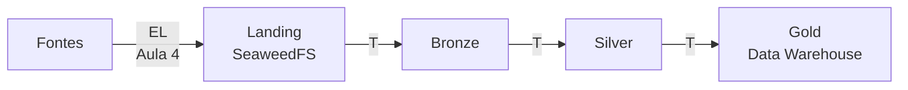
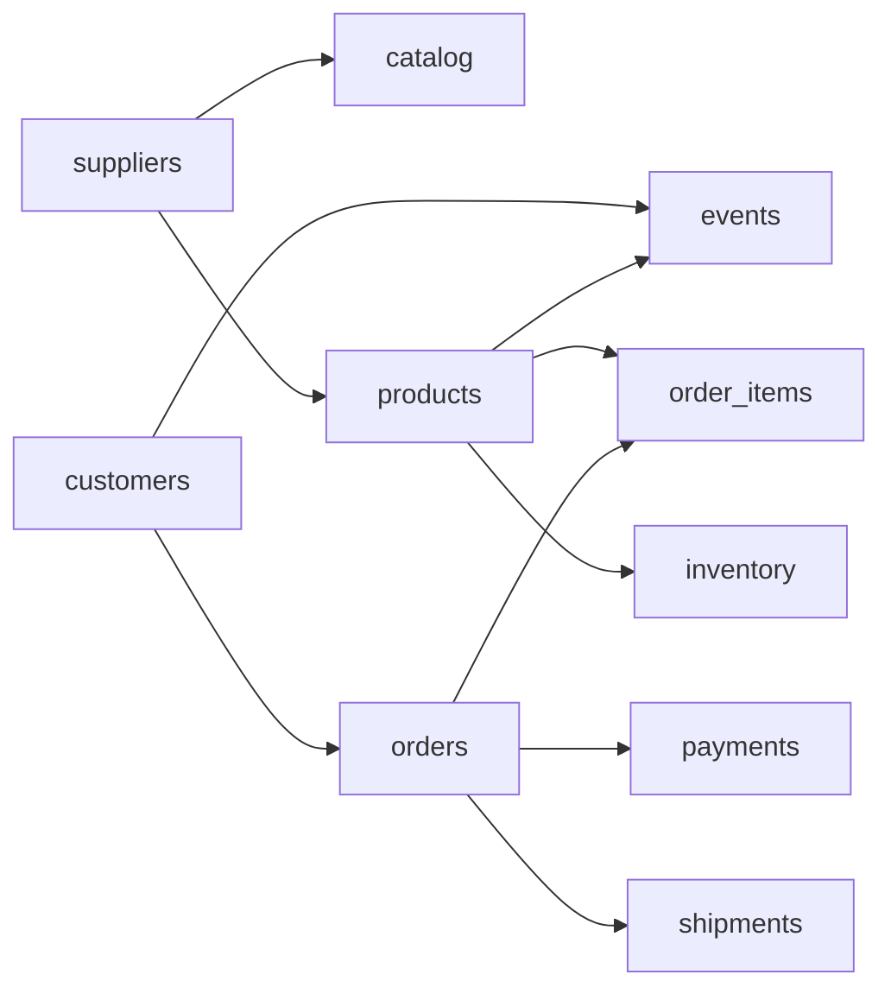
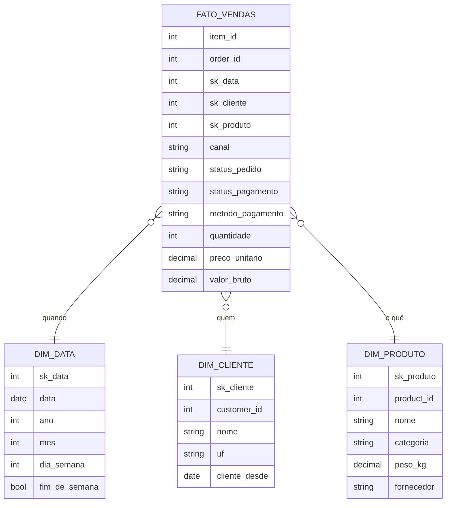
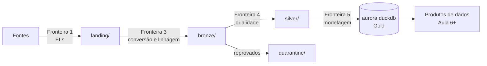

# Aula 5 — ETLs de Qualidade e Data Warehouse

## Conteúdo técnico da aula

**Tema:** EL, ETL e ELT, arquitetura medalhão (Bronze, Silver e Gold), qualidade de dados, quarentena, modelagem dimensional e Data Warehouse  
**Duração:** 2 horas  
**Formato:** discussão técnica guiada  
**Cenário:** a Aurora Shop já reúne seus dados no Data Lake, mas eles ainda não podem ser usados com confiança em análises  
**Ambiente:** Windows, VS Code, Python, SeaweedFS, Parquet e DuckDB, sem necessidade de AWS ou internet durante a aula

---

## 1. Resultado esperado da aula

Ao final, o aluno deverá ser capaz de:

1. explicar a diferença entre **EL**, **ETL** e **ELT** e identificar onde cada transformação acontece;
2. explicar por que a arquitetura medalhão separa o tratamento dos dados em camadas;
3. descrever o contrato das camadas **Bronze**, **Silver** e **Gold**;
4. reconhecer as principais **dimensões de qualidade de dados**;
5. transformar problemas reais dos dados em **regras de qualidade** verificáveis;
6. explicar o papel da **quarentena** e do **relatório de qualidade**;
7. diferenciar **Data Lake**, **Data Warehouse** e **Lakehouse**;
8. explicar **fato**, **dimensão**, **grão** e **star schema**;
9. explicar por que **Parquet** e **DuckDB** são adequados para processamento analítico;
10. reconhecer as limitações deste laboratório em relação a uma plataforma distribuída de produção.

> **Mensagem central:** na aula anterior garantimos que o dado chega. Nesta aula garantimos que o dado **merece confiança** e que está **organizado para responder perguntas de negócio**.

---

## 2. Roteiro sugerido

| Bloco | Conteúdo | Tempo |
| --- | --- | ---: |
| 1 | Onde paramos e os problemas reais dos dados | 10 min |
| 2 | EL, ETL e ELT | 15 min |
| 3 | Arquitetura medalhão e camada Bronze | 15 min |
| 4 | Camada Silver e qualidade de dados | 25 min |
| 5 | Camada Gold e Data Warehouse | 20 min |
| 6 | Ferramentas: Parquet e DuckDB | 15 min |
| 7 | Laboratório | 15 min |
| 8 | Limitações e encerramento | 5 min |

O bloco de qualidade é o mais longo de propósito. É nele que os alunos percebem que transformar dados é, antes de tudo, **tomar decisões**.

---

## 3. Onde paramos e por que isso ainda não basta

### 3.1 O que a Aula 4 entregou

Na aula anterior, construímos a entrada da plataforma:

```text
Fontes → ELs → Landing → sync.py → SeaweedFS
```

O resultado foi um Data Lake com os dados de todas as fontes, capturados de forma incremental, idempotente e auditável:

```text
curso-bigdata/
└── landing/
    ├── sqlite/
    ├── csv/
    ├── json/
    ├── events/
    └── api/
```

O dado chegou. Mas ele chegou **exatamente como a fonte o produziu**, inclusive com os problemas da fonte.

### 3.2 Olhando os dados de perto

Os dados da Aurora Shop foram gerados com uma taxa de erro de 2%. Isso parece pouco, mas veja o que existe na Landing no estado preparado da fonte:

| Fonte | Problema encontrado | Ocorrências |
| --- | --- | ---: |
| Catálogo (CSV) | Categoria escrita de formas diferentes: `beleza`, `BELEZA`, `" Jardim"` | 7 |
| Catálogo (CSV) | Peso do produto vazio | 2 |
| Catálogo (CSV) | Fornecedor que não existe no cadastro | 1 |
| Catálogo (CSV) | Linha repetida | 1 |
| Inventário (CSV) | Quantidade em estoque negativa | 4 |
| Eventos (JSONL) | Evento duplicado | 210 |
| Eventos (JSONL) | Data do evento igual a `data-invalida` | 441 |
| Eventos (JSONL) | Cliente que não existe | 425 |
| Eventos (JSONL) | Dispositivo ausente | 396 |
| Eventos (JSONL) | Tipo do evento ausente | 392 |
| Eventos (JSONL) | Produto que não existe | 379 |
| Entregas (API) | Entrega concluída sem data de entrega | 74 |
| Entregas (API) | Pedido que não existe | 65 |
| Entregas (API) | Status `UNKNOWN_VALUE` | 62 |

E há problemas que não aparecem olhando uma fonte sozinha:

- o catálogo e o banco de vendas **discordam sobre a categoria** de 457 dos 500 produtos;
- existem 1.397 pedidos **cancelados** cuja entrega aparece como **concluída**;
- uma campanha foi feita no canal `affiliate`, mas nenhum evento do site registra essa origem.

### 3.3 A pergunta da aula

> "Se a diretoria pedir hoje um dashboard de receita por categoria, podemos montá-lo diretamente sobre a Landing?"

Não podemos. Teríamos pelo menos três respostas erradas:

- a categoria `Beleza` apareceria dividida em `Beleza`, `beleza` e `BELEZA`;
- eventos duplicados inflariam o funil de conversão;
- nem saberíamos qual das duas fontes informa a categoria correta.

Falta uma etapa: a **transformação**. É o **T** que ainda não fizemos.

---

## 4. EL, ETL e ELT: onde entra a transformação

### 4.1 As três letras

Toda movimentação de dados para análise combina três ações:

| Letra | Ação | Pergunta que responde |
| --- | --- | --- |
| **E** — *Extract* | Extrair | De onde o dado vem? |
| **T** — *Transform* | Transformar | O que precisamos mudar para que ele seja útil? |
| **L** — *Load* | Carregar | Onde o dado será guardado? |

A diferença entre EL, ETL e ELT **não está nas letras, mas na ordem**. A ordem define **onde** e **quando** a transformação acontece.

### 4.2 EL — o que fizemos na Aula 4

```text
Fonte ──Extract──▶ ──Load──▶ Landing / Data Lake
```

No EL não há transformação de negócio. O objetivo é trazer o dado **fiel à origem** e de forma controlada.

Vantagens:

- o dado original fica preservado;
- a captura é simples e rápida;
- qualquer erro de transformação futura pode ser corrigido reprocessando o dado original.

Limitação: o dado ainda não está pronto para análise.

### 4.3 ETL — transformar antes de guardar

```text
Fonte ──Extract──▶ Servidor de transformação ──Transform──▶ ──Load──▶ Data Warehouse
```

No **ETL clássico**, o dado é extraído, transformado em um servidor intermediário e só depois carregado no destino. Apenas o resultado limpo é armazenado.

Esse modelo dominou entre as décadas de 1990 e 2010 por um motivo prático: **armazenamento era caro**. Guardar o dado bruto e o tratado ao mesmo tempo custava muito. Ferramentas como Informatica PowerCenter, IBM DataStage e Microsoft SSIS foram construídas para esse fluxo.

Vantagens:

- o destino recebe apenas dados prontos;
- o volume armazenado é menor;
- dados sensíveis podem ser removidos antes de chegar ao destino.

Problemas:

- **o dado original se perde**. Se uma regra estiver errada, é preciso extrair tudo de novo da fonte, e a fonte pode nem ter mais esse dado;
- novas perguntas de negócio exigem alterar o fluxo inteiro;
- a transformação depende de um servidor separado, que vira gargalo.

### 4.4 ELT — guardar antes de transformar

```text
Fonte ──Extract──▶ ──Load──▶ Data Lake ──Transform──▶ camadas tratadas
                              (bruto)      (dentro da plataforma)
```

No **ELT**, o dado é carregado bruto e transformado **dentro da própria plataforma de dados**.

Isso ficou viável por duas mudanças:

- o armazenamento ficou barato, principalmente com armazenamento de objetos como S3;
- os motores analíticos ficaram poderosos o suficiente para transformar grandes volumes com SQL.

Vantagens:

- o dado bruto continua disponível para sempre;
- se uma regra mudar, basta **reprocessar**, sem voltar à fonte;
- várias equipes podem criar transformações diferentes sobre o mesmo dado bruto;
- as transformações são escritas em SQL, uma linguagem conhecida por analistas e engenheiros.

Cuidados:

- armazenamos mais dados, inclusive os ruins;
- sem organização, o Data Lake vira um **Data Swamp**, um pântano de dados que ninguém entende.

Ferramentas típicas: dbt, Spark, Databricks, BigQuery, Snowflake e o próprio DuckDB.

### 4.5 Comparação

| | ETL | ELT |
| --- | --- | --- |
| Onde transforma | Fora do destino, em servidor intermediário | Dentro da plataforma de dados |
| Dado bruto preservado? | Não | Sim |
| Uma regra mudou | Extrair novamente da fonte | Reprocessar a partir do bruto |
| Custo principal | Processamento no servidor de ETL | Armazenamento e processamento na plataforma |
| Linguagem típica | Ferramentas visuais e código proprietário | SQL |
| Época predominante | Data Warehouse tradicional | Data Lake, nuvem e Lakehouse |

### 4.6 Na Aurora Shop: EL seguido de ELT

O projeto combina as duas abordagens:



- **Aula 4:** fizemos o **EL**, trazendo os dados até o lake sem alterá-los;
- **Aula 5:** fazemos o **T** dentro da plataforma, em etapas. Isso é **ELT**.

Na prática, quase toda plataforma é híbrida. Algumas transformações acontecem antes da carga, como mascarar um CPF por exigência da LGPD. O nome importa menos do que saber responder: **em que ponto do caminho cada transformação acontece e por quê?**

### 4.7 Que tipos de transformação existem?

A letra **T** reúne trabalhos bem diferentes:

| Tipo | Exemplo na Aurora Shop |
| --- | --- |
| **Conversão de formato** | JSONL e CSV → Parquet |
| **Tipagem** | Texto `"2026-09-01T02:09:42+00:00"` → `TIMESTAMP` |
| **Limpeza** | Remover espaços extras de `" Jardim"` |
| **Padronização** | `BELEZA` e `beleza` → `Beleza` |
| **Deduplicação** | Manter um único evento por `event_id` |
| **Validação** | Separar eventos com data inválida |
| **Integração** | Unir produto, catálogo e fornecedor |
| **Modelagem** | Organizar vendas em fatos e dimensões |
| **Agregação** | Calcular receita por categoria e dia |

Seria confuso fazer tudo isso em um único passo. Por isso as transformações são organizadas em **camadas**.

---

## 5. Arquitetura medalhão: Bronze, Silver e Gold

### 5.1 Por que separar em camadas?

A **arquitetura medalhão** organiza o Data Lake em camadas com níveis crescentes de qualidade. O nome vem das medalhas: bronze, prata e ouro. Ela foi popularizada pela Databricks, mas a ideia é independente de fornecedor.

Voltando à analogia do depósito da aula anterior:

| No depósito | No nosso projeto |
| --- | --- |
| Área onde as mercadorias chegam | Landing |
| Estoque organizado e etiquetado, ainda sem inspeção | **Bronze** |
| Mercadoria inspecionada; itens com defeito separados para análise | **Silver** |
| Produtos montados em kits e expostos na loja | **Gold** |

Separar em camadas traz quatro benefícios:

1. **cada camada tem uma responsabilidade clara**, o que facilita encontrar e corrigir erros;
2. **é possível reprocessar** uma camada a partir da anterior sem voltar à fonte;
3. **cada público consome a camada adequada**: o cientista de dados pode querer a Silver; o dashboard usa a Gold;
4. **a qualidade é progressiva**: o dado melhora a cada etapa, e sabemos em que ponto cada problema foi tratado.

### 5.2 O contrato de cada camada

| | **Bronze** | **Silver** | **Gold** |
| --- | --- | --- | --- |
| **Pergunta** | O que chegou? | O que é confiável? | O que o negócio precisa? |
| **Conteúdo** | Dado como veio da fonte | Dado validado, padronizado e deduplicado | Fatos, dimensões e métricas |
| **Organização** | Por fonte | Por entidade de negócio | Por assunto de análise |
| **Corrige dados?** | Não | Sim | Não; combina e agrega |
| **Descarta dados?** | Nunca | Separa em quarentena | Filtra por regra de negócio |
| **Formato** | Parquet | Parquet particionado | Tabelas no DuckDB |
| **Quem consome** | Engenharia de dados | Engenharia, ciência de dados | Dashboards, IA, API |

> Um **contrato** é o conjunto de garantias que uma camada oferece a quem a consome. Quem lê a Silver pode confiar que não há eventos duplicados. Quem lê a Bronze sabe que ali pode haver qualquer coisa que a fonte enviou.

### 5.3 Organização no bucket

As novas camadas ficam no mesmo bucket da aula anterior, cada uma em seu prefixo:

```text
curso-bigdata/
├── landing/          ← Aula 4: arquivos brutos (JSONL, CSV, JSON)
├── bronze/           ← Aula 5: mesmo conteúdo, em Parquet, com linhagem
├── silver/           ← Aula 5: entidades validadas
└── quarantine/       ← Aula 5: registros reprovados e o motivo
```

A camada Gold fica no arquivo do Data Warehouse:

```text
warehouse/aurora.duckdb
```

### 5.4 Camada Bronze: preservar e organizar

#### O que a Bronze faz

A Bronze é a **primeira cópia analítica** do dado bruto. Ela segue quatro regras:

1. **não corrige nada**: o evento com `data-invalida` continua com `data-invalida`;
2. **não descarta nada**: o evento duplicado continua duplicado;
3. **converte para Parquet**, um formato eficiente para análise;
4. **acrescenta colunas de linhagem**, que registram de onde e quando o dado veio.

#### Colunas de linhagem

| Coluna | Conteúdo | Para que serve |
| --- | --- | --- |
| `_source_file` | Key do arquivo na Landing | Saber de qual arquivo cada linha veio |
| `_ingested_at` | Momento em que a Bronze foi gerada | Saber quando o dado entrou na plataforma |

O prefixo `_` indica que a coluna foi criada pela plataforma, e não pela fonte.

**Termo técnico — linhagem (*data lineage*):** histórico de origem, movimentação e transformação de um dado. Com ela, é possível responder: "de onde veio esse número do dashboard?"

#### Um arquivo da Landing gera um arquivo da Bronze

Nesta aula adotamos uma regra simples:

```text
landing/events/events_2026-09-01.jsonl
                ↓
bronze/events/events_2026-09-01.parquet
```

Cada arquivo da Landing produz exatamente um arquivo na Bronze, **com o mesmo nome**. Isso garante a **idempotência**: se a Bronze for executada duas vezes, o segundo resultado substitui o primeiro no mesmo lugar, sem criar duplicatas.

É a mesma ideia da aula anterior, agora aplicada à transformação:

| Etapa | Como evita duplicar |
| --- | --- |
| Fonte → Landing | Watermark, sequência ou manifest |
| Landing → SeaweedFS | SHA-256 comparado ao objeto remoto |
| Landing → Bronze | Nome de saída determinístico, derivado do arquivo de origem |

#### Se já temos a Landing, por que criar a Bronze?

É uma pergunta comum. Landing e Bronze têm o mesmo conteúdo, mas papéis diferentes:

| Landing | Bronze |
| --- | --- |
| Formato da fonte: JSONL, CSV, JSON | Formato único: Parquet |
| Área de chegada, pensada para a captura | Área de leitura, pensada para a análise |
| Sem informação de linhagem | Com `_source_file` e `_ingested_at` |
| Lenta para consultar | Rápida para consultar |

Em muitas empresas a Landing é temporária e a Bronze é o registro permanente do dado bruto.

> "A Bronze é o seguro da plataforma. Se a Silver errar, recalculamos a partir daqui."

### 5.5 Camada Silver: qualidade de dados

A Silver é o coração desta aula. É nela que o dado deixa de ser "o que a fonte mandou" e passa a ser "o que a empresa considera correto".

#### 5.5.1 O que é qualidade de dados?

**Qualidade de dados** é o grau em que um dado é adequado para o uso pretendido. Não existe dado perfeito; existe dado bom o suficiente para uma decisão.

Para medir qualidade, usamos **dimensões**:

| Dimensão | Pergunta | Exemplo na Aurora Shop |
| --- | --- | --- |
| **Completude** | O valor está presente? | Peso do produto vazio |
| **Validade** | O valor respeita o formato e o domínio permitido? | `data-invalida`, estoque negativo, status `UNKNOWN_VALUE` |
| **Unicidade** | Cada registro aparece uma única vez? | 210 eventos duplicados |
| **Consistência** | O mesmo fato é representado da mesma forma? | `Beleza`, `beleza` e `BELEZA` |
| **Integridade referencial** | As referências apontam para registros existentes? | Evento de um cliente que não existe |
| **Coerência entre fontes** | Fontes diferentes concordam entre si? | Categoria diferente no catálogo e no banco |
| **Atualidade** | O dado é recente o suficiente? | Inventário semanal usado para decisão diária |

#### 5.5.2 Catálogo de regras da Aurora Shop

Cada problema encontrado vira uma **regra de qualidade**. Uma regra tem nome, dimensão e ação:

| Fonte | Regra | Dimensão | Ação | Ocorrências |
| --- | --- | --- | --- | ---: |
| Eventos | `duplicado` | Unicidade | Quarentena | 210 |
| Eventos | `data_invalida` | Validade | Quarentena | 441 |
| Eventos | `cliente_inexistente` | Integridade | Quarentena | 425 |
| Eventos | `dispositivo_ausente` | Completude | Quarentena | 396 |
| Eventos | `tipo_ausente` | Completude | Quarentena | 392 |
| Eventos | `produto_inexistente` | Integridade | Quarentena | 379 |
| Catálogo | Categoria fora do padrão | Consistência | **Corrigir** | 7 |
| Catálogo | `peso_ausente` | Completude | Quarentena | 2 |
| Catálogo | `fornecedor_inexistente` | Integridade | Quarentena | 1 |
| Catálogo | `duplicado` | Unicidade | Quarentena | 1 |
| Inventário | `estoque_negativo` | Validade | Quarentena | 4 |
| Entregas | `entrega_sem_data` | Completude | Quarentena | 74 |
| Entregas | `pedido_inexistente` | Integridade | Quarentena | 65 |
| Entregas | `status_invalido` | Validade | Quarentena | 62 |
| Pedidos × entregas | Pedido cancelado com entrega concluída | Coerência | **Alerta** | 1.397 |

Observe que existem três ações possíveis:

- **corrigir:** quando a correção é óbvia e segura, como padronizar `BELEZA` para `Beleza`;
- **quarentena:** quando não sabemos qual seria o valor correto;
- **alerta:** quando o registro é válido, mas revela uma situação que alguém precisa investigar.

> Uma boa pergunta para os alunos: "Por que não corrigimos o `cliente_inexistente`?" Porque não sabemos quem é o cliente correto. Inventar o valor seria pior do que separar o registro.

#### 5.5.3 Padronização

A padronização faz com que o mesmo fato seja sempre representado da mesma forma. Na Silver da Aurora Shop, adotamos:

| Item | Padrão adotado | Exemplo |
| --- | --- | --- |
| Textos | Sem espaços nas pontas | `" Jardim"` → `"Jardim"` |
| Categorias | Valor da **tabela de domínio** | `BELEZA` → `Beleza` |
| Códigos | Minúsculas | `DELIVERED` → `delivered` |
| Datas | `TIMESTAMP` em UTC | `"2026-09-01T02:09:42+00:00"` → `2026-09-01 02:09:42` |
| Dinheiro | `DECIMAL(12,2)` em reais | `price_cents = 1999` → `19.99` |
| Nomes de colunas | `snake_case` em inglês, como na fonte | `customer_id` |

**Termo técnico — tabela de domínio:** lista dos valores permitidos para um campo. Por exemplo, as 12 categorias oficiais da Aurora Shop. Um valor que não está na lista é inválido ou precisa ser mapeado.

**Por que não usar `FLOAT` para dinheiro?** Números de ponto flutuante não representam todos os decimais com exatidão. Somando os itens de pedido da Aurora com `DOUBLE`, o resultado é `90724701.35000096`. Com `DECIMAL`, o resultado é exatamente `90724701.35`. Em valores financeiros, centavos a mais ou a menos não são aceitáveis.

#### 5.5.4 Deduplicação e versão mais recente

Existem dois tipos de repetição:

**1. Duplicata exata.** O mesmo evento enviado duas vezes, com o mesmo `event_id`. Mantemos a primeira ocorrência e enviamos as demais para a quarentena com o motivo `duplicado`.

**2. Várias versões do mesmo registro.** Um pedido pode ser criado como `paid` e depois mudar para `shipped`. Se o pipeline capturar as duas versões, a Silver deve manter **apenas a mais recente**, usando `updated_at`.

```text
order_id  status    updated_at              ação
42        paid      2026-09-10 10:00:00     descartar (versão antiga)
42        shipped   2026-09-12 08:30:00     manter    (versão atual)
```

Isso conecta com uma limitação da aula anterior: o EL do SQLite captura apenas **IDs novos**, então alterações em pedidos antigos não chegam ao lake. A regra da Silver já está preparada para quando a captura usar `updated_at` ou CDC.

#### 5.5.5 Integridade referencial e ordem de construção

Para saber se um evento aponta para um cliente existente, a tabela de clientes da Silver precisa estar pronta **antes** da tabela de eventos. Isso cria uma **ordem de dependência**:



Esse diagrama é um **grafo de dependências**. Na Aula 6, ele se transformará em um **DAG do Airflow**, em que cada caixa vira uma tarefa e cada seta indica quem precisa terminar antes.

#### 5.5.6 Fonte da verdade: quando duas fontes discordam

O banco de vendas e o catálogo do estoque informam a categoria dos produtos. Em 457 dos 500 produtos, **eles discordam**.

Nenhuma regra técnica resolve isso. É uma **decisão de negócio**: qual sistema é o dono dessa informação?

| Informação | Fonte da verdade | Justificativa |
| --- | --- | --- |
| Nome, categoria e preço | Banco de vendas (`products`) | É o sistema que vende e fatura |
| Peso e nome externo | Catálogo (`catalog.csv`) | É o único que possui esses dados |
| Fornecedor | Banco de vendas (`suppliers`) | Cadastro oficial |

**Termo técnico — fonte da verdade (*source of truth*):** sistema reconhecido como responsável oficial por uma informação. Em empresas maiores, essa definição faz parte da **governança de dados** e do **MDM** (*Master Data Management*).

Outro exemplo: a campanha `Campanha 0009` foi feita no canal `affiliate`, mas o site não registra essa origem. Não é erro de dado; é uma **lacuna de rastreamento**. A Silver não resolve, mas o relatório de qualidade deve evidenciar.

#### 5.5.7 Quarentena

Um registro reprovado **não é apagado**. Ele vai para a **quarentena**, uma área separada onde fica guardado com o motivo da reprovação.

```text
Bronze (100.210 eventos)
        │
        ├──▶ Silver      97.968 eventos aprovados
        │
        └──▶ Quarentena   2.242 eventos reprovados + motivo
```

Por que não simplesmente apagar?

- **auditoria:** é possível provar o que foi removido e por quê;
- **correção na origem:** a equipe responsável pela fonte recebe a lista de problemas;
- **reprocessamento:** se uma regra estiver errada, os registros podem voltar;
- **medição:** a quantidade em quarentena é um indicador de saúde da fonte.

Cada registro da quarentena contém:

| Coluna | Exemplo |
| --- | --- |
| Colunas originais | `event_id`, `customer_id`, `event_at`... |
| `motivos` | `cliente_inexistente` |
| `_source_file` | `events/events_2026-09-14.jsonl` |
| `quarantined_at` | `2026-10-14 19:32:10` |

Um mesmo registro pode ter mais de um motivo, por exemplo `duplicado, dispositivo_ausente`.

#### 5.5.8 Regras bloqueantes e regras de alerta

Nem todo problema deve ter o mesmo peso:

| Tipo de regra | Comportamento | Exemplo |
| --- | --- | --- |
| **Por registro** | Separa o registro e segue | Evento com data inválida vai para a quarentena |
| **Alerta** | Registra o problema e segue | Pedido cancelado com entrega concluída |
| **Bloqueante** | Interrompe o pipeline | Mais de 10% dos eventos do dia em quarentena |

As regras bloqueantes protegem as camadas seguintes de um problema grande na fonte. Se a quarentena saltar de 2% para 40%, provavelmente a fonte mudou de formato, e publicar o dashboard com 60% dos dados seria pior do que atrasá-lo.

**Termo técnico — limiar (*threshold*):** valor a partir do qual uma regra muda de comportamento. Os limiares são definidos junto com a área de negócio.

#### 5.5.9 Relatório de qualidade

Ao final da Silver, o pipeline produz um resumo por fonte e por regra:

```text
Fonte       Lidos     Aprovados   Quarentena   %
events      100.210   97.968      2.242        2,24%
catalog     501       497         4            0,80%
shipments   10.000    9.799       201          2,01%
inventory   2.500     2.496       4            0,16%
```

A conta precisa sempre fechar:

```text
lidos na Bronze = aprovados na Silver + enviados à quarentena
```

Se não fechar, alguma regra está perdendo registros em silêncio, e esse é um dos erros mais perigosos em um pipeline.

O relatório é a base da **observabilidade** do pipeline. Na Aula 6, o Airflow poderá alertar quando esses números saírem do padrão.

#### 5.5.10 Como sabemos que as regras funcionam?

Os dados da Aurora Shop têm uma vantagem didática: o gerador marcou cada erro injetado na coluna `injected_issue`. Podemos comparar:

| Situação | Significado | Resultado esperado |
| --- | --- | ---: |
| Erro injetado e aprovado pela Silver | A regra deixou escapar | 0 |
| Registro correto e enviado à quarentena | Falso positivo | 0 |

Em produção não existe essa marcação. Por isso as empresas criam **testes de dados** com exemplos conhecidos e acompanham o volume de quarentena ao longo do tempo.

> A coluna `injected_issue` existe apenas para fins didáticos. A Silver **não** pode usá-la para decidir nada, porque nenhuma fonte real informa os próprios erros.

### 5.6 Camada Gold e Data Warehouse

#### 5.6.1 Data Lake, Data Warehouse e Lakehouse

| | **Data Lake** | **Data Warehouse** | **Lakehouse** |
| --- | --- | --- | --- |
| Guarda | Qualquer formato, inclusive bruto | Dados estruturados e modelados | Ambos |
| Esquema | Aplicado na leitura (*schema-on-read*) | Aplicado na escrita (*schema-on-write*) | Ambos |
| Otimizado para | Volume e flexibilidade | Consultas analíticas rápidas | Ambos |
| Usuário típico | Engenharia e ciência de dados | Analistas e dashboards | Todos |
| Na Aurora Shop | SeaweedFS: Landing, Bronze, Silver | DuckDB: Gold | A plataforma completa |

O Data Lake e o Data Warehouse **não competem**: um alimenta o outro. A plataforma da Aurora Shop é, na prática, um pequeno **Lakehouse**.

#### 5.6.2 Modelagem dimensional

A Silver organiza o dado **como o sistema de origem o enxerga**: pedidos, itens, pagamentos. A Gold organiza o dado **como o negócio pergunta**: "quanto vendemos, de quê, para quem, quando?"

A técnica mais usada para isso é a **modelagem dimensional**, popularizada por Ralph Kimball. Ela separa os dados em dois tipos de tabela:

| | **Fato** | **Dimensão** |
| --- | --- | --- |
| Representa | Um acontecimento mensurável | O contexto do acontecimento |
| Responde | Quanto? Quantos? | Quem? O quê? Quando? Onde? Como? |
| Exemplo | Uma venda de 2 unidades por R$ 39,98 | O produto, o cliente, a data |
| Tamanho | Muitas linhas, cresce sempre | Poucas linhas, muda pouco |
| Colunas | Chaves das dimensões + medidas | Atributos descritivos |

Uma frase ajuda os alunos a separar os dois:

```text
"O cliente Marcos comprou 2 unidades do produto Bola de Futebol em 14/09 pelo canal web, pagando R$ 39,98."
           └─dimensão─┘   └medida┘  └─────dimensão──────┘ └dim─┘  └dimensão┘     └medida┘
```

#### 5.6.3 Grão: a decisão mais importante

O **grão** define o que **uma linha** da tabela fato representa. Ele precisa ser decidido antes de qualquer outra coisa.

| Opção de grão para vendas | Uma linha representa | Consegue responder "receita por categoria"? |
| --- | --- | --- |
| Pedido | Um pedido inteiro | Não; um pedido tem produtos de várias categorias |
| **Item de pedido** | Um produto dentro de um pedido | **Sim** |
| Dia | O total vendido no dia | Não; perdeu-se o produto |

Regra prática: **escolha o grão mais detalhado disponível**. É sempre possível agregar depois, mas não é possível detalhar o que já foi agregado.

Na Aurora Shop, o grão de `fato_vendas` é **um item de pedido**, totalizando 29.891 linhas.

#### 5.6.4 Star schema da Aurora Shop

Quando a tabela fato fica no centro e as dimensões ao redor, o desenho lembra uma estrela. Por isso o nome **star schema** (esquema estrela).



O modelo completo da Aurora Shop tem três fatos que compartilham as mesmas dimensões:

| Tabela fato | Grão | Dimensões | Medidas |
| --- | --- | --- | --- |
| `fato_vendas` | Item de pedido | data, cliente, produto | quantidade, valor |
| `fato_eventos` | Evento de navegação | data, cliente, produto | contagem de eventos e sessões |
| `fato_entregas` | Entrega | data, transportadora | dias de atraso, entregue no prazo |

Dimensões usadas por mais de um fato, como `dim_data` e `dim_produto`, são chamadas de **dimensões conformadas**. Elas permitem cruzar assuntos diferentes, como comparar navegação e venda do mesmo produto.

#### 5.6.5 Chaves das dimensões

As dimensões usam uma **chave substituta** (*surrogate key*), com prefixo `sk_`, em vez do ID da fonte:

| Tipo de chave | Exemplo | Origem |
| --- | --- | --- |
| Chave natural | `customer_id = 727` | Sistema de origem |
| Chave substituta | `sk_cliente = 727` | Criada pelo Data Warehouse |

Por que criar outra chave?

- o Warehouse fica independente dos IDs da fonte, que podem mudar ou colidir entre sistemas;
- permite guardar **várias versões** do mesmo cliente, como veremos a seguir.

A `dim_data` usa uma convenção comum: a chave é a própria data no formato `AAAAMMDD`, como `20260914`.

#### 5.6.6 Dimensões que mudam: SCD

O que acontece se o cliente Marcos se mudar de SP para RJ? Isso é chamado de **dimensão de mudança lenta** (*Slowly Changing Dimension*, SCD).

| Tipo | Comportamento | Consequência |
| --- | --- | --- |
| **SCD tipo 1** | Sobrescreve o valor antigo | Vendas antigas de Marcos passam a aparecer no RJ |
| **SCD tipo 2** | Cria uma nova linha com período de validade | Vendas antigas continuam em SP; novas vão para RJ |

```text
SCD tipo 2 — dim_cliente

sk_cliente  customer_id  uf  valido_de    valido_ate   atual
727         727          SP  2025-07-25   2026-09-20   false
1001        727          RJ  2026-09-20   9999-12-31   true
```

Nesta aula, as dimensões usam **tipo 1**, por simplicidade. O tipo 2 é o padrão quando a análise histórica importa.

#### 5.6.7 Definindo métricas: o que é receita?

Antes de calcular, é preciso **definir**. Os pedidos da Aurora Shop têm estas combinações:

| Status do pedido | Status do pagamento | Pedidos | Conta como receita? |
| --- | --- | ---: | --- |
| `paid` | `approved` | 5.779 | Sim |
| `shipped` | `approved` | 1.382 | Sim |
| `delivered` | `approved` | 1.412 | Sim |
| `cancelled` | `refunded` | 1.427 | Não |

Sem essa definição, cada analista calcularia a receita de um jeito, e a diretoria receberia números diferentes para a mesma pergunta.

| Métrica | Definição | Valor no estado preparado |
| --- | --- | ---: |
| Receita bruta | Soma de todos os itens vendidos | R$ 90.724.701,35 |
| Receita aprovada | Itens de pedidos não cancelados com pagamento aprovado | R$ 77.740.683,02 |

> A camada Gold é onde as **regras de negócio** ficam registradas em código. Uma métrica bem definida é aquela que dá o mesmo resultado, não importa quem pergunte.

#### 5.6.8 Marts: respostas prontas para o negócio

Um **data mart** é um recorte da Gold preparado para um assunto ou área. Os marts da Aurora Shop respondem às perguntas do Big Picture:

| Mart | Pergunta de negócio | Fonte |
| --- | --- | --- |
| `mart_receita_categoria_dia` | Quais produtos e categorias vendem mais? | `fato_vendas` |
| `mart_funil_origem` | Quantas sessões avançam de visualização para compra, por origem? | `fato_eventos` |
| `mart_entregas_transportadora` | Quais transportadoras atrasam mais? | `fato_entregas` |
| `mart_campanhas` | Quais campanhas geram vendas? | `fato_eventos` + `dim_campanha` |

Exemplo do resultado de `mart_funil_origem`:

```text
origem    visualização  carrinho  checkout  compra
direct    2.873         1.826     1.121     805
email     2.872         1.783     1.087     812
organic   2.868         1.812     1.088     838
search    2.861         1.771     1.123     840
social    2.882         1.747     1.103     842
```

Os marts podem ser **views**, que são consultas salvas e recalculadas a cada leitura, ou **tabelas**, que guardam o resultado pronto. Com o volume da Aurora Shop, views são suficientes. Com volumes maiores, materializar em tabelas acelera os dashboards.

---

## 6. Ferramentas: Parquet e DuckDB

Agora que sabemos **o que** cada camada precisa fazer, podemos entender **com o quê** faremos.

As camadas exigem duas coisas:

| Necessidade | Ferramenta |
| --- | --- |
| Um **formato** de arquivo eficiente para guardar Bronze e Silver | **Parquet** |
| Um **motor** capaz de transformar e consultar esses arquivos com SQL | **DuckDB** |

### 6.1 OLTP e OLAP: dois tipos de pergunta

Na aula anterior, vimos que o SQLite representa um sistema **OLTP**. Agora precisamos do oposto:

| | **OLTP** | **OLAP** |
| --- | --- | --- |
| Significado | *Online Transaction Processing* | *Online Analytical Processing* |
| Pergunta típica | "Qual é o pedido 42?" | "Qual a receita por categoria em setembro?" |
| Lê | Poucas linhas, todas as colunas | Milhões de linhas, poucas colunas |
| Escreve | Muitas pequenas alterações | Grandes cargas em lote |
| Exemplo | SQLite, PostgreSQL, MySQL | DuckDB, BigQuery, Snowflake |

Para entender por que isso importa, veja como os dados são guardados no disco.

**Armazenamento por linha (OLTP):**

```text
[42, Marcos, SP, web, 39.98] [43, Natália, SP, store, 120.00] [44, ...]
```

Para somar o valor de todos os pedidos, é preciso ler **todas as colunas** de todas as linhas.

**Armazenamento por coluna (OLAP):**

```text
order_id: [42, 43, 44, ...]
nome:     [Marcos, Natália, ...]
uf:       [SP, SP, ...]
canal:    [web, store, ...]
valor:    [39.98, 120.00, ...]   ← lê apenas esta coluna
```

Para somar os valores, basta ler **uma coluna**. Além disso, valores parecidos ficam lado a lado e se comprimem muito melhor.

### 6.2 Parquet

**Apache Parquet** é um formato de arquivo **colunar**, aberto e criado para análise de grandes volumes. É o formato mais usado em Data Lakes.

Características:

| Característica | O que significa |
| --- | --- |
| **Colunar** | Cada coluna é guardada separadamente |
| **Tipado** | O arquivo sabe que `event_at` é `TIMESTAMP` e `quantity` é `INTEGER` |
| **Comprimido** | Usa algoritmos como Snappy e ZSTD |
| **Autodescritivo** | O esquema fica gravado dentro do próprio arquivo |
| **Estatísticas internas** | Guarda mínimo e máximo de cada bloco, permitindo pular blocos inteiros |
| **Aberto** | Lido por Spark, DuckDB, pandas, BigQuery, Snowflake, Athena... |

Na Aurora Shop, a diferença é visível:

| Dado | JSONL (Landing) | Parquet (Bronze) |
| --- | ---: | ---: |
| 100.210 eventos | 23 MB | 1,6 MB |

O mesmo conteúdo ocupa **cerca de 14 vezes menos espaço**, e as consultas leem apenas as colunas necessárias.

**Comparação de formatos:**

| | CSV | JSON/JSONL | Parquet |
| --- | --- | --- | --- |
| Legível por humanos | Sim | Sim | Não |
| Tipos de dados | Não; tudo é texto | Parcial | Sim |
| Estruturas aninhadas | Não | Sim | Sim |
| Compressão | Externa | Externa | Interna, por coluna |
| Leitura de poucas colunas | Lê o arquivo inteiro | Lê o arquivo inteiro | Lê apenas as colunas pedidas |
| Uso típico | Troca de arquivos | APIs e eventos | Análise e Data Lake |

### 6.3 Particionamento

**Particionar** é dividir os arquivos em pastas segundo o valor de uma coluna. A convenção mais usada é a do **Hive**:

```text
silver/events/
├── event_date=2026-09-01/data_0.parquet
├── event_date=2026-09-02/data_0.parquet
├── event_date=2026-09-03/data_0.parquet
└── ...
```

O nome da pasta contém o nome da coluna e o valor. Quando uma consulta filtra por data, o motor lê **apenas as pastas necessárias**. Isso se chama **partition pruning** (poda de partições).

```sql
-- Lê somente a pasta event_date=2026-09-14
SELECT count(*)
FROM read_parquet('s3://curso-bigdata/silver/events/*/*.parquet', hive_partitioning = true)
WHERE event_date = DATE '2026-09-14';
```

Cuidados:

- **escolha uma coluna usada nos filtros**: datas são a escolha mais comum;
- **evite partições demais**: particionar por `customer_id` criaria milhares de arquivos minúsculos, o que é mais lento do que não particionar;
- **a coluna precisa ser confiável**.

Esse último ponto explica uma decisão desta aula. A Bronze **não** é particionada por `event_at`, porque 441 eventos têm `data-invalida`, e a Bronze não pode falhar nem descartar dados por isso. A Bronze mantém a organização por arquivo de origem; a Silver, onde a data já foi validada, usa `event_date`.

### 6.4 DuckDB

**DuckDB** é um banco de dados analítico **embarcado**. Ele roda dentro do processo Python, sem instalar servidor, e guarda tudo em um único arquivo.

Uma forma simples de apresentá-lo:

> O DuckDB está para a análise de dados assim como o SQLite está para os sistemas transacionais.

| | SQLite | DuckDB |
| --- | --- | --- |
| Tipo | OLTP | OLAP |
| Armazenamento | Por linha | Por coluna |
| Servidor | Não precisa | Não precisa |
| Arquivo | `commerce.db` | `aurora.duckdb` |
| Papel na Aurora Shop | Sistema de vendas (fonte) | Motor de transformação e Data Warehouse |

Por que o DuckDB é adequado para esta aula:

- usa **SQL**, a linguagem padrão das transformações ELT;
- lê **CSV, JSON e Parquet diretamente**, sem importar antes;
- grava **Parquet particionado** com um único comando;
- é rápido em um notebook comum: processa os 100 mil eventos em menos de um segundo;
- instala com `pip`, a partir do `wheelhouse`, sem internet.

Exemplo de consulta direta sobre arquivos:

```sql
SELECT event_type, count(*) AS eventos
FROM read_parquet('s3://curso-bigdata/bronze/events/*.parquet')
GROUP BY event_type
ORDER BY eventos DESC;
```

Não houve `CREATE TABLE` nem importação. O DuckDB leu os arquivos onde eles estão.

### 6.5 DuckDB conversando com o SeaweedFS

Na aula anterior, o `boto3` era o mensageiro entre o Python e o SeaweedFS. Agora o próprio DuckDB fala S3, por meio da extensão **`httpfs`**:

```text
Aula 4:  sync.py → boto3  → API S3 → SeaweedFS
Aula 5:  SQL     → DuckDB (httpfs) → API S3 → SeaweedFS
```

A configuração usa as mesmas credenciais locais da aula anterior:

```sql
LOAD httpfs;

CREATE OR REPLACE SECRET seaweedfs (
    TYPE s3,
    KEY_ID 'admin',
    SECRET 'bigdata-secret',
    ENDPOINT '127.0.0.1:8333',
    URL_STYLE 'path',
    USE_SSL false,
    REGION 'us-east-1'
);
```

| Parâmetro | Por que é necessário |
| --- | --- |
| `ENDPOINT` | Aponta para o SeaweedFS, e não para a AWS |
| `URL_STYLE 'path'` | O SeaweedFS espera o bucket no caminho da URL: `127.0.0.1:8333/curso-bigdata/...` |
| `USE_SSL false` | A comunicação local usa HTTP, sem certificado |

Depois disso, qualquer caminho `s3://curso-bigdata/...` é lido e gravado no SeaweedFS.

> **Atenção para o ambiente offline:** diferentemente do suporte a Parquet e JSON, a extensão `httpfs` **não vem embutida** no pacote Python do DuckDB. Na primeira vez, o comando `INSTALL httpfs` faz download da internet. Para a aula, a extensão precisa ser instalada antes, em uma máquina com acesso, ou distribuída junto com o `wheelhouse`. Veja o checklist na seção 11.

### 6.6 Onde cada ferramenta atua

| Camada | Lê de | Grava em | Formato | Ferramenta |
| --- | --- | --- | --- | --- |
| Bronze | `landing/` | `bronze/` | Parquet | DuckDB + httpfs |
| Silver | `bronze/` | `silver/` e `quarantine/` | Parquet particionado | DuckDB + httpfs |
| Gold | `silver/` | `warehouse/aurora.duckdb` | Tabelas DuckDB | DuckDB |

O Python continua presente, mas com um papel mais simples: **orquestrar** a execução dos arquivos SQL na ordem correta e registrar o resultado. A lógica de transformação fica em SQL.

---

## 7. SQL essencial das camadas

Esta seção apresenta os trechos que os alunos precisam compreender. A organização em arquivos e comandos ficará no laboratório.

Nos exemplos, as tabelas com prefixo `stg_` são as versões tratadas de cada entidade dentro da Silver: `stg_customers`, `stg_products`, `stg_orders` e assim por diante. Todas seguem o padrão mostrado em 7.2. A tabela `catalog_aprovado` contém as linhas do catálogo que passaram nas regras de qualidade.

### 7.1 Bronze: um arquivo da Landing gera um Parquet

```sql
-- Lê um arquivo da Landing e grava o equivalente na Bronze.
-- O Python repete este comando para cada arquivo encontrado em landing/.
COPY (
    SELECT
        *,                                               -- todas as colunas, sem alteração
        'events/events_2026-09-01.jsonl' AS _source_file, -- linhagem: arquivo de origem
        current_timestamp                AS _ingested_at  -- linhagem: momento da carga
    FROM read_json_auto(
        's3://curso-bigdata/landing/events/events_2026-09-01.jsonl',
        format = 'newline_delimited'
    )
) TO 's3://curso-bigdata/bronze/events/events_2026-09-01.parquet'
  (FORMAT parquet, COMPRESSION zstd);
```

Pontos de atenção:

- nenhuma linha é filtrada e nenhum valor é corrigido;
- o nome de saída é derivado do nome de entrada, o que garante a idempotência;
- para CSV, a leitura usa `read_csv(..., all_varchar = true)`, mantendo todos os valores como texto. Assim, uma quantidade inválida não impede a carga.

### 7.2 Silver: última versão por chave

```sql
-- Mantém apenas a versão mais recente de cada pedido.
CREATE OR REPLACE TABLE stg_orders AS
SELECT
    order_id,
    customer_id,
    lower(status)                               AS status,
    lower(channel)                              AS channel,
    CAST(total_cents / 100.0 AS DECIMAL(12,2))  AS total,
    created_at,
    updated_at
FROM read_parquet('s3://curso-bigdata/bronze/sqlite/orders/*.parquet')
QUALIFY row_number() OVER (
    PARTITION BY order_id                        -- um grupo por pedido
    ORDER BY updated_at DESC, _ingested_at DESC  -- o mais recente primeiro
) = 1;                                           -- mantém só o primeiro de cada grupo
```

**Termo técnico — função de janela (*window function*):** calcula um valor para cada linha olhando para um grupo de linhas relacionadas, sem agrupar o resultado. O `row_number()` numera as linhas dentro de cada grupo.

**`QUALIFY`** filtra o resultado de uma função de janela, como o `WHERE` filtra colunas comuns.

### 7.3 Silver: eventos com regras de qualidade

Este é o trecho central da aula. Ele aplica todas as regras e calcula, para cada evento, a lista de motivos de reprovação:

```sql
CREATE OR REPLACE TABLE chk_events AS
WITH base AS (
    SELECT
        event_id,
        session_id,
        customer_id,
        product_id,
        order_id,
        lower(trim(event_type))          AS event_type,
        try_cast(event_at AS TIMESTAMP)  AS event_at,   -- NULL se a data for inválida
        lower(trim(device))              AS device,
        lower(trim(source))              AS source,
        _source_file,
        row_number() OVER (
            PARTITION BY event_id ORDER BY _source_file
        )                                AS ocorrencia   -- 1 = primeira vez; 2+ = duplicata
    FROM read_parquet('s3://curso-bigdata/bronze/events/*.parquet', union_by_name = true)
)
SELECT
    b.*,
    concat_ws(', ',                                     -- junta os motivos, ignorando NULLs
        CASE WHEN b.ocorrencia > 1       THEN 'duplicado'           END,
        CASE WHEN b.event_type IS NULL   THEN 'tipo_ausente'        END,
        CASE WHEN b.event_at IS NULL     THEN 'data_invalida'       END,
        CASE WHEN b.device IS NULL       THEN 'dispositivo_ausente' END,
        CASE WHEN c.customer_id IS NULL  THEN 'cliente_inexistente' END,
        CASE WHEN b.product_id IS NOT NULL
              AND p.product_id IS NULL   THEN 'produto_inexistente' END
    ) AS motivos                                        -- texto vazio = registro aprovado
FROM base b
LEFT JOIN stg_customers c ON c.customer_id = b.customer_id
LEFT JOIN stg_products  p ON p.product_id  = b.product_id;
```

Três técnicas importantes:

- **`try_cast`** tenta converter o valor e devolve `NULL` em caso de falha, em vez de interromper a execução. `CAST('data-invalida' AS TIMESTAMP)` gera erro; `try_cast` gera `NULL`;
- **`LEFT JOIN`** mantém o evento mesmo quando o cliente não existe. É assim que a integridade referencial é verificada: se `c.customer_id` vier `NULL`, a referência está quebrada;
- **`concat_ws`** junta os textos com um separador e ignora os valores `NULL`. Se nenhuma regra falhar, o resultado é um texto vazio.

Com os motivos calculados, a separação entre Silver e quarentena é simples:

```sql
-- Aprovados → Silver, particionada por data do evento
COPY (
    SELECT * EXCLUDE (ocorrencia, motivos),
           CAST(event_at AS DATE) AS event_date
    FROM chk_events
    WHERE motivos = ''
) TO 's3://curso-bigdata/silver/events'
  (FORMAT parquet, PARTITION_BY (event_date), OVERWRITE_OR_IGNORE);

-- Reprovados → quarentena, com o motivo
COPY (
    SELECT *, current_timestamp AS quarantined_at
    FROM chk_events
    WHERE motivos <> ''
) TO 's3://curso-bigdata/quarantine/events/events.parquet'
  (FORMAT parquet);
```

### 7.4 Silver: padronização com tabela de domínio

```sql
-- Categorias oficiais da Aurora Shop
CREATE OR REPLACE TABLE dominio_categoria AS
SELECT * FROM (VALUES
    ('Alimentos'), ('Beleza'), ('Brinquedos'), ('Casa'),
    ('Eletrônicos'), ('Esporte'), ('Jardim'), ('Livros'),
    ('Moda'), ('Papelaria'), ('Pet'), ('Tecnologia')
) AS t(categoria);

-- Mapeia qualquer variação para o valor oficial
SELECT
    k.product_id,
    k.category   AS categoria_recebida,
    d.categoria  AS categoria_padronizada   -- NULL se não houver correspondência
FROM read_parquet('s3://curso-bigdata/bronze/csv/catalog.parquet') k
LEFT JOIN dominio_categoria d
       ON lower(d.categoria) = lower(trim(replace(k.category, '0', 'o')));
```

A comparação é feita em minúsculas, sem espaços e trocando o `0` por `o`, mas o valor gravado é sempre o **oficial** da tabela de domínio.

### 7.5 Gold: dimensão de produto

```sql
CREATE OR REPLACE TABLE gold.dim_produto AS
SELECT
    row_number() OVER (ORDER BY p.product_id) AS sk_produto,  -- chave substituta
    p.product_id,                                             -- chave natural
    p.sku,
    p.name        AS nome,
    p.category    AS categoria,      -- fonte da verdade: banco de vendas
    p.price       AS preco_atual,
    k.weight_kg   AS peso_kg,        -- fonte da verdade: catálogo
    s.name        AS fornecedor,
    s.state       AS uf_fornecedor
FROM stg_products p
LEFT JOIN catalog_aprovado k USING (product_id)
LEFT JOIN stg_suppliers    s USING (supplier_id);
```

A decisão de fonte da verdade da seção 5.5.6 aparece aqui em forma de código: a categoria vem do banco de vendas, e o peso vem do catálogo.

### 7.6 Gold: fato de vendas

```sql
CREATE OR REPLACE TABLE gold.fato_vendas AS
SELECT
    i.item_id,
    o.order_id,
    CAST(strftime(o.created_at, '%Y%m%d') AS INTEGER) AS sk_data,  -- 20260914
    c.sk_cliente,
    p.sk_produto,
    o.channel         AS canal,
    o.status          AS status_pedido,
    pay.status        AS status_pagamento,
    pay.method        AS metodo_pagamento,
    i.quantity        AS quantidade,            -- medida
    i.unit_price      AS preco_unitario,        -- medida
    i.quantity * i.unit_price AS valor_bruto    -- medida
FROM stg_order_items i                          -- grão: um item de pedido
JOIN stg_orders       o   USING (order_id)
JOIN gold.dim_cliente c   ON c.customer_id = o.customer_id
JOIN gold.dim_produto p   ON p.product_id  = i.product_id
LEFT JOIN stg_payments pay ON pay.order_id = o.order_id;
```

A tabela parte de `stg_order_items` porque o **grão** é o item de pedido. Cada `JOIN` acrescenta contexto, mas não pode multiplicar as linhas. A validação da seção 7.8 confirma isso.

### 7.7 Gold: mart de receita

```sql
CREATE OR REPLACE VIEW gold.mart_receita_categoria_dia AS
SELECT
    d.data,
    p.categoria,
    count(DISTINCT f.order_id) AS pedidos,
    sum(f.quantidade)          AS itens,
    sum(f.valor_bruto)         AS receita
FROM gold.fato_vendas f
JOIN gold.dim_data    d USING (sk_data)
JOIN gold.dim_produto p USING (sk_produto)
WHERE f.status_pedido <> 'cancelled'           -- definição de receita aprovada
  AND f.status_pagamento = 'approved'
GROUP BY ALL;
```

O filtro `WHERE` é a definição de receita da seção 5.6.7 registrada em código.

### 7.8 Validando o resultado

Um pipeline confiável verifica a si mesmo. Três verificações simples:

```sql
-- 1. Nenhum registro foi perdido entre Bronze e Silver
SELECT
    (SELECT count(*) FROM read_parquet('s3://curso-bigdata/bronze/events/*.parquet'))       AS bronze,
    (SELECT count(*) FROM read_parquet('s3://curso-bigdata/silver/events/*/*.parquet'))     AS silver,
    (SELECT count(*) FROM read_parquet('s3://curso-bigdata/quarantine/events/*.parquet'))   AS quarentena;
-- Esperado: bronze = silver + quarentena → 100.210 = 97.968 + 2.242

-- 2. O grão do fato foi respeitado: uma linha por item
SELECT count(*) AS linhas, count(DISTINCT item_id) AS itens
FROM gold.fato_vendas;
-- Esperado: linhas = itens = 29.891

-- 3. Não há duplicatas na Silver
SELECT event_id, count(*)
FROM read_parquet('s3://curso-bigdata/silver/events/*/*.parquet')
GROUP BY event_id
HAVING count(*) > 1;
-- Esperado: nenhuma linha
```

---

## 8. Big picture técnico: o caminho completo do dado

Na Aula 4, vimos duas fronteiras. Esta aula acrescenta mais três:



A Fronteira 2, que é a sincronização da Landing com o SeaweedFS, continua acontecendo entre a captura e a Bronze.

| Fronteira | Pergunta que responde | Controle de idempotência |
| --- | --- | --- |
| 1. Fontes → Landing | O dado chegou? | Watermark, sequência e manifest |
| 2. Landing → SeaweedFS | O dado está guardado? | SHA-256 |
| 3. Landing → Bronze | O dado está em formato analítico? | Nome de saída determinístico |
| 4. Bronze → Silver | O dado é confiável? | Recriação completa da camada |
| 5. Silver → Gold | O dado responde ao negócio? | `CREATE OR REPLACE` das tabelas |

**Recriação completa ou incremental?** Nesta aula, a Silver e a Gold são **recriadas inteiras** a cada execução. Com o volume da Aurora Shop, isso leva poucos segundos e evita toda a complexidade de decidir o que mudou. Com bilhões de registros, seria necessário processar apenas as partições novas, uma evolução natural para plataformas maiores.

---

## 9. Limitações do laboratório

| Neste laboratório | Em produção |
| --- | --- |
| DuckDB em um único computador | Spark, Databricks, Snowflake, BigQuery ou Trino, distribuídos em vários servidores |
| Um único processo grava no `aurora.duckdb` | Muitos usuários e processos lendo e gravando ao mesmo tempo |
| Parquet simples | Formatos de tabela como **Delta Lake** e **Apache Iceberg**, que adicionam transações, histórico de versões e alteração de esquema |
| Silver e Gold recriadas a cada execução | Processamento incremental por partição |
| Regras de qualidade escritas em SQL próprio | Ferramentas como dbt tests, Great Expectations e Soda |
| SQL executado por scripts Python | Projetos dbt com testes, documentação e linhagem automáticos |
| SCD tipo 1 | SCD tipo 2 nas dimensões em que o histórico importa |
| Sem controle de acesso | Permissões por camada, mascaramento de dados pessoais, catálogo de dados |

Essas diferenças não invalidam o laboratório. Os **conceitos** são os mesmos; muda a **escala** e a quantidade de ferramentas envolvidas.

> Curiosidade técnica: o SeaweedFS já oferece suporte a tabelas Iceberg. A própria pasta de dados da Aula 4 contém um plugin de manutenção `iceberg_maintenance`. É um bom gancho para quem quiser explorar Lakehouse depois do curso.

---

## 10. Dicionário técnico consolidado

| Termo | Definição curta |
| --- | --- |
| **ETL** | Extrair, transformar fora do destino e carregar apenas o resultado |
| **ELT** | Extrair, carregar bruto e transformar dentro da plataforma |
| **Arquitetura medalhão** | Organização do lake em camadas Bronze, Silver e Gold |
| **Bronze** | Camada com o dado bruto em formato analítico e com linhagem |
| **Silver** | Camada com o dado validado, padronizado e deduplicado |
| **Gold** | Camada com o dado modelado para o negócio |
| **Contrato de camada** | Garantias que uma camada oferece a quem a consome |
| **Linhagem** | Registro de origem e transformações de um dado |
| **Qualidade de dados** | Grau em que o dado é adequado ao uso pretendido |
| **Regra de qualidade** | Verificação com nome, dimensão e ação definidas |
| **Quarentena** | Área onde ficam os registros reprovados e seus motivos |
| **Tabela de domínio** | Lista de valores permitidos para um campo |
| **Fonte da verdade** | Sistema oficialmente responsável por uma informação |
| **Integridade referencial** | Garantia de que uma referência aponta para um registro existente |
| **Deduplicação** | Remoção de registros repetidos |
| **Threshold (limiar)** | Valor a partir do qual uma regra muda de comportamento |
| **Data Warehouse** | Repositório modelado para consultas analíticas |
| **Lakehouse** | Arquitetura que combina Data Lake e Data Warehouse |
| **Modelagem dimensional** | Organização dos dados em fatos e dimensões |
| **Fato** | Tabela com acontecimentos mensuráveis |
| **Dimensão** | Tabela com o contexto dos acontecimentos |
| **Medida** | Valor numérico de um fato, como quantidade ou receita |
| **Grão** | O que uma linha da tabela fato representa |
| **Star schema** | Modelo com o fato no centro e as dimensões ao redor |
| **Dimensão conformada** | Dimensão compartilhada por mais de um fato |
| **Chave natural** | Identificador vindo do sistema de origem |
| **Chave substituta** | Identificador criado pelo Data Warehouse |
| **SCD** | Estratégia para tratar mudanças em dimensões |
| **Data mart** | Recorte da Gold preparado para um assunto |
| **View** | Consulta salva, recalculada a cada leitura |
| **OLAP** | Processamento voltado a consultas analíticas |
| **Armazenamento colunar** | Organização em que cada coluna é guardada separadamente |
| **Parquet** | Formato de arquivo colunar, tipado e comprimido |
| **Particionamento** | Divisão dos arquivos em pastas pelo valor de uma coluna |
| **Partition pruning** | Leitura apenas das partições necessárias para a consulta |
| **DuckDB** | Banco analítico embarcado, colunar e baseado em SQL |
| **httpfs** | Extensão do DuckDB para ler e gravar via HTTP e S3 |
| **`try_cast`** | Conversão de tipo que devolve `NULL` em vez de erro |
| **Função de janela** | Cálculo sobre um grupo de linhas relacionadas, sem agrupar o resultado |
| **`QUALIFY`** | Filtro aplicado ao resultado de funções de janela |
| **Delta Lake / Iceberg** | Formatos de tabela que adicionam transações ao Parquet |
| **dbt** | Ferramenta para organizar, testar e documentar transformações em SQL |

---

## 11. Checklist antes da aula

- [ ] Confirmar que a Landing da Aula 4 está sincronizada com o SeaweedFS.
- [ ] Incluir o pacote `duckdb` para Windows e Python 3.13 no `wheelhouse`.
- [ ] **Instalar a extensão `httpfs` com internet**, antes da aula. Ela fica em `%USERPROFILE%\.duckdb\extensions\<versão>\windows_amd64\httpfs.duckdb_extension`. Copiar esse arquivo para as máquinas dos alunos ou incluí-lo no material offline.
- [ ] Testar a conexão do DuckDB com o SeaweedFS lendo um arquivo de `landing/`.
- [ ] Confirmar que os prefixos `bronze/`, `silver/` e `quarantine/` estão vazios para a demonstração inicial.
- [ ] Executar Bronze, Silver e Gold uma vez e conferir os números das seções 5.5.9 e 7.8.
- [ ] Abrir o Filer em `http://127.0.0.1:8888/buckets/curso-bigdata/` para mostrar as novas camadas.
- [ ] Preparar uma consulta para comparar o tamanho de `landing/events` e `bronze/events`.
- [ ] Separar exemplos da quarentena para mostrar em sala, como um evento com `data-invalida`.
- [ ] Confirmar que `30. Preparar lote incremental (instrutor)` continua funcionando, para mostrar dados novos atravessando as camadas.
- [ ] Manter um backup do lake fora da pasta usada pelos alunos.

---

## 12. Encerramento conceitual

Nesta aula transformamos o Data Lake em uma plataforma confiável:

- entendemos que **ETL e ELT** diferem em **onde** a transformação acontece;
- organizamos o T em **camadas com contratos claros**;
- preservamos o dado bruto na **Bronze**;
- transformamos problemas reais em **regras de qualidade** na **Silver**;
- separamos o que não sabemos corrigir em uma **quarentena** auditável;
- descobrimos que algumas decisões são de **negócio**, como a fonte da verdade e a definição de receita;
- modelamos a **Gold** como um **Data Warehouse dimensional**;
- usamos **Parquet** e **DuckDB** como formato e motor analíticos.

O dado agora pode alimentar um dashboard sem que cada pessoa encontre um número diferente. A próxima etapa é transformar a Gold em **produtos de dados** e coordenar todo o pipeline com o **Airflow**.

> "Dados confiáveis não são dados sem erros. São dados em que sabemos exatamente quais erros existiam, o que fizemos com cada um e por quê."
